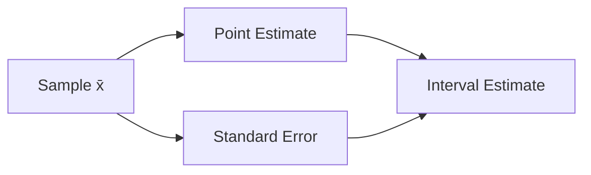

# 추정

> Statistics 101 시리즈 (5/10)


## 이 글에서 다룰 문제

평균을 보고했다고 끝나는 것이 아닙니다. 참값에 얼마나 가까운지도 함께 적어야 의사결정자가 위험을 평가할 수 있습니다.

> 추정값에는 오차가 항상 따라옵니다.

## 전체 흐름


## Before/After

**Before**: *“표본 평균은 100”* — 얼마나 신뢰할 수 있는지 알 수 없음.

**After**: *“x̄ = 100, SE = 2.5 (n=64). 모평균은 95% 구간 [95.1, 104.9].”*

## 5단계 추정

### 1단계 — 표본 준비

```python
import numpy as np
sample = np.random.normal(loc=100, scale=20, size=64)
```

### 2단계 — 점 추정

```python
mean = sample.mean()
print("x̄:", mean)
```

### 3단계 — 표준오차

```python
se = sample.std(ddof=1) / np.sqrt(len(sample))
print("SE:", se)
```

### 4단계 — 95% 구간

```python
lower, upper = mean - 1.96 * se, mean + 1.96 * se
print(f"95% CI: [{lower:.1f}, {upper:.1f}]")
```

### 5단계 — 보고

```text
x̄ = 99.8 (n=64), SE = 2.4
95% CI: [95.1, 104.5]
```

## 이 코드에서 주목할 점

- SE = s/√n 이며 표본이 클수록 작아집니다.
- 95% CI는 보통 ±1.96 × SE 형태로 계산합니다.
- 추정값은 항상 SE와 함께 보고해야 합니다.

## 자주 하는 실수 5가지

1. 표준편차와 SE를 같은 값으로 혼동합니다.
2. N을 늘리면 오차가 0이 된다고 오해합니다.
3. 점 추정만 적고 불확실성을 빼먹습니다.
4. 작은 표본인데도 정규 근사만 쓰고 t-distribution을 보지 않습니다.
5. 편향된 표본으로 불편 추정량을 만들 수 있다고 생각합니다.

## 실무에서는 이렇게 쓰입니다

A/B 테스트의 전환율 추정, 매출의 월간 평균, 응답 시간의 p95 같은 대시보드 숫자는 모두 추정값입니다. 그래서 오차 막대나 신뢰구간이 함께 붙어야 해석이 안전해집니다.

## 체크리스트

- [ ] 점 추정과 구간 추정의 차이를 설명할 수 있습니다.
- [ ] SE를 계산할 수 있습니다.
- [ ] 95% CI를 만들 수 있습니다.
- [ ] N이 오차에 미치는 영향을 이해합니다.

## 정리 및 다음 단계

추정은 불확실성을 숫자로 적는 일입니다. 다음 글에서는 95% CI가 실제로 무엇을 뜻하는지 자세히 살펴보겠습니다.

<!-- toc:begin -->
- [통계란 무엇인가?](./01-what-is-statistics.md)
- [평균, 중앙값, 분산](./02-mean-median-variance.md)
- [분포](./03-distributions.md)
- [표본과 모집단](./04-sample-and-population.md)
- **추정 (현재 글)**
- 신뢰구간 (예정)
- 가설검정 (예정)
- 상관과 회귀 (예정)
- p-value 이해하기 (예정)
- 통계적 사고방식 (예정)
<!-- toc:end -->

## 참고 자료

- [scipy.stats — Statistical Functions](https://docs.scipy.org/doc/scipy/reference/stats.html)
- [Khan Academy — Estimation](https://www.khanacademy.org/math/statistics-probability/confidence-intervals-one-sample)
- [Wikipedia — Standard Error](https://en.wikipedia.org/wiki/Standard_error)
- [NIST — Estimation Methods](https://www.itl.nist.gov/div898/handbook/eda/section3/eda35.htm)

Tags: Statistics, Estimation, Inference, PointEstimate, Beginner
