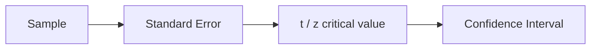

# 신뢰구간

> Statistics 101 시리즈 (6/10)


## 이 글에서 다룰 문제

신뢰구간은 불확실성을 보여 주는 가장 흔한 도구입니다. 동시에 가장 자주 오해되는 개념이기도 합니다. 정확한 의미를 알아야 정확한 결정을 내릴 수 있습니다.

> 95% CI는 방법의 적중률을 뜻할 뿐, 이번 구간의 확률을 뜻하지는 않습니다.

## 전체 흐름


## Before/After

**Before**: *“95% 확률로 평균이 95~105 사이”* — 흔한 오해.

**After**: *“같은 방법으로 100번 추정하면 약 95번이 95~105를 포함.”*

## 5단계 CI

### 1단계 — 표본

```python
import numpy as np
sample = np.random.normal(100, 20, size=64)
```

### 2단계 — t-임계값

```python
from scipy import stats
df = len(sample) - 1
t_crit = stats.t.ppf(0.975, df)
print("t*:", t_crit)
```

### 3단계 — SE & MoE

```python
se = sample.std(ddof=1) / np.sqrt(len(sample))
moe = t_crit * se
```

### 4단계 — 구간

```python
mean = sample.mean()
print(f"95% CI: [{mean - moe:.2f}, {mean + moe:.2f}]")
```

### 5단계 — 부트스트랩

```python
from numpy.random import default_rng
rng = default_rng(0)
boots = [rng.choice(sample, len(sample), replace=True).mean() for _ in range(2000)]
print("Bootstrap CI:", np.percentile(boots, [2.5, 97.5]))
```

## 이 코드에서 주목할 점

- 작은 표본에는 t-distribution을 쓰는 편이 안전합니다.
- Bootstrap은 분포 가정이 약한 상황에서도 유용합니다.
- 두 결과가 비슷할수록 사용한 가정이 비교적 적절했다고 볼 수 있습니다.

## 자주 하는 실수 5가지

1. 이번 구간 자체에 95% 확률이 있다고 오해합니다.
2. N=10 같은 작은 표본에도 z=1.96만 사용합니다. 이때는 t가 더 적절합니다.
3. 신뢰수준과 유의수준을 같은 개념처럼 섞어 씁니다.
4. 왜곡된 분포인데도 부트스트랩 없이 정규 CI만 적용합니다.
5. CI가 0을 포함하면 곧바로 효과가 없다고 단정합니다.

## 실무에서는 이렇게 쓰입니다

A/B 테스트 결과, 회귀계수, 효과 크기처럼 추론이 들어가는 보고서에는 CI가 함께 적혀야 합니다. 대시보드의 오차 막대도 결국 신뢰구간을 시각화한 경우가 많습니다.

## 체크리스트

- [ ] CI의 정확한 의미를 설명할 수 있습니다.
- [ ] t-distribution을 사용할 수 있습니다.
- [ ] 부트스트랩의 쓰임을 이해합니다.
- [ ] 상황에 맞는 신뢰수준을 고릅니다.

## 정리 및 다음 단계

신뢰구간은 불확실성을 시각화하는 도구입니다. 다음 글에서는 가설검정으로 실제 차이가 있는지 묻는 방법을 배워 보겠습니다.

<!-- toc:begin -->
- [통계란 무엇인가?](./01-what-is-statistics.md)
- [평균, 중앙값, 분산](./02-mean-median-variance.md)
- [분포](./03-distributions.md)
- [표본과 모집단](./04-sample-and-population.md)
- [추정](./05-estimation.md)
- **신뢰구간 (현재 글)**
- 가설검정 (예정)
- 상관과 회귀 (예정)
- p-value 이해하기 (예정)
- 통계적 사고방식 (예정)
<!-- toc:end -->

## 참고 자료

- [scipy.stats — t and bootstrap](https://docs.scipy.org/doc/scipy/reference/stats.html)
- [BMJ — Common Misconceptions of Confidence Intervals](https://www.bmj.com/content/322/7280/226)
- [Khan Academy — Confidence Intervals](https://www.khanacademy.org/math/statistics-probability/confidence-intervals-one-sample)
- [Wikipedia — Bootstrap](https://en.wikipedia.org/wiki/Bootstrapping_%28statistics%29)

Tags: Statistics, ConfidenceInterval, Inference, Uncertainty, Beginner
