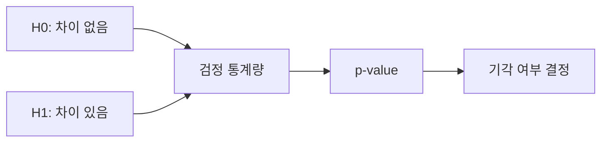

# 가설검정

> Statistics 101 시리즈 (7/10)

## 이 글에서 다룰 문제

- 데이터로 “차이가 있다”는 말을 어디까지 해도 될까요?
- 귀무가설 H0와 대립가설 H1은 무엇을 뜻할까요?
- t-test 결과를 읽을 때 p-value만 보면 왜 위험할까요?
- 1종 오류, 2종 오류, 검정력은 실무 판단에 어떻게 연결될까요?

가설검정은 숫자를 더 정교하게 계산하는 절차가 아니라, 차이가 우연인지 아닌지를 말하는 규칙입니다. 그래서 A/B 테스트, 캠페인 비교, 모델 성능 비교처럼 둘이 다르다는 주장을 해야 하는 순간마다 등장합니다.

문제는 많은 보고서가 p-value 하나만으로 결론을 내려 버린다는 점입니다. 하지만 가설검정은 p-value보다 더 넓은 이야기입니다. 어떤 가설을 먼저 세웠는지, 어떤 오류를 감수할지, 표본 수가 충분한지, 실제 차이가 얼마나 큰지까지 함께 봐야 판단이 선명해집니다.

> 올바른 질문을 먼저 세우는 일이 정답보다 더 중요할 때가 많습니다.

## 왜 중요한가

현업의 많은 결정은 비교에서 시작합니다. 새 버튼이 전환율을 올렸는지, 새 모델이 기존 모델보다 나은지, 두 집단의 평균이 다른지 판단해야 합니다. 눈으로 보기에는 차이가 커 보여도 우연일 수 있고, 반대로 실제 효과가 있어도 표본이 너무 작으면 놓칠 수 있습니다.

가설검정은 이런 상황에서 과신과 과소 판단을 모두 줄여 줍니다. 아무 차이도 없는데 있다고 말하는 1종 오류와, 실제 차이가 있는데 놓치는 2종 오류 사이에서 어떤 균형을 택할지 정하게 해 주기 때문입니다.

## 한눈에 보는 개념



## 핵심 용어

- **H0(귀무가설)**: 차이가 없다고 두는 기본 가설입니다.
- **H1(대립가설)**: 차이가 있다고 주장하는 가설입니다.
- **유의수준(α)**: 1종 오류를 어느 정도까지 감수할지 정한 기준입니다. 보통 0.05를 씁니다.
- **검정력(Power, 1-β)**: 실제 효과가 있을 때 그것을 잡아낼 확률입니다.
- **1종 오류**: H0가 참인데도 기각하는 오류입니다.
- **2종 오류**: H0가 거짓인데도 기각하지 못하는 오류입니다.

## Before/After

**Before**: “B 그룹 평균이 더 높네요. 효과가 있나 봅니다.” — 우연일 수도 있습니다.

**After**: “B 그룹 평균은 0.4pp 높고 (t=3.2, p=0.001), α=0.05 기준에서 유의합니다. 다만 효과 크기도 함께 봐야 합니다.”

## 실습: 5단계 가설검정

아래 예시는 두 그룹 평균 차이를 Welch t-test로 검정하는 가장 기본적인 흐름입니다. 코드를 따라가면서, 숫자 한 개가 아니라 검정 전체 맥락을 읽는 연습을 해 보겠습니다.

### 1단계 — 가설 진술

```text
H0: μ_A = μ_B
H1: μ_A ≠ μ_B
α = 0.05
```

### 2단계 — 표본

```python
import numpy as np
a = np.random.normal(3.2, 1, 1000)
b = np.random.normal(3.6, 1, 1000)
```

### 3단계 — 검정 통계량

```python
from scipy.stats import ttest_ind
stat, p = ttest_ind(a, b, equal_var=False)
print("t:", stat, "p:", p)
```

### 4단계 — 결정

```python
print("Reject H0" if p < 0.05 else "Fail to reject H0")
```

### 5단계 — 효과 크기

```python
diff = b.mean() - a.mean()
pooled = np.sqrt((a.var(ddof=1) + b.var(ddof=1)) / 2)
print("Cohen's d:", diff / pooled)
```

## 이 코드에서 주목할 점

- p-value만으로 결론을 내리면 안 됩니다.
- Cohen's d를 함께 봐야 실제 효과 크기를 이해할 수 있습니다.
- `equal_var=False`는 Welch t-test를 선택한다는 뜻입니다.

가설검정의 핵심은 기각 여부 자체보다 그 판정을 어떤 전제 위에서 내렸는지 이해하는 데 있습니다. 유의수준을 어떻게 잡았는지, 표본 수가 충분했는지, 그리고 차이가 실무적으로도 의미 있는지까지 확인해야 합니다. 그래서 좋은 분석가는 p-value와 효과 크기, 검정력을 함께 읽습니다.

## 자주 하는 실수 5가지

1. p < 0.05만 보고 곧바로 효과가 있다고 단정합니다.
2. 여러 가설을 동시에 검정하면서 다중검정 보정을 하지 않습니다.
3. 검정력 분석 없이 표본 크기를 정합니다.
4. 단측 검정과 양측 검정을 맥락 없이 고릅니다.
5. 결과를 본 뒤에 H0와 H1을 바꾸는 HARKing을 합니다.

## 실무에서는 이렇게 생각합니다

A/B 테스트 결과 페이지, 모델 성능 비교, 임상시험처럼 비교 기반 결정이 필요한 곳에서는 가설검정이 사실상 표준 절차입니다. 동시에 여러 캠페인을 돌리거나 여러 지표를 한꺼번에 보면 Bonferroni나 FDR 같은 다중검정 보정도 함께 고려해야 합니다.

시니어 엔지니어는 데이터를 보기 전에 가설을 먼저 적어 둡니다. p-value와 효과 크기를 함께 읽고, 표본 수는 검정력 기준으로 미리 계산합니다. 그리고 “기각하지 못했다”는 말과 “귀무가설이 참이다”라는 말을 절대 같은 뜻으로 쓰지 않습니다.

## 체크리스트

- [ ] H0와 H1을 명확하게 적을 수 있습니다.
- [ ] α와 검정력을 미리 정합니다.
- [ ] 효과 크기를 함께 보고합니다.
- [ ] 다중검정 보정의 필요성을 이해합니다.

## 연습 문제

1. N=30과 N=3000에서 p-value가 어떻게 달라지는지 시뮬레이션해 보세요.
2. 1종 오류와 2종 오류의 차이를 예시로 설명해 보세요.
3. 세 개 캠페인을 동시에 검정할 때 p < 0.05를 어떻게 보정할지 적어 보세요.

## 정리와 다음 글

가설검정은 비교 기반 의사결정의 표준 언어입니다. 하지만 그 핵심은 p-value를 외우는 데 있지 않고, 어떤 질문을 어떤 오류 기준으로 검정했는지 분명히 말하는 데 있습니다. 다음 글에서는 변수 사이 관계를 다루는 상관과 회귀로 넘어가겠습니다.

<!-- toc:begin -->
- [통계란 무엇인가?](./01-what-is-statistics.md)
- [평균, 중앙값, 분산](./02-mean-median-variance.md)
- [분포](./03-distributions.md)
- [표본과 모집단](./04-sample-and-population.md)
- [추정](./05-estimation.md)
- [신뢰구간](./06-confidence-interval.md)
- **가설검정 (현재 글)**
- 상관과 회귀 (예정)
- p-value 이해하기 (예정)
- 통계적 사고방식 (예정)
<!-- toc:end -->

## 참고 자료

- [scipy.stats — Hypothesis Tests](https://docs.scipy.org/doc/scipy/reference/stats.html)
- [Khan Academy — Hypothesis Testing](https://www.khanacademy.org/math/statistics-probability/significance-tests-one-sample)
- [Wikipedia — Multiple Comparisons Problem](https://en.wikipedia.org/wiki/Multiple_comparisons_problem)
- [Statistics Done Wrong (Reinhart)](https://www.statisticsdonewrong.com/)

Tags: Statistics, HypothesisTesting, Inference, ABTest, Beginner
