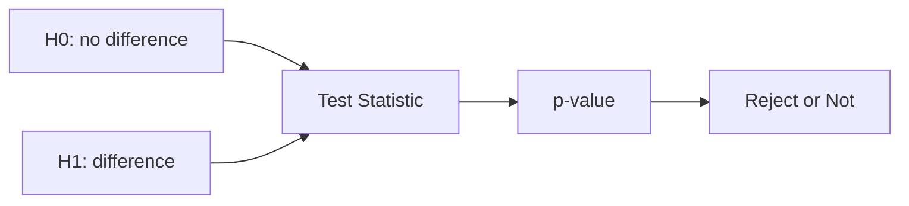

# 가설검정

> Statistics 101 시리즈 (7/10)


## 이 글에서 다룰 문제

*A/B 테스트, 캠페인 효과, 모델 비교* — *결정의 절반* 이 *가설검정* 입니다. *제대로* 묻는 법을 알면 *과신* 과 *과소* 양쪽을 피할 수 있습니다.

> *질문을 *바르게* 던지는 법이 *답* 보다 중요하다.*

## 개념 한눈에 보기



## Before/After

**Before**: *“B 그룹 평균이 더 높네요. 효과 있어요!”* — 우연일 수도.

**After**: *“B 평균 +0.4pp (t=3.2, p=0.001) — 5% 유의수준에서 *효과 있음*.”*

## 실습: 5단계 가설검정

### 1단계 — 가설 진술

```text
H0: μ_A = μ_B
H1: μ_A ≠ μ_B
α = 0.05
```

### 2단계 — 표본

```python
import numpy as np
a = np.random.normal(3.2, 1, 1000)
b = np.random.normal(3.6, 1, 1000)
```

### 3단계 — 검정 통계량

```python
from scipy.stats import ttest_ind
stat, p = ttest_ind(a, b, equal_var=False)
print("t:", stat, "p:", p)
```

### 4단계 — 결정

```python
print("Reject H0" if p < 0.05 else "Fail to reject H0")
```

### 5단계 — 효과 크기

```python
diff = b.mean() - a.mean()
pooled = np.sqrt((a.var(ddof=1) + b.var(ddof=1)) / 2)
print("Cohen's d:", diff / pooled)
```

## 이 코드에서 주목할 점

- *p-value* 만으로 *결정* 하지 않는다.
- *Cohen's d* 로 *효과 크기* 를 *함께* 본다.
- *equal_var=False* 가 *Welch t-test*.

## 자주 하는 실수 5가지

1. ***p < 0.05* 면 *효과 있음* 이라고 *단정*.**
2. ***다중검정* 보정 *없이* 여러 가설 검사.**
3. ***검정력* 분석 *없이* 표본 크기 결정.**
4. ***단측/양측* 을 *상황 없이* 결정.**
5. ***결과를 보고* H0/H1 를 *바꾼다* (HARKing).**

## 실무에서는 이렇게 쓰입니다

A/B 테스트 결과 페이지, 모델 *성능 비교*, *임상시험* 등 — 모든 *비교 결정* 의 표준 절차입니다. *Bonferroni*, *FDR* 같은 *다중검정* 보정이 함께 쓰입니다.

## 체크리스트

- [ ] *H0/H1* 을 *명확히* 적는다.
- [ ] *α* 와 *검정력* 을 *결정* 한다.
- [ ] *효과 크기* 를 *보고* 한다.
- [ ] *다중검정* 보정을 안다.

## 정리 및 다음 단계

가설검정은 *결정의 표준 언어* 입니다. 다음 글에서는 *상관과 회귀* 로 *변수 사이* 의 *관계* 를 봅니다.

<!-- toc:begin -->
- [통계란 무엇인가?](./01-what-is-statistics.md)
- [평균, 중앙값, 분산](./02-mean-median-variance.md)
- [분포](./03-distributions.md)
- [표본과 모집단](./04-sample-and-population.md)
- [추정](./05-estimation.md)
- [신뢰구간](./06-confidence-interval.md)
- **가설검정 (현재 글)**
- 상관과 회귀 (예정)
- p-value 이해하기 (예정)
- 통계적 사고방식 (예정)
<!-- toc:end -->

## 참고 자료

- [scipy.stats — Hypothesis Tests](https://docs.scipy.org/doc/scipy/reference/stats.html)
- [Khan Academy — Hypothesis Testing](https://www.khanacademy.org/math/statistics-probability/significance-tests-one-sample)
- [Wikipedia — Multiple Comparisons Problem](https://en.wikipedia.org/wiki/Multiple_comparisons_problem)
- [Statistics Done Wrong (Reinhart)](https://www.statisticsdonewrong.com/)

Tags: Statistics, HypothesisTesting, Inference, ABTest, Beginner
