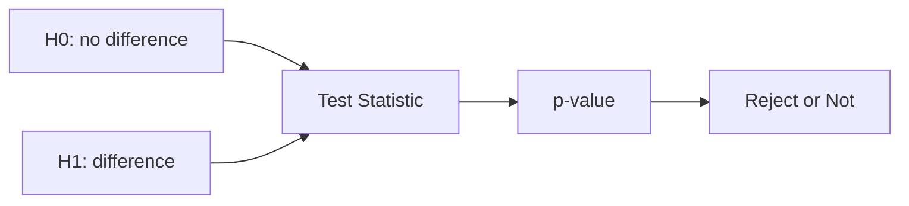

# 가설검정

데이터를 보다 보면 “차이가 있는가”라는 질문을 자주 만나게 됩니다. 새 버튼이 전환율을 올렸는지, 새 약물이 기존 치료보다 나은지, 두 모델의 성능 차이가 우연인지 아닌지 같은 질문입니다. 가설검정은 이런 비교 질문을 정식 절차로 다루는 방법입니다.

가설검정이 필요한 이유는 눈으로 보이는 차이가 항상 의미 있는 차이는 아니기 때문입니다. 표본에서는 우연한 흔들림이 계속 생기고, 그 흔들림을 통제하지 않으면 과장된 결론을 내리기 쉽습니다.

이 글은 Statistics 101 시리즈의 7번째 글입니다. 여기서는 귀무가설과 대립가설, t-test의 기본 흐름, 1종 오류와 2종 오류, 검정력이 왜 실무에서 빠지면 안 되는 개념인지 정리하겠습니다.

## 이 글에서 다룰 문제

- 데이터로 “차이가 있다”는 말을 어디까지 할 수 있을까요?
- 귀무가설 H0와 대립가설 H1은 무엇을 뜻할까요?
- p-value만으로 판단하면 왜 부족할까요?
- 표본 수와 검정력은 어떤 관계를 가질까요?

> 가설검정은 우연을 숫자로 다루어 성급한 결론을 막는 절차입니다.

## 왜 중요한가

A/B 테스트, 캠페인 효과 측정, 모델 성능 비교처럼 비교 중심의 의사결정은 매우 많습니다. 이때 차이가 보인다는 이유만으로 바로 배포하거나 중단하면, 우연한 잡음을 효과로 오해할 수 있습니다. 반대로 실제 효과가 있는데도 표본이 작아 놓치는 경우도 생깁니다.

가설검정은 이 두 위험을 구분하는 프레임을 제공합니다. 유의수준은 어느 정도의 거짓 경보를 감수할지 정하는 값이고, 검정력은 실제 효과를 얼마나 잘 잡아낼지를 말합니다. 실무에서는 이 둘을 함께 봐야 합니다.

## 멘탈 모델

가설검정은 먼저 “차이가 없다”는 기본 가정을 세우고, 표본에서 계산한 검정통계량이 그 가정 아래 얼마나 드문지 측정한 뒤, 미리 정한 기준과 비교해 결론을 내리는 절차입니다. 중요한 점은 가설을 데이터 보기 전에 정해야 한다는 것입니다.



이 구조를 이해하면 p-value는 답 자체가 아니라 판단 재료라는 점이 보입니다. 실제 의사결정은 p-value, 효과 크기, 비용, 맥락을 함께 놓고 이뤄집니다.

## 핵심 용어

- **귀무가설(H0)**: 차이가 없다는 기본 가정입니다.
- **대립가설(H1)**: 차이가 있다는 가정입니다.
- **유의수준(α)**: 1종 오류를 허용하는 기준값입니다. 보통 0.05를 많이 씁니다.
- **검정력(1-β)**: 실제 효과가 있을 때 그것을 잡아낼 확률입니다.
- **1종 오류**: H0가 참인데 기각하는 오류입니다.
- **2종 오류**: H0가 거짓인데 기각하지 못하는 오류입니다.

## 눈에 보이는 차이와 통계적 차이는 다를 수 있다

이전 해석: “B 그룹 평균이 더 높으니 새 처리 방식이 효과가 있습니다.”

표본 차이는 우연으로도 얼마든지 나타날 수 있습니다.

이후 해석: “B 그룹 평균은 0.4퍼센트포인트 높고, t=3.2, p=0.001입니다. 유의수준 0.05 기준에서는 차이가 있다고 읽을 수 있으며, 효과 크기는 별도로 함께 봐야 합니다.”

가설검정은 차이의 존재를 말하는 절차이지, 그 차이가 큰지 작은지 대신 말해 주는 절차는 아닙니다.

## 실습: 5단계 가설검정

### 1단계 — 가설을 적는다

```text
H0: μ_A = μ_B
H1: μ_A ≠ μ_B
α = 0.05
```

가설을 결과 보기 전에 정하는 습관이 중요합니다.

### 2단계 — 표본을 준비한다

```python
import numpy as np
a = np.random.normal(3.2, 1, 1000)
b = np.random.normal(3.6, 1, 1000)
```

### 3단계 — 검정통계량과 p-value를 계산한다

```python
from scipy.stats import ttest_ind
stat, p = ttest_ind(a, b, equal_var=False)
print("t:", stat, "p:", p)
```

Welch의 t-test를 사용하면 분산이 같지 않아도 더 안전합니다.

### 4단계 — 기준에 따라 판단한다

```python
print("Reject H0" if p < 0.05 else "Fail to reject H0")
```

기각 실패는 H0가 참하다고 단정할 근거가 아니라, 현재 데이터로는 충분히 반박하지 못했다는 말입니다.

### 5단계 — 효과 크기를 함께 본다

```python
diff = b.mean() - a.mean()
pooled = np.sqrt((a.var(ddof=1) + b.var(ddof=1)) / 2)
print("Cohen's d:", diff / pooled)
```

p-value와 효과 크기를 함께 읽어야 실제 의미가 보입니다.

## 이 코드에서 먼저 볼 점

- p-value만으로 결론을 닫으면 부족합니다.
- 효과 크기를 같이 보면 차이의 크기를 해석할 수 있습니다.
- `equal_var=False`는 Welch의 t-test를 선택합니다.

## 자주 헷갈리는 지점 5가지

1. **p < 0.05면 자동으로 큰 효과라고 보는 경우**: 유의성과 효과 크기는 다릅니다.
2. **여러 검정을 하면서 다중비교 보정을 빼는 경우**: 거짓 양성이 빠르게 늘어납니다.
3. **검정력 계산 없이 표본 수를 정하는 경우**: 실제 효과를 놓칠 수 있습니다.
4. **단측검정과 양측검정을 결과를 보고 고르는 경우**: 절차 오염이 생깁니다.
5. **결과를 본 뒤 가설을 바꾸는 경우**: HARKing 문제로 이어집니다.

## 실무에서는 이렇게 읽습니다

A/B 테스트 결과 페이지, 모델 비교 실험, 임상 연구처럼 비교가 중심인 작업에서는 가설검정이 표준 절차처럼 등장합니다. 이때 Bonferroni나 FDR 같은 다중비교 보정이 함께 붙는 경우도 많습니다. 비교가 많아질수록 우연히 유의해 보이는 결과가 늘기 때문입니다.

시니어 엔지니어는 데이터를 보기 전에 가설을 적고, p-value와 효과 크기를 함께 읽으며, 필요한 표본 수를 먼저 계산합니다. 또 “기각하지 못함”과 “차이가 없음”을 같은 말로 쓰지 않습니다. 이 구분이 의사결정 품질을 크게 바꿉니다.

## 체크리스트

- [ ] H0와 H1을 명확히 적을 수 있습니다.
- [ ] 유의수준과 검정력의 역할을 설명할 수 있습니다.
- [ ] p-value와 효과 크기를 함께 보고합니다.
- [ ] 다중비교 보정이 왜 필요한지 압니다.

## 연습 문제

1. N=30과 N=3000에서 p-value가 어떻게 달라질지 시뮬레이션해 보세요.
2. 1종 오류와 2종 오류를 예시와 함께 설명해 보세요.
3. 세 개의 캠페인을 동시에 비교할 때 어떤 보정을 고려할지 적어 보세요.

## 정리와 다음 글

가설검정은 차이를 정식으로 묻는 절차입니다. 귀무가설과 대립가설을 먼저 세우고, 우연으로 설명될 가능성을 계산하고, 그 결과를 미리 정한 기준과 비교해 판단합니다. 다만 실제 의사결정은 p-value 하나로 끝나지 않습니다. 효과 크기, 표본 수, 비용, 맥락이 함께 들어와야 합니다.

다음 글에서는 상관과 회귀를 다룹니다. 두 변수의 관계를 숫자와 식으로 표현할 때 어떤 함정이 생기는지, 특히 상관과 인과를 섞지 않으려면 무엇을 봐야 하는지 이어서 살펴보겠습니다.

<!-- toc:begin -->
- [통계란 무엇인가?](./01-what-is-statistics.md)
- [평균, 중앙값, 분산](./02-mean-median-variance.md)
- [분포](./03-distributions.md)
- [표본과 모집단](./04-sample-and-population.md)
- [추정](./05-estimation.md)
- [신뢰구간](./06-confidence-interval.md)
- **가설검정 (현재 글)**
- 상관과 회귀 (예정)
- p-value 이해하기 (예정)
- 통계적 사고방식 (예정)
<!-- toc:end -->

## 참고 자료

- [scipy.stats — Hypothesis Tests](https://docs.scipy.org/doc/scipy/reference/stats.html)
- [Khan Academy — Hypothesis Testing](https://www.khanacademy.org/math/statistics-probability/significance-tests-one-sample)
- [Wikipedia — Multiple Comparisons Problem](https://en.wikipedia.org/wiki/Multiple_comparisons_problem)
- [Statistics Done Wrong (Reinhart)](https://www.statisticsdonewrong.com/)

Tags: Statistics, HypothesisTesting, Inference, ABTest, Beginner
