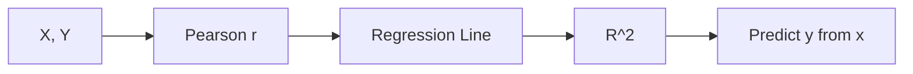

# 상관과 회귀

> Statistics 101 시리즈 (8/10)


## 이 글에서 다룰 문제

*매출 ~ 광고비*, *공부 시간 ~ 점수* — *관계* 는 *모든 분석의 시작* 입니다. *상관과 회귀* 는 *관계를 수치로* 표현하는 도구입니다.

> *Correlation is not causation.*

## 전체 흐름


## Before/After

**Before**: *“광고비와 매출 상관 0.6”* — 어떤 관계인지 *모름*.

**After**: *“sales = 1,200 + 4.2·ads (R²=0.36) — 광고비 +1만원 → 매출 +4.2만원.”*

## 5단계 회귀

### 1단계 — 데이터

```python
import numpy as np, pandas as pd
ads = np.array([10, 20, 30, 40, 50, 60])
sales = np.array([1300, 1280, 1320, 1360, 1410, 1450])
```

### 2단계 — 상관

```python
print("r:", np.corrcoef(ads, sales)[0, 1])
```

### 3단계 — 회귀 적합

```python
from sklearn.linear_model import LinearRegression
X = ads.reshape(-1, 1)
model = LinearRegression().fit(X, sales)
print("β1:", model.coef_[0], "β0:", model.intercept_)
```

### 4단계 — R²

```python
print("R^2:", model.score(X, sales))
```

### 5단계 — 잔차

```python
import matplotlib.pyplot as plt
resid = sales - model.predict(X)
plt.scatter(model.predict(X), resid); plt.axhline(0); plt.show()
```

## 이 코드에서 주목할 점

- *상관* 은 *방향+강도* 만, *회귀* 는 *예측 가능한 식*.
- *R²* 는 *0~1*. 1에 가까울수록 *설명력 큼*.
- *잔차 패턴* 이 보이면 *비선형* 의심.

## 자주 하는 실수 5가지

1. ***상관 = 인과* 라고 *오해*.**
2. ***이상치* 가 *상관* 을 *부풀린다*.**
3. ***비선형* 관계에 *Pearson* 사용.**
4. ***R²* 만 보고 *모델 좋다* 단정.**
5. ***잔차* 를 *진단* 하지 않는다.**

## 실무에서는 이렇게 쓰입니다

매출 예측, 가격 ~ 수요, 광고 ~ 전환, 사용량 ~ 이탈 — *비즈니스 의사결정* 에 자주 쓰입니다. *Multivariate*, *Logistic*, *Time Series* 회귀로 확장됩니다.

## 체크리스트

- [ ] *상관 ≠ 인과* 임을 안다.
- [ ] *Pearson/Spearman* 차이를 안다.
- [ ] *R²* 를 안다.
- [ ] *잔차* 를 본다.

## 정리 및 다음 단계

상관과 회귀는 *관계를 수치로* 옮기는 가장 기본 도구입니다. 다음 글에서는 *p-value 의 진짜 의미* 를 깊이 봅니다.

<!-- toc:begin -->
- [통계란 무엇인가?](./01-what-is-statistics.md)
- [평균, 중앙값, 분산](./02-mean-median-variance.md)
- [분포](./03-distributions.md)
- [표본과 모집단](./04-sample-and-population.md)
- [추정](./05-estimation.md)
- [신뢰구간](./06-confidence-interval.md)
- [가설검정](./07-hypothesis-testing.md)
- **상관과 회귀 (현재 글)**
- p-value 이해하기 (예정)
- 통계적 사고방식 (예정)
<!-- toc:end -->

## 참고 자료

- [scikit-learn — Linear Regression](https://scikit-learn.org/stable/modules/linear_model.html)
- [Khan Academy — Correlation](https://www.khanacademy.org/math/statistics-probability/describing-relationships-quantitative-data)
- [Spurious Correlations (Vigen)](https://www.tylervigen.com/spurious-correlations)
- [Wikipedia — Anscombe's Quartet](https://en.wikipedia.org/wiki/Anscombe%27s_quartet)

Tags: Statistics, Correlation, Regression, Modeling, Beginner
