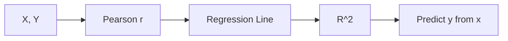

# 상관과 회귀

두 변수가 함께 움직이면 사람은 곧바로 이유를 찾고 싶어 합니다. 광고비가 늘면 매출이 오르는지, 공부 시간이 길면 점수가 오르는지, 가격이 내려가면 수요가 늘어나는지 같은 질문은 분석의 출발점이 됩니다.

하지만 함께 움직인다는 사실만으로 원인과 결과가 증명되지는 않습니다. 상관은 관계의 방향과 강도를 보여 주고, 회귀는 그 관계를 식으로 표현해 예측 가능한 형태로 만듭니다. 둘은 연결되어 있지만 같은 질문에 답하지는 않습니다.

이 글은 Statistics 101 시리즈의 8번째 글입니다. 여기서는 상관계수와 단순 선형 회귀를 나란히 놓고, R²와 잔차가 왜 중요한지, 그리고 왜 상관과 인과를 절대 섞어 읽으면 안 되는지 정리하겠습니다.

## 이 글에서 다룰 문제

- 상관계수는 무엇을 말하고 무엇은 말하지 못할까요?
- 회귀식은 상관계수보다 어떤 정보를 더 줄까요?
- R²는 어떤 범위에서 어떻게 읽어야 할까요?
- 잔차를 보지 않으면 어떤 문제를 놓치게 될까요?

> 상관은 함께 움직임을 말하고, 회귀는 그 움직임을 예측 가능한 식으로 정리합니다.

## 왜 중요한가

비즈니스 데이터의 많은 질문은 관계를 묻는 형태로 시작합니다. 광고비와 매출, 사용량과 이탈, 공부 시간과 점수처럼 변수 간 연결을 숫자로 요약해야 할 때가 많습니다. 이때 상관과 회귀는 가장 먼저 손에 잡히는 기본 도구입니다.

문제는 이 도구들이 너무 익숙해서 오용되기 쉽다는 점입니다. 상관이 높다고 곧바로 원인이라고 읽거나, R²가 높다고 좋은 모델이라고 단정하거나, 잔차를 보지 않고 선형성을 가정하는 일이 자주 생깁니다. 그래서 기본 개념을 차분하게 구분할 필요가 있습니다.

## 멘탈 모델

상관은 두 변수가 같은 방향으로 움직이는지와 그 강도를 보여 줍니다. 회귀는 그 관계를 식으로 적어, x가 바뀔 때 y가 어떻게 달라지는지 예측 가능한 형태로 만듭니다. 마지막으로 R²와 잔차는 그 식이 데이터를 얼마나 설명하는지 점검하게 합니다.



이 흐름을 이해하면 상관계수는 요약 지표이고, 회귀는 모델이며, 잔차 진단은 모델 검토 단계라는 점이 분명해집니다.

## 핵심 용어

- **Pearson 상관계수 r**: 선형 관계의 방향과 강도를 -1에서 +1 사이 값으로 나타냅니다.
- **Spearman ρ**: 순위 기반 상관으로, 비선형 구조나 이상치에 조금 더 강합니다.
- **단순 선형 회귀**: `y = β0 + β1·x + ε` 형태의 모델입니다.
- **R²**: 모델이 데이터 분산을 얼마나 설명하는지 나타내는 비율입니다.
- 잔차: 실제값에서 예측값을 뺀 값으로, 모델 진단의 핵심 재료입니다.

## 함께 움직인다고 바로 원인이라고 말할 수는 없다

이전 해석: “광고비와 매출의 상관이 0.6이므로 광고비가 매출을 만든다.”

이 문장은 관계와 인과를 섞은 해석입니다. 제3의 변수나 시간 효과가 함께 작용했을 수도 있습니다.

이후 해석: “광고비와 매출 사이에는 양의 선형 관계가 보이며, 단순 회귀식은 `sales = 1,200 + 4.2·ads`입니다. 다만 이 식은 관계를 설명할 뿐 인과를 보증하지는 않습니다.”

상관과 회귀는 관계를 표현하는 도구이지, 자동으로 원인을 증명하는 장치는 아닙니다.

## 실습: 5단계 회귀 읽기

### 1단계 — 데이터를 준비한다

```python
import numpy as np, pandas as pd
ads = np.array([10, 20, 30, 40, 50, 60])
sales = np.array([1300, 1280, 1320, 1360, 1410, 1450])
```

### 2단계 — 상관계수를 계산한다

```python
print("r:", np.corrcoef(ads, sales)[0, 1])
```

방향과 강도를 먼저 봅니다.

### 3단계 — 회귀모형을 적합한다

```python
from sklearn.linear_model import LinearRegression
X = ads.reshape(-1, 1)
model = LinearRegression().fit(X, sales)
print("β1:", model.coef_[0], "β0:", model.intercept_)
```

기울기와 절편은 관계를 식으로 바꾼 결과입니다.

### 4단계 — 설명력을 본다

```python
print("R^2:", model.score(X, sales))
```

R²는 0과 1 사이에서 읽습니다.

### 5단계 — 잔차를 점검한다

```python
import matplotlib.pyplot as plt
resid = sales - model.predict(X)
plt.scatter(model.predict(X), resid); plt.axhline(0); plt.show()
```

잔차 패턴은 선형성 위반이나 누락 변수를 암시할 수 있습니다.

## 이 코드에서 먼저 볼 점

- 상관은 방향과 강도를, 회귀는 예측 가능한 식을 줍니다.
- R²는 설명력의 크기를 말하지만 모델 품질 전체를 대신하지는 않습니다.
- 잔차 패턴은 비선형성이나 구조적 문제를 알려 줍니다.

## 자주 헷갈리는 지점 5가지

1. **상관을 인과로 읽는 경우**: 가장 흔한 오해입니다.
2. **이상치가 상관을 부풀리는 경우를 놓치는 경우**: 산점도를 함께 봐야 합니다.
3. **비선형 관계에 Pearson 상관만 적용하는 경우**: Spearman이나 다른 모델을 검토해야 합니다.
4. **R²만 보고 모델이 좋다고 말하는 경우**: 해석과 예측은 더 많은 검토가 필요합니다.
5. **잔차 진단을 생략하는 경우**: 모델이 틀린 모양으로 데이터를 설명하고 있을 수 있습니다.

## 실무에서는 이렇게 읽습니다

매출 예측, 가격과 수요 관계, 광고와 전환, 사용량과 이탈률 분석처럼 관계를 다루는 작업은 매우 많습니다. 단순 선형 회귀는 출발점으로 유용하지만, 실제 문제는 다변량 회귀, 로지스틱 회귀, 시계열 회귀로 확장되는 경우가 많습니다. 그 출발점에서 가장 먼저 익혀야 할 태도는 시각화와 잔차 진단입니다.

시니어 엔지니어는 상관이 높아도 바로 인과를 말하지 않고, 산점도를 먼저 보고, 잔차를 점검하고, 설명과 예측을 구분합니다. 숫자를 멋지게 뽑는 것보다 어떤 질문에 이 모델이 답할 수 있고 무엇은 답하지 못하는지 말하는 능력이 더 중요합니다.

## 체크리스트

- [ ] 상관과 인과를 구분할 수 있습니다.
- [ ] Pearson과 Spearman의 차이를 설명할 수 있습니다.
- [ ] R²의 의미와 한계를 압니다.
- [ ] 잔차를 확인해야 하는 이유를 설명할 수 있습니다.

## 연습 문제

1. 공부 시간과 점수 데이터를 만들어 r과 R²를 각각 계산해 보세요.
2. 상관이 높지만 인과가 아닌 사례 하나를 적어 보세요.
3. 비선형 관계에서 Pearson 상관이 약할 수 있는 이유를 설명해 보세요.

## 정리와 다음 글

상관과 회귀는 변수 관계를 숫자와 식으로 표현하는 가장 기본적인 도구입니다. 상관은 함께 움직임의 강도를, 회귀는 그 관계를 예측 가능한 형태로 보여 줍니다. 다만 둘 다 인과를 자동으로 보장하지 않으며, 잔차와 시각화 같은 진단 단계를 건너뛰면 쉽게 오해로 이어집니다.

다음 글에서는 p-value를 따로 떼어 더 깊게 다룹니다. 많은 보고서가 결론을 p < 0.05 한 줄로 적는 이유와, 그 문장이 왜 자주 잘못 읽히는지 정리해 보겠습니다.

<!-- toc:begin -->
- [통계란 무엇인가?](./01-what-is-statistics.md)
- [평균, 중앙값, 분산](./02-mean-median-variance.md)
- [분포](./03-distributions.md)
- [표본과 모집단](./04-sample-and-population.md)
- [추정](./05-estimation.md)
- [신뢰구간](./06-confidence-interval.md)
- [가설검정](./07-hypothesis-testing.md)
- **상관과 회귀 (현재 글)**
- p-value 이해하기 (예정)
- 통계적 사고방식 (예정)
<!-- toc:end -->

## 참고 자료

- [scikit-learn — Linear Regression](https://scikit-learn.org/stable/modules/linear_model.html)
- [Khan Academy — Correlation](https://www.khanacademy.org/math/statistics-probability/describing-relationships-quantitative-data)
- [Spurious Correlations (Vigen)](https://www.tylervigen.com/spurious-correlations)
- [Wikipedia — Anscombe's Quartet](https://en.wikipedia.org/wiki/Anscombe%27s_quartet)

Tags: Statistics, Correlation, Regression, Modeling, Beginner
