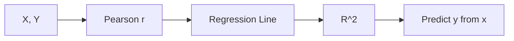

# 상관과 회귀

> Statistics 101 시리즈 (8/10)


## 이 글에서 다룰 문제

매출과 광고비, 공부 시간과 점수처럼 변수 사이 관계는 많은 분석의 출발점입니다. 상관과 회귀는 그 관계를 숫자와 식으로 표현하는 기본 도구입니다.

> *Correlation is not causation.*

## 전체 흐름


## Before/After

**Before**: “광고비와 매출 상관 0.6” — 실제 관계가 어떤 모양인지는 알 수 없습니다.

**After**: *“sales = 1,200 + 4.2·ads (R²=0.36) — 광고비 +1만원 → 매출 +4.2만원.”*

## 5단계 회귀

### 1단계 — 데이터

```python
import numpy as np, pandas as pd
ads = np.array([10, 20, 30, 40, 50, 60])
sales = np.array([1300, 1280, 1320, 1360, 1410, 1450])
```

### 2단계 — 상관

```python
print("r:", np.corrcoef(ads, sales)[0, 1])
```

### 3단계 — 회귀 적합

```python
from sklearn.linear_model import LinearRegression
X = ads.reshape(-1, 1)
model = LinearRegression().fit(X, sales)
print("β1:", model.coef_[0], "β0:", model.intercept_)
```

### 4단계 — R²

```python
print("R^2:", model.score(X, sales))
```

### 5단계 — 잔차

```python
import matplotlib.pyplot as plt
resid = sales - model.predict(X)
plt.scatter(model.predict(X), resid); plt.axhline(0); plt.show()
```

## 이 코드에서 주목할 점

- 상관은 방향과 강도를 보여 주고, 회귀는 예측 가능한 식을 제공합니다.
- R²는 0에서 1 사이 값이며 1에 가까울수록 설명력이 큽니다.
- 잔차 패턴이 보이면 비선형 관계를 의심해야 합니다.

## 자주 하는 실수 5가지

1. 상관을 곧바로 인과로 받아들입니다.
2. 이상치가 상관계수를 부풀리는 상황을 놓칩니다.
3. 비선형 관계인데도 Pearson 상관만 사용합니다.
4. R²만 보고 모델이 좋다고 단정합니다.
5. 잔차 진단을 하지 않고 결과만 해석합니다.

## 실무에서는 이렇게 쓰입니다

매출 예측, 가격과 수요의 관계, 광고와 전환, 사용량과 이탈 같은 문제에서 상관과 회귀가 자주 쓰입니다. 실무에서는 이를 다변량 회귀, 로지스틱 회귀, 시계열 회귀로 확장해 사용합니다.

## 체크리스트

- [ ] 상관과 인과가 다르다는 점을 설명할 수 있습니다.
- [ ] Pearson과 Spearman의 차이를 압니다.
- [ ] R²의 의미를 이해합니다.
- [ ] 잔차를 확인합니다.

## 정리 및 다음 단계

상관과 회귀는 관계를 수치와 식으로 옮기는 가장 기본 도구입니다. 다음 글에서는 p-value가 실제로 무엇을 뜻하는지 더 깊이 살펴보겠습니다.

<!-- toc:begin -->
- [통계란 무엇인가?](./01-what-is-statistics.md)
- [평균, 중앙값, 분산](./02-mean-median-variance.md)
- [분포](./03-distributions.md)
- [표본과 모집단](./04-sample-and-population.md)
- [추정](./05-estimation.md)
- [신뢰구간](./06-confidence-interval.md)
- [가설검정](./07-hypothesis-testing.md)
- **상관과 회귀 (현재 글)**
- p-value 이해하기 (예정)
- 통계적 사고방식 (예정)
<!-- toc:end -->

## 참고 자료

- [scikit-learn — Linear Regression](https://scikit-learn.org/stable/modules/linear_model.html)
- [Khan Academy — Correlation](https://www.khanacademy.org/math/statistics-probability/describing-relationships-quantitative-data)
- [Spurious Correlations (Vigen)](https://www.tylervigen.com/spurious-correlations)
- [Wikipedia — Anscombe's Quartet](https://en.wikipedia.org/wiki/Anscombe%27s_quartet)

Tags: Statistics, Correlation, Regression, Modeling, Beginner
