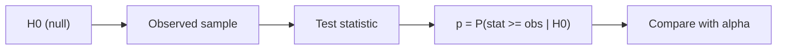

# p-value 이해하기

> Statistics 101 시리즈 (9/10)


## 이 글에서 다룰 문제

대부분의 논문과 보고서는 p < 0.05라는 한 줄로 결론을 내립니다. 하지만 많은 독자가 그 의미를 잘못 이해합니다. p-value를 잘못 읽으면 결정도 쉽게 잘못됩니다.

> p-value는 답이 아니라 질문의 시작입니다.

## 전체 흐름


## Before/After

**Before**: “p = 0.03이니 H0는 3% 확률로 참이다.” — 틀린 해석입니다.

**After**: “H0가 참이라고 가정했을 때 지금 같은 데이터가 나올 확률이 3%입니다.”

## 5단계 p-value

### 1단계 — 가설 설정

```python
# H0: 평균 = 100, H1: 평균 != 100
mu0 = 100
```

### 2단계 — 데이터

```python
import numpy as np
rng = np.random.default_rng(0)
sample = rng.normal(102, 15, size=40)
```

### 3단계 — 검정 실행

```python
from scipy import stats
t, p = stats.ttest_1samp(sample, mu0)
print("t:", t, "p:", p)
```

### 4단계 — 효과 크기

```python
import numpy as np
effect = (sample.mean() - mu0) / sample.std(ddof=1)
print("Cohen's d:", effect)
```

### 5단계 — p-hacking 시뮬레이션

```python
import numpy as np
from scipy import stats
hits = 0
for _ in range(20):
    x = np.random.default_rng().normal(100, 15, size=40)
    if stats.ttest_1samp(x, 100).pvalue < 0.05:
        hits += 1
print("20번 중 거짓 양성 횟수:", hits)
```

## 이 코드에서 주목할 점

- p-value는 데이터의 함수이지 가설 자체의 확률이 아닙니다.
- 효과 크기가 작아도 표본이 크면 p는 작아질 수 있습니다.
- 같은 데이터를 여러 번 분석하면 우연한 유의가 쌓일 수 있습니다.

## 자주 하는 실수 5가지

1. p를 H0가 참일 확률로 해석합니다.
2. p를 효과 크기 자체로 받아들입니다.
3. p > 0.05이면 효과가 없다고 단정합니다.
4. 여러 검정을 하면서도 보정을 하지 않습니다.
5. 사후에 가설을 데이터에 맞춰 수정합니다.

## 실무에서는 이렇게 쓰입니다

A/B 테스트, 임상시험, 품질관리에서는 p-value와 효과 크기, 신뢰구간을 함께 보고합니다. Bonferroni나 FDR 같은 다중검정 보정도 표준 절차로 자주 등장합니다.

## 체크리스트

- [ ] p-value의 정의를 정확히 압니다.
- [ ] 유의수준과 Type I 오류를 구분합니다.
- [ ] p-hacking이 왜 문제인지 설명할 수 있습니다.
- [ ] 효과 크기를 함께 봅니다.

## 정리 및 다음 단계

p-value는 증명이 아니라 놀라움의 척도입니다. 다음 글에서는 지금까지 배운 내용을 통계적 사고방식이라는 큰 흐름으로 묶어 마무리하겠습니다.

<!-- toc:begin -->
- [통계란 무엇인가?](./01-what-is-statistics.md)
- [평균, 중앙값, 분산](./02-mean-median-variance.md)
- [분포](./03-distributions.md)
- [표본과 모집단](./04-sample-and-population.md)
- [추정](./05-estimation.md)
- [신뢰구간](./06-confidence-interval.md)
- [가설검정](./07-hypothesis-testing.md)
- [상관과 회귀](./08-correlation-and-regression.md)
- **p-value 이해하기 (현재 글)**
- 통계적 사고방식 (예정)
<!-- toc:end -->

## 참고 자료

- [ASA Statement on p-Values (2016)](https://www.amstat.org/asa/files/pdfs/p-valuestatement.pdf)
- [Nature — Scientists rise up against statistical significance](https://www.nature.com/articles/d41586-019-00857-9)
- [scipy.stats — ttest_1samp](https://docs.scipy.org/doc/scipy/reference/generated/scipy.stats.ttest_1samp.html)
- [Wikipedia — Misuse of p-values](https://en.wikipedia.org/wiki/Misuse_of_p-values)

Tags: Statistics, PValue, Inference, Misconceptions, Beginner
