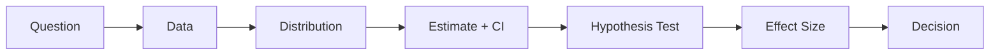

# 통계적 사고방식

통계를 한 챕터씩 배우면 평균, 분산, 분포, 가설검정, p-value가 서로 다른 도구처럼 보이기 쉽습니다. 하지만 실무에서 이 도구들은 따로 움직이지 않습니다. 하나의 질문에서 시작해 데이터 수집, 분포 확인, 추정, 검정, 최종 결정까지 한 흐름으로 이어집니다.

그래서 시리즈의 마지막에서 필요한 것은 새 공식을 하나 더 배우는 일이 아닙니다. 지금까지 본 개념이 어떤 순서로 연결되어 의사결정으로 닫히는지, 그 흐름을 머릿속에 하나로 묶는 일입니다.

이 글은 Statistics 101 시리즈의 마지막 글입니다. 여기서는 통계를 도구 상자가 아니라 사고방식으로 다시 정리하고, 질문에서 결정까지 이어지는 실전 흐름을 한 번에 묶어 보겠습니다.

## 이 글에서 다룰 문제

- 통계는 공식 모음일까요, 아니면 사고방식일까요?
- 질문, 데이터, 분포, 추정, 검정은 어떤 순서로 이어질까요?
- p-value와 효과 크기, 비용은 어떻게 함께 판단에 들어갈까요?
- 데이터 기반 결정이 더 좋아지려면 무엇을 기록해야 할까요?

> 통계적 사고는 숫자를 계산하는 기술이 아니라 불확실성을 관리하며 결정을 내리는 흐름입니다.

## 왜 중요한가

도구를 안다고 해서 바로 좋은 판단이 나오지는 않습니다. 평균을 계산할 줄 알아도 질문이 흐리면 분석이 흔들리고, p-value를 읽을 줄 알아도 효과 크기와 비용을 함께 보지 않으면 잘못된 결정을 내릴 수 있습니다. 통계적 사고는 각 도구가 어느 타이밍에 등장해야 하는지 알려 줍니다.

실무에서는 이 흐름 감각이 중요합니다. 데이터를 먼저 뒤지고 질문을 나중에 붙이는 방식은 낚시식 분석으로 가기 쉽고, 숫자를 읽기 전에 배포 여부를 정해 두면 통계는 정당화 도구로 전락합니다. 순서를 바로 세우는 것이 통계적 사고의 출발점입니다.

## 멘탈 모델

통계적 사고는 질문에서 출발해 데이터, 분포, 추정, 신뢰구간, 검정, 효과 크기, 결정으로 이어집니다. 이 순서가 정리되면 시리즈 전체가 하나의 작업 흐름처럼 읽히기 시작합니다.



중요한 점은 마지막 결정이 통계량 하나에서 바로 나오지 않는다는 사실입니다. 추정값과 불확실성, 효과 크기, 비즈니스 비용이 함께 모여서 결정이 됩니다.

## 핵심 용어

- 질문 우선: 데이터를 보기 전에 무엇을 묻는지 먼저 적는 태도입니다.
- 불확실성: 모든 추정에는 오차가 따라붙는다는 전제입니다.
- 맥락: 같은 p-value도 분야와 비용 구조에 따라 다르게 읽힙니다.
- 효과 크기: 유의성보다 실제 크기가 더 중요한 상황이 많습니다.
- 의사결정: 통계의 마지막 목적지입니다.

## 분석이 아니라 낚시가 되는 순간

이전 해석: “일단 데이터를 돌려 보고 뭐가 나오는지 보자.”

이 접근은 보기에는 유연하지만, 실제로는 가설을 뒤늦게 붙이고 우연한 패턴을 과도하게 믿게 만들 수 있습니다.

이후 해석: “우리가 답하고 싶은 질문이 무엇인지 먼저 적고, 그 질문에 맞는 데이터와 기준을 정한 뒤, 불확실성을 포함해 결정을 내리자.”

통계적 사고는 계산 순서가 아니라 질문 순서를 바로 세우는 작업입니다.

## 실습: 5단계 통계적 사고

### 1단계 — 질문을 분명히 한다

```python
# 새 체크아웃 버튼이 전환율을 올리는가?
question = "Does new button increase conversion?"
```

### 2단계 — 데이터와 분포를 확인한다

```python
# A: 5,000 users, 250 conversions ; B: 5,000 users, 290 conversions
nA, kA = 5000, 250
nB, kB = 5000, 290
pA, pB = kA/nA, kB/nB
print(pA, pB)
```

비율 데이터라는 사실이 보이면 어떤 추정과 검정을 쓸지도 함께 보입니다.

### 3단계 — 추정과 신뢰구간을 계산한다

```python
import math
diff = pB - pA
se = math.sqrt(pA*(1-pA)/nA + pB*(1-pB)/nB)
print("diff:", diff, "95% CI:", (diff - 1.96*se, diff + 1.96*se))
```

차이의 크기와 불확실성을 같이 적는 단계입니다.

### 4단계 — 검정과 효과 크기를 읽는다

```python
import math
z = diff / se
print("z:", z, "lift:", diff / pA)
```

통계적 유의성과 상대 향상 폭을 함께 봅니다.

### 5단계 — 비용까지 포함해 결정한다

```python
# 효과가 작아도 배포 비용이 거의 없으면 출시하고, 비용이 크면 데이터를 더 본다
decision = "ship" if (diff > 0 and z > 1.96) else "hold"
print(decision)
```

통계는 마지막에 비즈니스 판단과 만날 때 완성됩니다.

## 이 코드에서 먼저 볼 점

- 질문이 분석 설계를 결정합니다.
- 추정값, 신뢰구간, 효과 크기는 p-value 하나보다 더 많은 정보를 줍니다.
- 결정은 통계량과 비용 구조를 함께 고려해 내려야 합니다.

## 자주 헷갈리는 지점 5가지

1. **질문보다 데이터를 먼저 보는 경우**: 해석이 흔들리기 쉽습니다.
2. **p-value 하나로 결정을 끝내는 경우**: 효과 크기와 비용이 빠집니다.
3. **불확실성을 말로 풀어 쓰지 않는 경우**: 숫자가 과장되어 보일 수 있습니다.
4. **맥락 없이 결과를 비교하는 경우**: 같은 수치도 판단이 달라집니다.
5. **효과 크기와 실행 비용을 분리하는 경우**: 결정 품질이 떨어집니다.

## 실무에서는 이렇게 읽습니다

제품 실험, 가격 결정, 정책 평가, 임상 승인, 수요 예측처럼 데이터 기반 판단이 필요한 모든 장면에는 같은 흐름이 있습니다. 질문을 먼저 적고, 데이터를 수집하고, 분포를 읽고, 추정과 검정을 거쳐, 마지막에 비용과 맥락을 포함해 결정을 내립니다. 데이터 과학, 머신러닝, 비즈니스 분석도 이 뼈대를 공유합니다.

시니어 엔지니어는 통계를 도구 목록으로 기억하지 않습니다. 질문에서 결정까지의 흐름으로 기억합니다. 불확실성을 숫자와 문장으로 함께 남기고, 효과 크기와 비용을 같이 읽으며, 분석 맥락을 문서화합니다. 이 태도가 팀의 의사결정을 반복 가능하게 만듭니다.

## 체크리스트

- [ ] 질문을 먼저 정의합니다.
- [ ] 추정값, 신뢰구간, 효과 크기를 함께 보고합니다.
- [ ] 불확실성을 명시적으로 적습니다.
- [ ] 결정 비용과 맥락을 같이 검토합니다.

## 연습 문제

1. 최근에 했던 데이터 기반 결정을 질문 → 결정 흐름으로 다시 써 보세요.
2. p < 0.05 한 줄 보고서를 효과 크기와 신뢰구간 중심 보고서로 바꿔 보세요.
3. 통계적으로는 유의하지만 실무적으로는 거의 의미 없었던 사례를 하나 떠올려 보세요.

## 정리와 다음 글

통계적 사고는 숫자를 많이 아는 상태가 아니라, 불확실한 상황에서 어떤 순서로 생각해야 하는지 아는 상태입니다. 질문을 먼저 적고, 데이터의 모양을 보고, 추정과 검정을 통해 불확실성을 드러내고, 효과 크기와 비용을 함께 읽어 결정을 내리는 흐름이 이 시리즈의 뼈대였습니다.

이 시리즈는 여기서 마무리되지만, 통계적 사고는 Probability 101, Machine Learning 101 같은 다음 주제의 기반이 됩니다. 확률과 예측 모델을 배우더라도 출발점은 여전히 같습니다. 좋은 질문을 세우고, 데이터를 바르게 읽고, 불확실성을 숨기지 않는 것입니다.

<!-- toc:begin -->
- [통계란 무엇인가?](./01-what-is-statistics.md)
- [평균, 중앙값, 분산](./02-mean-median-variance.md)
- [분포](./03-distributions.md)
- [표본과 모집단](./04-sample-and-population.md)
- [추정](./05-estimation.md)
- [신뢰구간](./06-confidence-interval.md)
- [가설검정](./07-hypothesis-testing.md)
- [상관과 회귀](./08-correlation-and-regression.md)
- [p-value 이해하기](./09-understanding-p-value.md)
- **통계적 사고방식 (현재 글)**
<!-- toc:end -->

## 참고 자료

- [Nate Silver — The Signal and the Noise](https://en.wikipedia.org/wiki/The_Signal_and_the_Noise)
- [Hans Rosling — Factfulness](https://en.wikipedia.org/wiki/Factfulness)
- [ASA Statement on p-Values (2016)](https://www.amstat.org/asa/files/pdfs/p-valuestatement.pdf)
- [Wikipedia — Statistical Thinking](https://en.wikipedia.org/wiki/Statistical_thinking)

Tags: Statistics, Thinking, Mindset, Decision, Beginner
