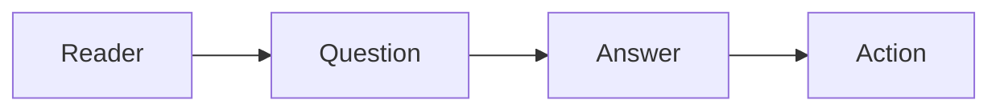

# What Is Technical Writing

This is the first post in the Technical Writing 101 series.

> Technical Writing 101 series (1/10)

<!-- a-grade-intro:begin -->

**Core question**: How is *technical writing* different from *everyday writing*?

> The reader must be able to *act* on it.

<!-- a-grade-intro:end -->

## What You Will Learn

- A definition of *technical writing*
- The difference from *everyday* prose
- The *three purposes*
- The reader's *action*
- The shape of a *series*

## Why It Matters

Writing tends to *outlive* the *code* it describes.

## Concept at a Glance



## Key Terms

- **technical writing**: Prose that *delivers technical information*.
- **audience**: The *reader*.
- **task**: A *job to do*.
- **outcome**: A *result*.
- **scope**: The *boundary*.

## Before/After

**Before**: "*Python* is a *great language*."

**After**: "A *beginner* can *run Hello World* in *five minutes*."

## Hands-on: One Technical Paragraph

### Step 1 — Pick the audience

```python
audience = "Python beginners"
```

### Step 2 — Pick the task

```python
task = "Create and activate a virtual environment"
```

### Step 3 — The commands

```bash
python3 -m venv .venv
source .venv/bin/activate
```

### Step 4 — The result

```python
result = "(.venv) shows up in the prompt"
```

### Step 5 — The next action

```python
next_step = "pip install requests"
```

## What to Notice in This Code

- The *reader* comes *first*.
- The *commands* are *short*.
- The *result* is *visible*.

## Five Common Mistakes

1. **A *vague* audience.**
2. **Too much *theory*.**
3. **Commands that are *not copy paste safe*.**
4. **No *visible result*.**
5. **No *next step*.**

## How This Shows Up in Production

Internal company docs, open source READMEs, and conference talk slides are all *technical writing*.

## How a Senior Engineer Thinks

- Saves the *reader's time*.
- Commands work *as written*.
- Results are *visible*.
- Stale information is *deleted*.
- Links are *alive*.

## Checklist

- [ ] The *audience* is *named*.
- [ ] The *task* is *one line*.
- [ ] The *commands* run.
- [ ] The *result* is stated.

## Practice Problems

1. Write the definition of *technical writing* in one line.
2. Write the meaning of *audience* in one line.
3. Write the definition of *outcome* in one line.

## Wrap-up and Next Steps

The next post is *Defining the Reader*.

<!-- toc:begin -->
- **What Is Technical Writing (current)**
- Defining the Reader (upcoming)
- Title and Structure (upcoming)
- Explaining Concepts (upcoming)
- Explaining Example Code (upcoming)
- Using Figures and Tables (upcoming)
- Writing the README (upcoming)
- Writing Tutorials (upcoming)
- Blog vs Documentation (upcoming)
- Pre-publish Checklist (upcoming)
<!-- toc:end -->

## References

- [Docs for Developers - Bhatti et al.](https://docsfordevelopers.com/)
- [Google Developer Documentation Style Guide](https://developers.google.com/style)
- [Microsoft Writing Style Guide](https://learn.microsoft.com/en-us/style-guide/welcome/)
- [Write the Docs Community](https://www.writethedocs.org/)

Tags: TechnicalWriting, Writing, Documentation, Communication, Beginner
