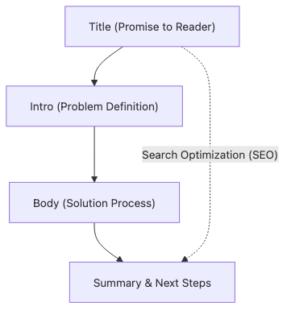

# Title and Structure

Some posts earn the click and lose the reader two scrolls later. Others contain useful material but hide it behind a vague title, so the right reader never opens them in the first place. Those failures look different, but they come from the same source: the title promised one thing while the structure delivered another.

A strong title is not just marketing copy. It compresses the reader action and the payoff. The structure is the route that gets the reader there with the least friction. That is why these two pieces should be designed together, not fixed separately at the end.

This is post 3 in the Technical Writing 101 series. It focuses on shaping titles, outlines, headings, and summaries as one system.

## Questions this post answers

- *SEO* titles
- *H heading* hierarchy
- *Intro, body, summary* shape
- Building an *outline*
- Handling *paragraphs*

## Why It Matters

The *title* earns the *click*, and the *structure* earns the *time*.

> Mental model: the title makes the promise, and the section order delivers it.

## Concept at a Glance



*Concept at a Glance*
## Key Terms

- **SEO title**: A *search-friendly title*.
- **outline**: A *draft table of contents*.
- **heading**: A *heading level*.
- **lede**: The *first paragraph*.
- **TL;DR**: *Too long, did not read* summary.

## Before/After

**Before**: "*FastAPI* notes".

**After**: "*Ship your first FastAPI endpoint in five minutes*".

## Run a quick scannability test on the outline

Compare these two skeletons.

```markdown
# FastAPI notes

## Overview
## Part 1
## Part 2
## Summary
```

```markdown
# Ship your first FastAPI endpoint in five minutes

## Why this matters
## Install
## Write the code
## Run and verify
## Common blockers
```

The second outline is stronger because the headings expose the route. The title promise continues into the H2s, the verification point is visible, and the likely blocker is named early. A simple test works well here: if a reader can skim only the title and H2s and still predict the next action, the structure is probably doing its job.

## Hands-on: A Skeleton for One Post

### Step 1 — Title

```python
title = "Ship your first FastAPI endpoint in five minutes"
```

### Step 2 — Outline

```python
outline = ["Install", "Code", "Run", "Verify", "Next step"]
```

### Step 3 — First paragraph

```python
lede = "Hello World in five minutes"
```

### Step 4 — Body headings

```markdown
## Install
## Code
## Run
```

### Step 5 — Summary

```python
summary = "Now you can ship your own endpoint"
```

## What to Notice in This Code

- The title has a *verb*.
- The outline has *five items or fewer*.
- The summary ends with an *action*.

## Five Common Mistakes

1. **A title with *only nouns*.**
2. **An outline that is *too deep*.**
3. **A *long* first paragraph.**
4. **No *summary*.**
5. **Multiple *H1* headings.**

## How This Shows Up in Production

News articles use the *inverted pyramid*, and technical blogs ask for *conclusion first* writing.

## How a Senior Engineer Thinks

- The title is a *promise*.
- The outline is a *map*.
- The summary points to an *action*.
- Paragraphs stay *short*.
- There is *one* H1.

## Checklist

- [ ] A *verb* in the title.
- [ ] *Five or fewer* outline items.
- [ ] *Three lines or fewer* in the first paragraph.
- [ ] A *one line* summary.

## Practice Problems

1. Write the definition of an *SEO title* in one line.
2. Write the meaning of *outline* in one line.
3. Write the meaning of *TL;DR* in one line.

## Wrap-up and Next Steps

The next post is *Explaining Concepts*.

<!-- toc:begin -->
- [What Is Technical Writing](./01-what-is-technical-writing.md)
- [Defining the Reader](./02-defining-the-reader.md)
- **Title and Structure (current)**
- Explaining Concepts (upcoming)
- Explaining Example Code (upcoming)
- Using Figures and Tables (upcoming)
- Writing the README (upcoming)
- Writing Tutorials (upcoming)
- Blog vs Documentation (upcoming)
- Pre-publish Checklist (upcoming)
<!-- toc:end -->

## References

- [On Writing Well - Zinsser](https://www.harpercollins.com/products/on-writing-well-william-zinsser)
- [The Elements of Style - Strunk & White](https://www.bartleby.com/141/)
- [Inverted Pyramid - Nielsen Norman Group](https://www.nngroup.com/articles/inverted-pyramid/)
- [Google Search Central Title Best Practices](https://developers.google.com/search/docs/appearance/title-link)

Tags: TechnicalWriting, Title, Structure, Outline, Beginner
