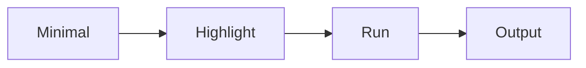

# Explaining Example Code

> Technical Writing 101 series (5/10)

<!-- a-grade-intro:begin -->

**Core question**: Why does pasting *code* still leave the *reader* lost?

> One *callout line* matters more than the *code* itself.

<!-- a-grade-intro:end -->

## What You Will Learn

- A *minimal* example
- Where to place *comments*
- Writing a *callout line*
- Showing the *input and output*
- Linking the *full code*

## Why It Matters

A *runnable* example must reach the reader's *hands* to teach.

## Concept at a Glance



## Key Terms

- **MWE**: A *Minimal Working Example*.
- **callout**: A *highlight line outside the code*.
- **inline comment**: A *comment inside the code*.
- **fixture**: *Example data*.
- **snippet**: A *short excerpt*.

## Before/After

**Before**: A 200 line code dump.

**After**: An 8 line *MWE* with a 2 line *callout*.

## Hands-on: One Example

### Step 1 — Minimal code

```python
def add(a, b):
    return a + b
```

### Step 2 — Callout

```python
# Highlight: take two numbers and return their sum
```

### Step 3 — Run

```bash
python3 -c "from m import add; print(add(2, 3))"
```

### Step 4 — Output

```text
5
```

### Step 5 — Link the full code

```python
full_code_url = "https://github.com/example/repo/blob/main/m.py"
```

## What to Notice in This Code

- The *code* is *minimal*.
- The *comment* sits *outside* the snippet.
- The *output* is *visible*.

## Five Common Mistakes

1. **Code that is *too long*.**
2. **Too many *comments*.**
3. **No *output* shown.**
4. **No *version* noted.**
5. **A snippet that *breaks on copy paste*.**

## How This Shows Up in Production

Open source README *Quick Start* sections nearly always follow the *MWE plus output* pattern.

## How a Senior Engineer Thinks

- The *code* is *minimal*.
- The *comment* lives *outside*.
- The *output* is *real*.
- The *version* is *pinned*.
- The *full code* is a *link*.

## Checklist

- [ ] An *MWE* of *ten lines or fewer*.
- [ ] A *callout* of *one or two lines*.
- [ ] *Output* is shown.
- [ ] *Version* is noted.

## Practice Problems

1. Write the meaning of *MWE* in one line.
2. Write the definition of *callout* in one line.
3. Write an example of a *fixture* in one line.

## Wrap-up and Next Steps

The next post is *Using Figures and Tables*.

<!-- toc:begin -->
- [What Is Technical Writing](./01-what-is-technical-writing.md)
- [Defining the Reader](./02-defining-the-reader.md)
- [Title and Structure](./03-title-and-structure.md)
- [Explaining Concepts](./04-explaining-concepts.md)
- **Explaining Example Code (current)**
- Using Figures and Tables (upcoming)
- Writing the README (upcoming)
- Writing Tutorials (upcoming)
- Blog vs Documentation (upcoming)
- Pre-publish Checklist (upcoming)
<!-- toc:end -->

## References

- [The Art of Readable Code - Boswell & Foucher](https://www.oreilly.com/library/view/the-art-of/9781449318482/)
- [Stack Overflow MCVE Guide](https://stackoverflow.com/help/minimal-reproducible-example)
- [Python Tutorial Style Guide](https://docs.python.org/3/tutorial/index.html)
- [Diátaxis Framework - Code Examples](https://diataxis.fr/)

Tags: TechnicalWriting, Code, Examples, Walkthrough, Beginner
