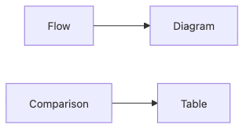
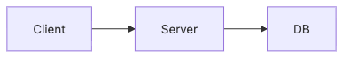
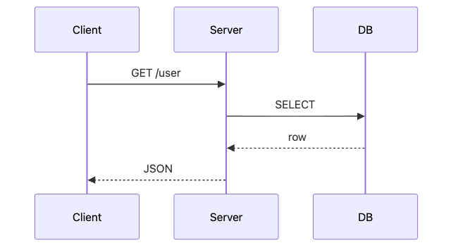

# Using Figures and Tables

Not every dense paragraph should become a diagram. Not every list of options deserves a table. The real skill is choosing the visual form that best answers the reader's question. If that choice is wrong, visuals add noise instead of clarity.

Figures are strongest when the reader needs direction, sequence, or system shape. Tables are strongest when the reader needs side-by-side differences, limits, and trade-offs. Once you see that split, visual choices stop feeling decorative and start feeling editorial.

This is post 6 in the Technical Writing 101 series. It covers when to use figures, when to use tables, and how captions and alt text make them readable.

## Questions this post answers

- *Flowcharts* and *sequence diagrams*
- *Comparison* and *decision* tables
- Writing *captions*
- Writing *alt text*
- *Resolution* and *accessibility*

## Why It Matters

One *figure* often replaces *five* paragraphs.

> Mental model: use a figure for flow and a table for side-by-side decisions.

## Concept at a Glance



*Concept at a Glance*
## Key Terms

- **flowchart**: A *flow diagram*.
- **sequence diagram**: A *sequence diagram*.
- **caption**: A *caption*.
- **alt text**: *Alternative text* for an image.
- **a11y**: *Accessibility*.

## Before/After

**Before**: "The *request* goes from *client* to *server* to *DB*..." (five lines)

**After**: One *flowchart*.

## Choose the visual from the reader's question

| Reader question | Better fit | Why |
| --- | --- | --- |
| Where does the request go? | Flowchart | Direction and order matter most. |
| Which option is cheaper? | Comparison table | Criteria need side-by-side alignment. |
| Where does the failure happen? | Sequence diagram | Timing and handoff points matter. |
| What policy should we choose? | Decision table | Trade-offs must stay visible at once. |

Captions should answer the same question. `Architecture diagram` is too broad to help. `Request path from client to API server and database` tells the reader what to extract before they even inspect the figure.

## Hands-on: A Figure and a Table

### Step 1 — Flowchart



*This flowchart shows the basic path from the client to the server and database.*
### Step 2 — Sequence



*This sequence diagram shows the call order between the client, server, and database.*
### Step 3 — Comparison table

```markdown
| Option | Speed | Cost |
| --- | --- | --- |
| A | Fast | High |
| B | Medium | Low |
```

### Step 4 — Caption

```markdown
*Figure 1*. Request flow from client to database.
```

### Step 5 — Alt text

```markdown

```

## What to Notice in This Code

- The *figure* shows *flow*.
- The *table* shows *comparison*.
- The *caption* is a *full sentence*.

## Five Common Mistakes

1. **No *figure* at all.**
2. **A *table* that is *too large*.**
3. **No *caption*.**
4. **No *alt text*.**
5. **Low *resolution*.**

## How This Shows Up in Production

Specs, architecture docs, and incident retros all combine *figures and tables*.

## How a Senior Engineer Thinks

- *Figures* for *flow*.
- *Tables* for *comparison*.
- *Captions* are *complete sentences*.
- *Alt text* is *required*.
- *Resolution* is *two times the display size*.

## Checklist

- [ ] At least *one figure*.
- [ ] *Seven rows or fewer* per table.
- [ ] *Caption* on every figure.
- [ ] *Alt text* on every figure.

## Practice Problems

1. Write the difference between *flowchart* and *sequence diagram* in one line.
2. Write the definition of *caption* in one line.
3. Write the meaning of *alt text* in one line.

## Wrap-up and Next Steps

The next post is *Writing the README*.

<!-- toc:begin -->
- [What Is Technical Writing](./01-what-is-technical-writing.md)
- [Defining the Reader](./02-defining-the-reader.md)
- [Title and Structure](./03-title-and-structure.md)
- [Explaining Concepts](./04-explaining-concepts.md)
- [Explaining Example Code](./05-explaining-example-code.md)
- **Using Figures and Tables (current)**
- Writing the README (upcoming)
- Writing Tutorials (upcoming)
- Blog vs Documentation (upcoming)
- Pre-publish Checklist (upcoming)
<!-- toc:end -->

## References

- [The Visual Display of Quantitative Information - Tufte](https://www.edwardtufte.com/tufte/books_vdqi)
- [Mermaid Diagram Syntax](https://mermaid.js.org/intro/)
- [Web Content Accessibility Guidelines](https://www.w3.org/WAI/standards-guidelines/wcag/)
- [Storytelling with Data - Knaflic](https://www.storytellingwithdata.com/)

Tags: TechnicalWriting, Diagrams, Tables, Visual, Beginner
