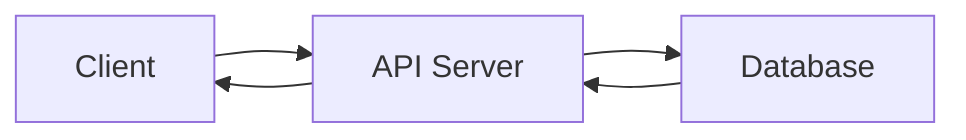
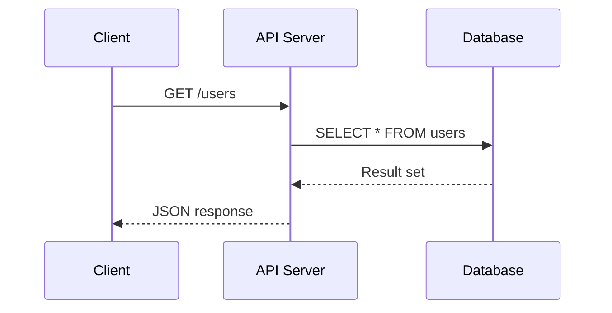

# Technical Writing 101 (6/10): Using Figures and Tables

Not every dense paragraph should become a diagram. Not every list of options deserves a table. The real skill is choosing the visual form that best answers the reader's question. If that choice is wrong, visuals add noise instead of clarity.

Figures are strongest when the reader needs direction, sequence, or system shape. Tables are strongest when the reader needs side-by-side differences, limits, and trade-offs. Once you see that split, visual choices stop feeling decorative and start feeling editorial.

This is the 6th post in the Technical Writing 101 series. It covers when to use figures, when to use tables, and how captions and alt text make them readable.


*technical writing 101 chapter 6 flow overview*
> A figure answers one question; a table makes side-by-side comparison possible; captions tie them both to the text.

## Questions to Keep in Mind

- When is a figure better than a paragraph?
- When does a table show comparison more clearly?
- Why are captions and alt text part of the content, not decoration?

## Why It Matters

One well-placed figure often replaces five paragraphs of directional prose. One comparison table lets readers make a decision in 10 seconds instead of re-reading three sections.

> Mental model: use a figure for flow and a table for side-by-side decisions.

## Key Terms

- **flowchart**: A diagram showing steps and decisions in sequence.
- **sequence diagram**: A diagram showing call order between participants over time.
- **caption**: A sentence below a figure that tells the reader what to extract from it.
- **alt text**: Alternative text that conveys the figure's meaning when the image cannot be displayed.
- **a11y**: Accessibility—designing content so all users can consume it.

## Before/After

**Before**: "The request goes from client to server to DB, then the DB returns the result to the server, which formats it and sends it back to the client..." (five lines of directional prose)

**After**: One flowchart with a one-sentence caption.

## Choose the Visual from the Reader's Question

| Reader question | Better fit | Why |
| --- | --- | --- |
| Where does the request go? | Flowchart | Direction and order matter most. |
| Which option is cheaper? | Comparison table | Criteria need side-by-side alignment. |
| Where does the failure happen? | Sequence diagram | Timing and handoff points matter. |
| What policy should we choose? | Decision table | Trade-offs must stay visible at once. |

## Diagram Type Selection Guide

| Diagram type | Best for | Strength | Recommended tool |
| --- | --- | --- | --- |
| Flowchart | Request flow, decision branches, process steps | Shows direction and conditions intuitively | Mermaid, draw.io |
| Sequence Diagram | Inter-service call order, timing | Reveals call order and response relationships | Mermaid, PlantUML |
| ER Diagram | Database structure, entity relationships | Shows table relationships at a glance | dbdiagram.io, ERDPlus |
| Architecture Diagram | System components, deployment layout | Expresses boundaries and responsibility separation | draw.io, Lucidchart |
| State Diagram | State transitions, workflow phases | Clarifies state changes and conditions | Mermaid, PlantUML |

Before choosing a tool, clarify which question you are answering. If you want to show where a request goes, use a flowchart. If you need to show who calls whom and when, use a sequence diagram.

## Table Design Principles

Tables are powerful for side-by-side comparison, but a poorly designed table creates confusion. Follow these principles:

### 1. Put comparison subjects in rows

Readers scan left to right. Place options (A, B, C) as rows and criteria (Speed, Cost, Complexity) as columns.

### 2. Order columns by importance

Put the most critical criterion on the left. If cost drives the decision, place Cost before Speed.

### 3. Put units in the header

Instead of repeating `100ms`, `50ms` in every cell, write `Latency (ms)` in the column header once.

### 4. Keep cell content short

If a cell needs three lines, the information probably belongs in prose, not a table. Tables are summary tools, not explanation containers.

## Caption Writing

A caption explains what the figure shows in one sentence. A good caption lets a skimming reader recover the context without reading surrounding paragraphs.

### Good caption

```markdown
*Request path from client through API server to database and back.*
```

This caption names who (client), what (request), where (API server → database), and how (path).

### Bad caption

```markdown
*Architecture diagram*
```

This only names the diagram type. It does not tell the reader what to look for.

### Caption vs Alt Text

- **Caption**: Explains what the visual shows. All readers see it.
- **Alt text**: Replaces the image when it cannot be displayed (screen readers, broken images). Accessibility tools read it.

Both are required. Captions are part of the editorial flow; alt text is an accessibility requirement.

## Mermaid Code Examples

Mermaid draws diagrams from code—easy to version-control and review in pull requests.

### Flowchart example



This code shows a four-step request path: client to API server, API to database, and back.

### Sequence diagram example



Solid arrows represent requests; dashed arrows represent responses.

## Resolution and Accessibility Guide

Images should be prepared at 2× the display size for retina displays.

### Recommended resolution

| Display size | Actual image resolution | Ratio |
| --- | --- | --- |
| 800×600px | 1600×1200px | 2× |
| 1200×800px | 2400×1600px | 2× |

### Accessibility checklist

- [ ] Every image has alt text.
- [ ] Every caption is a complete sentence.
- [ ] Information is not conveyed by color alone.
- [ ] Contrast ratio is at least 4.5:1.

## Integrating Figures and Tables into Prose

Figures and tables should appear naturally within the reading flow, not as appendices.

### 1. Provide context before the figure

One sentence before the figure tells the reader what to look for:

```markdown
The following diagram shows the full request path from client to database and back.


```

### 2. Summarize after the figure

Two to three sentences below the figure state the key takeaway:

```markdown


*Request path from client through API server to database.*

The API server validates the request; the database returns the actual data. The response travels the same path in reverse.
```

### 3. State comparison criteria before the table

Tell readers what they are comparing before they see the table:

```markdown
The following table compares three deployment options by speed, cost, and complexity.

| Option | Speed | Cost | Complexity |
| --- | --- | --- | --- |
| A | Fast | High | Low |
| B | Medium | Medium | Medium |
| C | Slow | Low | High |
```

### 4. Use figure numbers only in long documents

Blog posts and short docs rarely need "Figure 1." Reserve numbered figures for specifications and academic papers.

## Practical Case Study: Choosing the Right Diagram

The same API server can be explained with different diagrams depending on the reader's question:

| Reader question | Diagram type | What it shows |
| --- | --- | --- |
| "How is the API structured?" | Architecture Diagram | System boundaries, components, external dependencies |
| "How is a request processed?" | Flowchart | Step-by-step from entry to response, including branches |
| "What's the call order between services?" | Sequence Diagram | Who calls whom, when, and what comes back |
| "How are database tables connected?" | ER Diagram | Tables, columns, foreign key relationships |

## Diagram Tool Selection

| Situation | Recommended tool | Reason |
| --- | --- | --- |
| Version control matters | Mermaid | Text-based, Git-friendly |
| Complex architecture | draw.io | Free, rich icon library |
| Team collaboration | Lucidchart | Real-time collaboration, cloud |
| Database design | dbdiagram.io | ERD-specialized, fast generation |

## Caption Correction Examples

| Before | After |
| --- | --- |
| Architecture diagram | Request path from client through API gateway, service, and database to response |
| Deployment table | Comparison of three deployment methods by setup cost, operational difficulty, and incident response speed |

## Hands-on: A Figure and a Table

### Step 1 — Flowchart


*This flowchart shows the basic path from the client to the server and database.*

### Step 2 — Sequence diagram


*This sequence diagram shows the call order between the client, server, and database.*

### Step 3 — Comparison table

```markdown
| Option | Speed | Cost |
| --- | --- | --- |
| A | Fast | High |
| B | Medium | Low |
```

### Step 4 — Caption

```markdown
*Figure 1. Request flow from client to database.*
```

### Step 5 — Alt text

```markdown

```

## What to Notice in This Code

- The figure shows flow.
- The table shows comparison.
- The caption is a full sentence.

## Five Common Mistakes

1. **No figure at all.** When flow matters, prose alone is slow.
2. **A table that is too large.** Seven rows max; beyond that, split or summarize.
3. **No caption.** Readers cannot skim without one.
4. **No alt text.** Accessibility fails silently.
5. **Low resolution.** Blurry diagrams erode trust.

## How This Shows Up in Production

Specs, architecture docs, and incident retros all combine figures and tables. Flows go in diagrams; options go in tables. Teams that follow this split produce documents readers finish instead of skim.

## How a Senior Engineer Thinks

- Figures for flow.
- Tables for comparison.
- Captions are complete sentences.
- Alt text is required.
- Resolution is two times the display size.

## Checklist

- [ ] At least one figure.
- [ ] Seven rows or fewer per table.
- [ ] Caption on every figure.
- [ ] Alt text on every figure.
- [ ] Context sentence before the figure.
- [ ] Color is not the only differentiator.

## Practice Problems

1. Write the difference between *flowchart* and *sequence diagram* in one line.
2. Write the definition of *caption* in one line.
3. Write the meaning of *alt text* in one line.

## Wrap-up and Next Steps

The next post is *Writing the README*—how to make a new visitor run the project in under five minutes.

## Answering the Opening Questions

- **When is a figure better than a paragraph?**
  Figures convey structure faster than text when sequence and boundaries matter. Request flows, responsibility boundaries, and branching conditions—anything with directionality—transfer understanding faster as diagrams.
- **When does a table show comparison more clearly?**
  Tables place multiple options side by side against the same criteria, reducing decision time. Use them whenever readers need to compare 3+ items across 2+ dimensions.
- **Why are captions and alt text part of the content, not decoration?**
  Captions direct the reader's eye to what matters in the figure; alt text conveys meaning in accessibility contexts. Both contribute to content quality.

<!-- toc:begin -->
## In this series

- [Technical Writing 101 (1/10): What Is Technical Writing](./01-what-is-technical-writing.md)
- [Technical Writing 101 (2/10): Defining the Reader](./02-defining-the-reader.md)
- [Technical Writing 101 (3/10): Title and Structure](./03-title-and-structure.md)
- [Technical Writing 101 (4/10): Explaining Concepts](./04-explaining-concepts.md)
- [Technical Writing 101 (5/10): Explaining Example Code](./05-explaining-example-code.md)
- **Using Figures and Tables (current)**
- Writing the README (upcoming)
- Writing Tutorials (upcoming)
- Blog vs Documentation (upcoming)
- Pre-publish Checklist (upcoming)

<!-- toc:end -->

## References

- [The Visual Display of Quantitative Information - Tufte](https://www.edwardtufte.com/tufte/books_vdqi)
- [Mermaid Diagram Syntax](https://mermaid.js.org/intro/)
- [Web Content Accessibility Guidelines](https://www.w3.org/WAI/standards-guidelines/wcag/)
- [Storytelling with Data - Knaflic](https://www.storytellingwithdata.com/)

Tags: TechnicalWriting, Diagrams, Tables, Visual, Beginner
