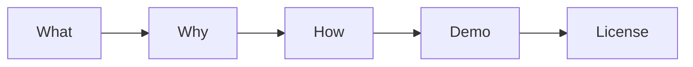

# Writing the README

This is post 7 in the Technical Writing 101 series.

> Technical Writing 101 series (7/10)

<!-- a-grade-intro:begin -->

**Core question**: Can a *first-time visitor* run the project in *five minutes* using only the *README*?

> A *kind entrance* makes the whole *house* feel *kind*.

<!-- a-grade-intro:end -->

## What You Will Learn

- The *five part* structure
- Writing the *Quick Start*
- Using *badges*
- Adding an *FAQ*
- Stating the *license*

## Why It Matters

The *README* is the *first impression* of a project.

## Concept at a Glance



## Key Terms

- **What**: What it *is*.
- **Why**: *Why* it was built.
- **How**: *How* to use it.
- **Demo**: Proof it *works*.
- **License**: The *legal terms*.

## Before/After

**Before**: "A *Python* package called *Hello*."

**After**: A README with all *five* parts.

## Hands-on: Five README Parts

### Step 1 — What

```markdown
# greeter
A small greeting library.
```

### Step 2 — Why

```markdown
## Why
I wanted multilingual greetings in a single line.
```

### Step 3 — How

```bash
pip install greeter
python3 -c "from greeter import hello; print(hello('en'))"
```

### Step 4 — Demo

```text
Hello!
```

### Step 5 — License

```markdown
## License
MIT
```

## What to Notice in This Code

- All *five* parts are present.
- The *commands* are *copy paste safe*.
- The *result* is *visible*.

## Five Common Mistakes

1. **Missing *Why*.**
2. **A *long* Quick Start.**
3. **No *demo result*.**
4. **No *license*.**
5. **No *screenshots*.**

## How This Shows Up in Production

Most trending GitHub projects follow nearly the same *five part* pattern.

## How a Senior Engineer Thinks

- Runnable in *five minutes*.
- *Why* in one line.
- Commands run *as written*.
- License is *stated*.
- At least *one screenshot*.

## Checklist

- [ ] All *five* parts.
- [ ] *Quick Start* of *five lines or fewer*.
- [ ] *Demo result* shown.
- [ ] *License* stated.

## Practice Problems

1. Write the definition of *What* in one line.
2. Write the meaning of *Demo* in one line.
3. Write an example of a *License* in one line.

## Wrap-up and Next Steps

The next post is *Writing Tutorials*.

<!-- toc:begin -->
- [What Is Technical Writing](./01-what-is-technical-writing.md)
- [Defining the Reader](./02-defining-the-reader.md)
- [Title and Structure](./03-title-and-structure.md)
- [Explaining Concepts](./04-explaining-concepts.md)
- [Explaining Example Code](./05-explaining-example-code.md)
- [Using Figures and Tables](./06-using-figures-and-tables.md)
- **Writing the README (current)**
- Writing Tutorials (upcoming)
- Blog vs Documentation (upcoming)
- Pre-publish Checklist (upcoming)
<!-- toc:end -->

## References

- [Make a README - GitHub](https://www.makeareadme.com/)
- [Standard README - RichardLitt](https://github.com/RichardLitt/standard-readme)
- [Awesome README - matiassingers](https://github.com/matiassingers/awesome-readme)
- [Choose a License](https://choosealicense.com/)

Tags: TechnicalWriting, README, OpenSource, Documentation, Beginner
