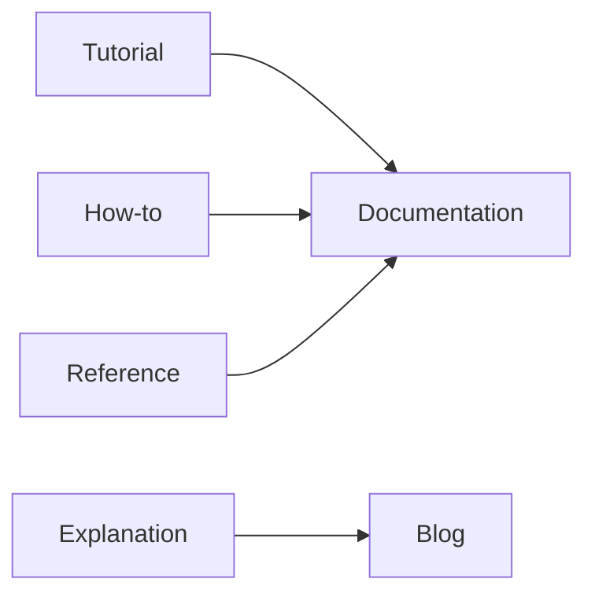

# Blog vs Documentation

This is post 9 in the Technical Writing 101 series.

> Technical Writing 101 series (9/10)

<!-- a-grade-intro:begin -->

**Core question**: Why must *blogs* and *official docs* not be *mixed up*?

> Their *lifespan* and *ownership* differ.

<!-- a-grade-intro:end -->

## What You Will Learn

- The four quadrants of *Diátaxis*
- The *lifespan* of blog vs docs
- What *blogs* do well
- What *docs* do well
- *Linking* the two

## Why It Matters

When *kinds of writing* mix up, the *reader* gets *lost*.

## Concept at a Glance



## Key Terms

- **Diátaxis**: A *four quadrant* documentation model.
- **lifecycle**: The *life cycle*.
- **freshness**: *How current* the content is.
- **canonical**: The *official source*.
- **archive**: *Storage* of older posts.

## Before/After

**Before**: A *blog post* gets cited as *official documentation*.

**After**: *Blogs* hold *experience*; *docs* hold *truth*.

## Hands-on: Mapping the Quadrants

### Step 1 — Tutorial

```python
tutorial = "First-time learning"
```

### Step 2 — How-to

```python
how_to = "Solving a specific problem"
```

### Step 3 — Reference

```python
reference = "API specification"
```

### Step 4 — Explanation

```python
explanation = "Why a design was chosen"
```

### Step 5 — Blog vs docs

```python
blog = "My experience and opinion"
docs = "The team's official truth"
```

## What to Notice in This Code

- *Blogs* hold *experience*.
- *Docs* hold *truth*.
- They split into *four quadrants*.

## Five Common Mistakes

1. **Citing a *blog* as *official docs*.**
2. **Letting the *docs* go *stale*.**
3. **Not stating the *version*.**
4. **No *archive* policy.**
5. **No *canonical* link.**

## How This Shows Up in Production

Engineering teams *separate* blogs from docs and *version control* the docs alongside the *code*.

## How a Senior Engineer Thinks

- *Blogs* capture *past decisions*.
- *Docs* are the *living truth*.
- Old posts go to the *archive*.
- The *canonical* source is in the *docs*.
- *Blogs* link to *docs*.

## Checklist

- [ ] *Four quadrant* mapping.
- [ ] *Freshness* shown.
- [ ] *Canonical* link.
- [ ] *Archive* policy.

## Practice Problems

1. Write the four quadrants of *Diátaxis* in one line.
2. Write the meaning of *canonical* in one line.
3. Write the definition of *freshness* in one line.

## Wrap-up and Next Steps

The next post is *Pre-publish Checklist*.

<!-- toc:begin -->
- [What Is Technical Writing](./01-what-is-technical-writing.md)
- [Defining the Reader](./02-defining-the-reader.md)
- [Title and Structure](./03-title-and-structure.md)
- [Explaining Concepts](./04-explaining-concepts.md)
- [Explaining Example Code](./05-explaining-example-code.md)
- [Using Figures and Tables](./06-using-figures-and-tables.md)
- [Writing the README](./07-writing-the-readme.md)
- [Writing Tutorials](./08-writing-tutorials.md)
- **Blog vs Documentation (current)**
- Pre-publish Checklist (upcoming)
<!-- toc:end -->

## References

- [Diátaxis - Procida](https://diataxis.fr/)
- [Docs Like Code - Anne Gentle](https://www.docslikecode.com/)
- [Docs as Code - Write the Docs](https://www.writethedocs.org/guide/docs-as-code/)
- [Stripe Engineering Blog](https://stripe.com/blog/engineering)

Tags: TechnicalWriting, Blog, Documentation, Diataxis, Beginner
