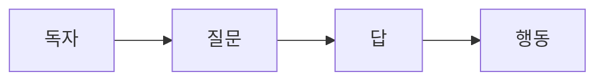

# 기술 글쓰기란 무엇인가

## 이 글에서 다룰 문제

- 기술 글쓰기는 일반 글쓰기와 무엇이 다를까요?
- 기술 글은 왜 설명에서 끝나지 않고 독자의 행동까지 이어져야 할까요?
- 독자, 작업, 결과, 범위를 먼저 정리하면 글이 어떻게 또렷해질까요?
- 짧은 단락 하나를 써도 기술 글의 기본 구조를 만들 수 있을까요?

> 기술 글은 정보를 전달하는 글이 아니라, 독자가 다음 행동을 할 수 있게 만드는 글입니다.

> 기술 글쓰기 101 시리즈 (1/10)

처음 기술 글을 쓸 때는 흔히 “정확하게만 쓰면 되겠지”라고 생각합니다. 하지만 실제로 독자가 원하는 것은 정확한 문장 그 자체가 아니라, 그 문장을 읽은 뒤 바로 따라 할 수 있는 다음 행동입니다. 설치를 하든, 오류를 고치든, 개념을 이해하든, 기술 글은 늘 독자의 손을 움직이게 해야 합니다.

그래서 기술 글은 일상 글과 출발점이 다릅니다. 일상 글은 생각을 표현하는 데서 출발할 수 있지만, 기술 글은 독자의 질문과 작업에서 출발합니다. 글쓴이가 하고 싶은 말을 앞세우는 대신, 독자가 지금 무엇을 해야 하는지부터 정리해야 합니다.

## 왜 중요한가

코드는 바뀌어도 설명은 오래 남습니다. 팀 위키, README, 사내 운영 문서, 튜토리얼, 블로그 글은 한 번 쓰고 끝나는 텍스트가 아닙니다. 누군가 몇 달 뒤에 다시 읽고, 그 글을 기준으로 환경을 만들고, 배포를 하고, 장애를 확인합니다. 처음 쓸 때 애매하게 적어 둔 문장이 나중에는 그대로 작업 비용이 됩니다.

좋은 기술 글은 독자의 시간을 절약합니다. 어떤 도구를 써야 하는지, 어디까지 따라 하면 되는지, 성공했는지 어떻게 확인하는지, 다음에는 무엇을 보면 되는지를 한 번에 알려 주기 때문입니다. 반대로 나쁜 기술 글은 읽는 데 오래 걸릴 뿐 아니라, 읽고 나서도 행동으로 이어지지 않습니다.

## 한눈에 보는 흐름

기술 글의 기본 흐름은 단순합니다. 독자가 질문을 가져오고, 글이 답을 주고, 그 답이 행동으로 이어집니다.



이 흐름이 중요한 이유는 분명합니다. 질문은 있는데 행동이 없으면 설명만 남습니다. 행동은 있는데 질문이 맞지 않으면 엉뚱한 해결책이 됩니다. 기술 글은 이 둘을 정확히 이어 주는 연결 장치여야 합니다.

## 핵심 용어

- **기술 글쓰기**: 기술 정보를 전달해 독자가 실제 작업을 하게 만드는 글쓰기입니다.
- **독자**: 이 글을 읽는 사람입니다. 초보자일 수도 있고, 팀 동료일 수도 있습니다.
- **작업**: 독자가 글을 읽고 수행해야 하는 일입니다.
- **결과**: 작업이 성공했을 때 눈으로 확인할 수 있는 상태입니다.
- **범위**: 이 글이 어디까지 다루고 어디까지 다루지 않는지를 정한 경계입니다.

이 다섯 가지를 먼저 정하면 글이 훨씬 단단해집니다. 특히 입문 글일수록 범위를 좁게 잡는 편이 좋습니다. 한 글에서 모든 것을 다 설명하려 하면 오히려 독자가 아무것도 못 가져갑니다.

## Before / After

같은 내용을 써도 기술 글답게 보이는 문장과 그렇지 않은 문장은 분명히 다릅니다.

**Before**: "Python은 좋은 언어다."

**After**: "초보자는 5분 안에 Hello World를 실행할 수 있다."

앞 문장은 의견에 가깝습니다. 누가 읽어도 다음 행동이 보이지 않습니다. 뒤 문장은 독자, 시간, 목표가 모두 드러납니다. 기술 글은 대개 이런 식으로 구체적인 작업과 결과를 앞에 둡니다.

## 실습: 짧은 기술 단락 만들기

이제 아주 작은 예시로 기술 글의 뼈대를 만들어 보겠습니다.

### 1단계 — 독자 정하기

```python
audience = "Python beginners"
```

독자가 불분명하면 설명 깊이도, 예제 난이도도, 용어 선택도 모두 흔들립니다. “누구를 위한 글인가”는 제목만큼 중요합니다.

### 2단계 — 작업 정하기

```python
task = "Create and activate a virtual environment"
```

한 글에는 한 작업이 가장 좋습니다. 기술 글을 처음 쓸수록 작업 단위를 작게 잡아야 합니다. 그래야 글이 튀지 않고, 독자도 따라가기 쉽습니다.

### 3단계 — 명령 제시하기

```bash
python3 -m venv .venv
source .venv/bin/activate
```

명령은 가능한 한 그대로 복사해 실행할 수 있어야 합니다. 설명은 뒤에서 붙일 수 있지만, 명령이 먼저 깨지면 독자는 그 자리에서 이탈합니다.

### 4단계 — 결과 보여 주기

```python
result = "(.venv) shows up in the prompt"
```

기술 글에서 결과는 선택이 아닙니다. 성공했는지 독자가 직접 확인할 수 있어야 하기 때문입니다. “잘 설치되면 됩니다”처럼 흐린 문장보다, 프롬프트나 출력처럼 눈에 보이는 기준이 훨씬 낫습니다.

### 5단계 — 다음 행동 연결하기

```python
next_step = "pip install requests"
```

좋은 기술 글은 현재 작업을 끝내는 동시에 다음 작업으로 독자를 부드럽게 넘깁니다. 여기서 글의 흐름이 시리즈로 이어지기도 하고, README의 다음 절로 이어지기도 합니다.

## 이 예시에서 봐야 할 점

- 독자가 가장 먼저 등장합니다.
- 명령은 짧고 복사하기 쉽습니다.
- 결과는 눈으로 확인할 수 있습니다.
- 다음 단계가 바로 이어집니다.

이 네 가지가 갖춰지면 문단이 짧아도 기술 글의 기본 역할은 해냅니다. 길고 화려한 설명보다 이 기본기가 더 중요합니다.

## 자주 하는 실수 다섯 가지

1. 독자를 넓게 잡아 설명 난이도가 중간에서 떠버립니다.
2. 배경 설명이 너무 길어 실제 작업이 뒤로 밀립니다.
3. 복사해 붙여 넣으면 깨지는 명령을 그대로 올립니다.
4. 결과를 보여 주지 않아 성공 여부를 독자가 추측하게 만듭니다.
5. 다음에 무엇을 해야 하는지 적지 않아 글이 중간에서 끊깁니다.

기술 글은 친절해야 하지만 장황할 필요는 없습니다. 독자가 지금 필요한 최소 단위를 정확히 전달하면 됩니다.

## 실무에서는 이렇게 드러납니다

회사 내부 문서, 오픈소스 README, 장애 대응 런북, 발표 자료까지 모두 기술 글의 범주에 들어갑니다. 형태는 달라도 공통점은 같습니다. 읽는 사람이 뭔가를 이해하거나 실행하거나 판단해야 한다는 점입니다.

특히 팀 문서에서는 “설명은 잘했는데 작업은 못 한다”는 상태가 가장 위험합니다. 문서는 읽기 위한 산문이 아니라, 작업을 줄이기 위한 도구이기 때문입니다.

## 시니어 엔지니어는 이렇게 생각합니다

- 독자의 시간을 먼저 아낍니다.
- 명령은 문서에 적힌 그대로 동작해야 한다고 봅니다.
- 결과 확인 방법까지 문서의 일부로 봅니다.
- 오래된 정보는 남겨 두기보다 지웁니다.
- 다음 단계나 관련 문서를 연결해 흐름을 만듭니다.

결국 시니어 관점의 기술 글은 많이 쓰는 글이 아니라, 읽는 사람이 덜 헤매게 만드는 글입니다.

## 체크리스트

- [ ] 독자가 한 문장으로 드러나는가
- [ ] 작업이 하나로 좁혀져 있는가
- [ ] 명령을 그대로 실행할 수 있는가
- [ ] 성공 결과를 눈으로 확인할 수 있는가
- [ ] 다음 단계가 자연스럽게 이어지는가

## 연습 문제

1. 기술 글쓰기의 정의를 한 줄로 다시 써 보세요.
2. 독자와 작업의 차이를 한 줄씩 설명해 보세요.
3. 결과를 보여 주는 문장이 왜 필요한지 예를 들어 적어 보세요.

## 정리 및 다음 단계

기술 글은 정보 전달에서 끝나지 않습니다. 독자의 질문을 해결하고, 실제 행동까지 이어 줘야 비로소 제 역할을 합니다. 그래서 좋은 기술 글은 독자, 작업, 명령, 결과, 다음 단계가 분명합니다.

다음 글에서는 같은 내용을 써도 누구에게 쓰느냐에 따라 문장이 어떻게 달라지는지 살펴보겠습니다. 다음 글은 **독자 정의하기**입니다.

<!-- toc:begin -->
- **기술 글쓰기란 무엇인가 (현재 글)**
- 독자 정의하기 (예정)
- 제목과 구조 잡기 (예정)
- 개념 설명하기 (예정)
- 예제 코드 설명하기 (예정)
- 그림과 표 사용하기 (예정)
- README 작성하기 (예정)
- 튜토리얼 작성하기 (예정)
- 블로그와 문서 차이 (예정)
- 발행 전 체크리스트 (예정)
<!-- toc:end -->

## 참고 자료

- [Docs for Developers - Bhatti et al.](https://docsfordevelopers.com/)
- [Google Developer Documentation Style Guide](https://developers.google.com/style)
- [Microsoft Writing Style Guide](https://learn.microsoft.com/en-us/style-guide/welcome/)
- [Write the Docs Community](https://www.writethedocs.org/)

Tags: TechnicalWriting, Writing, Documentation, Communication, Beginner
