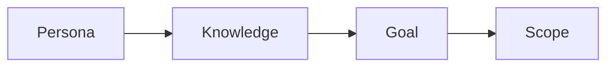

# 독자 정의하기

> 기술 글쓰기 101 시리즈 (2/10)


## 이 글에서 다룰 문제

독자가 흐릿하면 문장도 흐릿해집니다.

## 전체 흐름


## Before/After

**Before**: "개발자를 위한 글."

**After**: "*Python 1년차*, *FastAPI* 입문자를 위한 글."

## 페르소나 카드

### 1단계 — 이름과 직무

```python
persona = {"name": "지민", "role": "Python 1년차 백엔드"}
```

### 2단계 — 전제 지식

```python
knows = ["변수", "함수", "git basics"]
```

### 3단계 — 모르는 것

```python
unknown = ["async", "타입 힌트"]
```

### 4단계 — 목표

```python
goal = "FastAPI 로 첫 엔드포인트 띄우기"
```

### 5단계 — 비목표

```python
non_goal = ["배포", "DB 마이그레이션"]
```

## 이 코드에서 주목할 점

- 이름이 있습니다.
- 모르는 것이 드러납니다.
- 비목표가 분명합니다.

## 자주 하는 실수 5가지

1. **모두를 대상으로 잡습니다.**
2. **전제 지식을 적지 않습니다.**
3. **목표가 추상적입니다.**
4. **비목표가 없습니다.**
5. **예시가 너무 어렵습니다.**

## 실무에서는 이렇게 쓰입니다

API 레퍼런스, 사용자 가이드, 튜토리얼은 모두 페르소나 단위로 분리됩니다.

## 체크리스트

- [ ] 페르소나 1명을 정했는가
- [ ] 전제 지식 3개를 적었는가
- [ ] 목표를 한 줄로 썼는가
- [ ] 비목표를 1개 이상 적었는가

## 정리 및 다음 단계

다음 글은 제목과 구조 잡기입니다.

<!-- toc:begin -->
- [기술 글쓰기란 무엇인가](./01-what-is-technical-writing.md)
- **독자 정의하기 (현재 글)**
- 제목과 구조 잡기 (예정)
- 개념 설명하기 (예정)
- 예제 코드 설명하기 (예정)
- 그림과 표 사용하기 (예정)
- README 작성하기 (예정)
- 튜토리얼 작성하기 (예정)
- 블로그와 문서 차이 (예정)
- 발행 전 체크리스트 (예정)
<!-- toc:end -->

## 참고 자료

- [The Persona Lifecycle - Pruitt & Adlin](https://www.elsevier.com/books/the-persona-lifecycle/pruitt/978-0-12-566251-2)
- [About Face - Cooper et al.](https://www.wiley.com/en-us/About+Face%3A+The+Essentials+of+Interaction+Design%2C+4th+Edition-p-9781118766576)
- [Nielsen Norman Group on Personas](https://www.nngroup.com/articles/persona/)
- [Writing for Developers - Karl Hughes](https://www.writingfordevelopers.com/)

Tags: TechnicalWriting, Audience, Persona, Writing, Beginner
