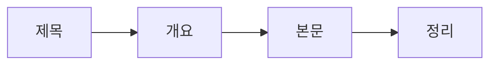

# 제목과 구조 잡기

## 이 글에서 다룰 문제

- 좋은 제목은 왜 클릭만이 아니라 기대치를 정하는 약속일까요?
- 제목이 좋아도 구조가 나쁘면 왜 독자는 끝까지 읽지 못할까요?
- 기술 글에서 제목, 개요, 첫 단락, 본문 헤딩, 정리는 어떤 순서로 맞물릴까요?
- 짧은 글이라도 읽기 쉬운 뼈대를 미리 만들 수 있을까요?

> 제목은 약속이고, 구조는 그 약속을 실제로 전달하는 방식입니다.

> 기술 글쓰기 101 시리즈 (3/10)

제목이 좋아 보이는데 글을 읽고 나면 허전한 경우가 있습니다. 대개는 제목이 약속한 것을 구조가 받쳐 주지 못했기 때문입니다. 반대로 내용은 좋은데 제목이 흐리면 독자는 아예 글을 열지 않습니다. 기술 글에서 제목과 구조는 따로 움직이지 않습니다.

실무 글일수록 이 연결이 더 중요합니다. 독자는 여유 있게 감상하려고 들어오는 것이 아니라, 지금 필요한 정보를 빠르게 찾으려고 들어오기 때문입니다. 제목으로 방향을 파악하고, 구조로 필요한 위치를 찾고, 마지막에는 바로 행동으로 옮기려 합니다.

## 왜 중요한가

제목은 클릭을 만들고, 구조는 체류 시간을 만듭니다. 둘 중 하나만 좋아서는 부족합니다. 제목만 세고 구조가 흐리면 낚인 느낌이 남고, 구조만 좋아도 제목이 약하면 독자에게 발견되지 않습니다.

특히 기술 글에서는 제목이 독자의 검색어와 맞닿아야 합니다. 그리고 본문 구조는 독자가 스캔하면서도 길을 잃지 않게 만들어야 합니다. 설치, 코드, 실행, 검증처럼 순서가 드러나는 구조가 좋은 이유도 여기에 있습니다.

## 한눈에 보는 흐름

좋은 기술 글은 대체로 다음 순서로 흘러갑니다.



제목이 글의 목적을 잡고, 개요가 독자에게 지도를 주고, 본문이 약속한 내용을 전달하고, 마지막 정리가 다음 행동을 제시합니다. 구조를 먼저 잡으면 문장을 쓰는 동안 길을 잃을 일이 크게 줄어듭니다.

## 핵심 용어

- **SEO 제목**: 검색과 공유 상황에서 잘 드러나는 제목입니다.
- **개요**: 글의 큰 흐름을 미리 적어 둔 초안입니다.
- **헤딩**: 본문을 구분하는 제목 계층입니다.
- **리드 문단**: 글을 연 직후 독자에게 맥락을 주는 첫 단락입니다.
- **요약**: 긴 설명을 읽지 못한 독자도 핵심을 가져갈 수 있게 만드는 마무리입니다.

이 용어를 알고 나면 글을 쓸 때 막연히 “잘 정리해야지”라고 생각하는 대신, 제목과 구조를 개별 부품처럼 다룰 수 있습니다.

## Before / After

**Before**: "FastAPI 정리"

**After**: "FastAPI로 5분 안에 첫 엔드포인트 띄우기"

앞 제목은 주제가 넓고 결과가 보이지 않습니다. 뒤 제목은 도구, 시간, 결과가 드러납니다. 독자는 이 제목만 보고도 “내가 얻는 것이 무엇인지”를 알 수 있습니다.

## 실습: 글 한 편의 뼈대 만들기

### 1단계 — 제목 쓰기

```python
title = "Ship your first FastAPI endpoint in five minutes"
```

제목에는 가능하면 동사가 들어가는 편이 좋습니다. 기술 글은 상태보다 행동을 설명하는 경우가 많기 때문입니다. “개요”, “정리”, “메모”보다 “실행하기”, “만들기”, “검증하기”가 독자에게 더 분명합니다.

### 2단계 — 개요 잡기

```python
outline = ["Install", "Code", "Run", "Verify", "Next step"]
```

개요는 다섯 항목 안팎이면 대개 충분합니다. 항목이 너무 많아지면 한 글의 범위가 넓다는 신호일 수 있습니다. 이때는 글을 둘로 나누는 편이 낫습니다.

### 3단계 — 첫 단락 쓰기

```python
lede = "Hello World in five minutes"
```

첫 단락은 짧아야 합니다. 여기서 독자는 “내가 맞는 글을 열었는가”를 판단합니다. 배경 설명을 길게 늘이기보다 얻을 결과를 먼저 보여 주는 편이 좋습니다.

### 4단계 — 본문 헤딩 만들기

```markdown
## Install
## Code
## Run
```

헤딩은 독자를 위한 표지판입니다. 평서문으로 길게 쓰기보다, 지금 무엇을 하는 단계인지 바로 보이게 적는 편이 낫습니다.

### 5단계 — 정리 적기

```python
summary = "Now you can ship your own endpoint"
```

정리는 단순 반복이 아닙니다. 독자가 무엇을 얻었는지, 다음에는 어디로 가야 하는지를 짧게 묶어 주는 문장입니다.

## 이 예시에서 봐야 할 점

- 제목에는 동사가 들어 있습니다.
- 개요는 다섯 항목 안에서 정리됩니다.
- 첫 단락은 결과를 빠르게 보여 줍니다.
- 정리는 다음 행동으로 닫힙니다.

이 네 가지가 맞물리면 글이 짧아도 읽기 쉽습니다. 글을 잘 쓰는 것보다 먼저, 길을 잘 만드는 것이 중요합니다.

## 자주 하는 실수 다섯 가지

1. 명사만 늘어놓은 제목으로 글의 목적이 흐려집니다.
2. 헤딩 계층이 너무 깊어 독자가 어디에 있는지 잊습니다.
3. 첫 단락이 길어 본론 진입이 늦어집니다.
4. 정리가 없어 읽고 나서 남는 행동이 없습니다.
5. H1을 여러 개 써 문서 구조를 스스로 깨뜨립니다.

특히 기술 글에서는 구조가 곧 사용성입니다. 읽기 편한 글이 아니라, 찾기 쉬운 글을 먼저 만들어야 합니다.

## 실무에서는 이렇게 드러납니다

뉴스 기사는 역피라미드 구조를 쓰고, 기술 블로그는 결론을 앞당겨 배치하는 경우가 많습니다. 둘 다 이유는 같습니다. 독자가 처음부터 끝까지 순서대로 읽는다고 가정하지 않기 때문입니다.

사내 문서나 블로그에서도 마찬가지입니다. 제목으로 찾히고, 헤딩으로 탐색되고, 정리에서 행동이 이어지는 글이 오래 살아남습니다.

## 시니어 엔지니어는 이렇게 생각합니다

- 제목은 독자와 한 약속입니다.
- 개요는 글의 지도입니다.
- 각 헤딩은 하나의 질문에 답해야 합니다.
- 문단은 짧아야 스캔하기 쉽습니다.
- 문서에는 H1이 하나여야 합니다.

시니어가 구조를 먼저 보는 이유는, 내용이 좋아도 구조가 무너지면 팀 전체가 읽는 비용을 계속 내야 하기 때문입니다.

## 체크리스트

- [ ] 제목에 행동이나 결과가 드러나는가
- [ ] 개요가 다섯 항목 안팎으로 정리되는가
- [ ] 첫 단락이 세 줄 안팎으로 짧은가
- [ ] 헤딩만 읽어도 흐름이 보이는가
- [ ] 마지막에 한 줄 정리와 다음 단계가 있는가

## 연습 문제

1. SEO 제목이 왜 중요한지 한 줄로 적어 보세요.
2. 개요가 너무 길다는 신호를 한 가지 적어 보세요.
3. 기술 글에서 요약이 맡는 역할을 한 줄로 적어 보세요.

## 정리 및 다음 단계

좋은 제목은 독자에게 무엇을 얻게 될지 약속합니다. 좋은 구조는 그 약속을 가장 짧은 경로로 전달합니다. 그래서 제목과 구조는 따로 고치는 요소가 아니라, 한 번에 설계해야 하는 한 세트입니다.

다음 글에서는 제목과 구조보다 더 어려운 문제, 곧 처음 보는 독자에게 추상적인 개념을 어떻게 설명할지 다뤄 보겠습니다. 다음 글은 **개념 설명하기**입니다.

<!-- toc:begin -->
- [기술 글쓰기란 무엇인가](./01-what-is-technical-writing.md)
- [독자 정의하기](./02-defining-the-reader.md)
- **제목과 구조 잡기 (현재 글)**
- 개념 설명하기 (예정)
- 예제 코드 설명하기 (예정)
- 그림과 표 사용하기 (예정)
- README 작성하기 (예정)
- 튜토리얼 작성하기 (예정)
- 블로그와 문서 차이 (예정)
- 발행 전 체크리스트 (예정)
<!-- toc:end -->

## 참고 자료

- [On Writing Well - Zinsser](https://www.harpercollins.com/products/on-writing-well-william-zinsser)
- [The Elements of Style - Strunk & White](https://www.bartleby.com/141/)
- [Inverted Pyramid - Nielsen Norman Group](https://www.nngroup.com/articles/inverted-pyramid/)
- [Google Search Central Title Best Practices](https://developers.google.com/search/docs/appearance/title-link)

Tags: TechnicalWriting, Title, Structure, Outline, Beginner
