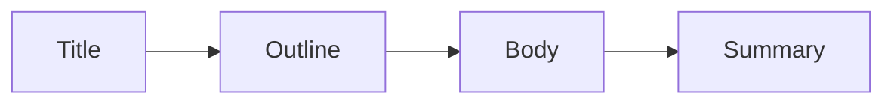

# 제목과 구조 잡기

> 기술 글쓰기 101 시리즈 (3/10)


## 이 글에서 다룰 문제

*독자* 는 *제목* 으로 *클릭* 하고, *구조* 로 *머무릅니다*.

## 전체 흐름


## Before/After

**Before**: "*FastAPI* 정리".

**After**: "*FastAPI* 로 *5분* 안에 *첫 엔드포인트* 띄우기".

## 글 한 편의 뼈대

### 1단계 — 제목

```python
title = "FastAPI 로 첫 엔드포인트 띄우기"
```

### 2단계 — 목차

```python
outline = ["설치", "코드", "실행", "확인", "다음 단계"]
```

### 3단계 — 첫 단락

```python
lede = "Hello World 를 5분 안에 띄웁니다"
```

### 4단계 — 본문 헤딩

```markdown
## 설치
## 코드
## 실행
```

### 5단계 — 결론

```python
summary = "이제 자기 엔드포인트를 만들 수 있다"
```

## 이 코드에서 주목할 점

- *제목* 에 *동사* 가 있다.
- *목차* 가 *5개 이내*.
- *결론* 이 *행동* 으로 끝난다.

## 자주 하는 실수 5가지

1. ***제목* 이 *명사* 만 있다.**
2. ***목차* 가 *너무 깊다*.**
3. ***첫 단락* 이 *길다*.**
4. ***결론* 이 *없다*.**
5. ***H1* 이 *여러 개*.**

## 실무에서는 이렇게 쓰입니다

뉴스 기사도 *역피라미드* 구조를 쓰고, 기술 블로그도 *결론 우선* 을 권장합니다.

## 체크리스트

- [ ] *제목* 에 *동사*.
- [ ] *목차* 5개 이하.
- [ ] *첫 단락* 3줄 이하.
- [ ] *결론* 1줄.

## 정리 및 다음 단계

다음 글은 *개념 설명하기* 입니다.

<!-- toc:begin -->
- [기술 글쓰기란 무엇인가](./01-what-is-technical-writing.md)
- [독자 정의하기](./02-defining-the-reader.md)
- **제목과 구조 잡기 (현재 글)**
- 개념 설명하기 (예정)
- 예제 코드 설명하기 (예정)
- 그림과 표 사용하기 (예정)
- README 작성하기 (예정)
- 튜토리얼 작성하기 (예정)
- 블로그와 문서 차이 (예정)
- 발행 전 체크리스트 (예정)
<!-- toc:end -->

## 참고 자료

- [On Writing Well - Zinsser](https://www.harpercollins.com/products/on-writing-well-william-zinsser)
- [The Elements of Style - Strunk & White](https://www.bartleby.com/141/)
- [Inverted Pyramid - Nielsen Norman Group](https://www.nngroup.com/articles/inverted-pyramid/)
- [Google Search Central Title Best Practices](https://developers.google.com/search/docs/appearance/title-link)

Tags: TechnicalWriting, Title, Structure, Outline, Beginner
