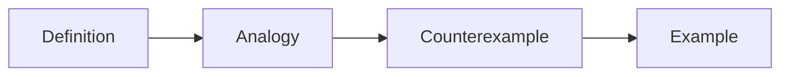

# 개념 설명하기

이 글은 Technical Writing 101 시리즈의 4번째 글입니다.

## 이 글에서 다룰 문제

- 처음 보는 독자가 개념을 바로 이해하게 하려면 무엇부터 보여 줘야 할까요?
- 비유와 반례는 왜 같이 움직여야 할까요?
- 한 줄 정의만으로는 왜 설명이 오래 남지 않을까요?
- 짧은 예시와 흔한 오해를 함께 두면 무엇이 달라질까요?

## 이 글에서 배울 것

- 한 줄 정의
- 비유 쓰기
- 반례 쓰기
- 다이어그램 쓰기
- 풀이 예시 만들기

## 왜 중요한가

개념이 흐리면 그 뒤에 붙는 모든 설명은 모래성처럼 무너집니다. 한 번 잘못 잡힌 개념은 코드와 설계와 운영 판단까지 계속 비틀어 놓습니다.

## 한눈에 보는 멘탈 모델

> 멘탈 모델: 좋은 개념 설명은 정의로 중심을 잡고, 비유로 문을 열고, 반례로 경계를 긋고, 예시로 손에 잡히게 만듭니다.



## 핵심 용어

- **definition**: 한 줄 정의입니다.
- **analogy**: 비유입니다.
- **counterexample**: 반례입니다.
- **worked example**: 풀이 과정을 보여 주는 예시입니다.
- **misconception**: 흔한 오해입니다.

## Before / After

**Before**: "Async means running at the same time." (Wrong.)

**After**: "Async means doing other work while you wait."

## 실습: 개념 하나 설명해 보기

### 1단계 — 정의

```python
definition = "A cache stores frequent answers ahead of time"
```

### 2단계 — 비유

```python
analogy = "Side dishes you keep at the front of the fridge"
```

### 3단계 — 반례

```python
counterexample = "Data you read only once does not belong in a cache"
```

### 4단계 — 코드 예시

```python
cache = {}
cache["user:1"] = {"name": "Jimin"}
```

### 5단계 — 흔한 오해

```python
misconception = "A cache can grow forever"
```

## 이 코드에서 먼저 볼 점

- 정의는 한 줄입니다.
- 비유는 일상에 닿아 있습니다.
- 반례가 경계를 그립니다.

## 자주 하는 실수 5가지

1. **정의가 너무 깁니다.**
2. **비유를 너무 멀리 끌고 갑니다.**
3. **반례가 없습니다.**
4. **코드 예시가 너무 큽니다.**
5. **흔한 오해를 건너뜁니다.**

## 실무에서는 이렇게 드러납니다

좋은 사내 위키 문서는 대개 정의, 비유, 반례, 예시 순서로 열립니다. 그 구조가 있어야 팀 안에서 같은 단어를 비슷한 뜻으로 쓰기 쉬워집니다.

## 시니어 엔지니어는 이렇게 생각합니다

- 정의는 한 줄입니다.
- 비유는 익숙한 영역에 둡니다.
- 반례가 경계입니다.
- 예시는 실행할 수 있어야 합니다.
- 오해를 먼저 깨뜨립니다.

## 체크리스트

- [ ] 한 줄 정의가 있는가
- [ ] 비유가 하나 있는가
- [ ] 반례가 하나 있는가
- [ ] 예시 코드가 다섯 줄 이하인가

## 연습 문제

1. definition의 길이를 한 줄로 적어 보세요.
2. counterexample의 뜻을 한 줄로 적어 보세요.
3. worked example의 뜻을 한 줄로 적어 보세요.

## 정리

개념 설명은 정의 하나로 끝나지 않습니다. 비유로 감각을 만들고, 반례로 오해를 막고, 예시로 손에 잡히게 해야 독자가 실제로 이해합니다. 다음 글에서는 이렇게 잡은 개념을 코드 예제로 어떻게 설명해야 하는지 이어서 살펴보겠습니다.

<!-- toc:begin -->
- [기술 글쓰기란 무엇인가](./01-what-is-technical-writing.md)
- [독자 정의하기](./02-defining-the-reader.md)
- [제목과 구조 잡기](./03-title-and-structure.md)
- **개념 설명하기 (현재 글)**
- 예제 코드 설명하기 (예정)
- 그림과 표 사용하기 (예정)
- README 작성하기 (예정)
- 튜토리얼 작성하기 (예정)
- 블로그와 문서 차이 (예정)
- 발행 전 체크리스트 (예정)
<!-- toc:end -->

## 참고 자료

- [Made to Stick - Heath Brothers](https://heathbrothers.com/books/made-to-stick/)
- [Explain Like I am Five - Reddit](https://www.reddit.com/r/explainlikeimfive/)
- [Refactoring UI - Adam Wathan](https://www.refactoringui.com/)
- [Mental Models - Farnam Street](https://fs.blog/mental-models/)

Tags: TechnicalWriting, Concept, Explanation, Analogy, Beginner