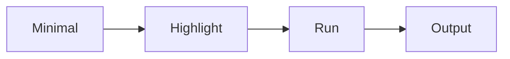

# 예제 코드 설명하기

이 글은 Technical Writing 101 시리즈의 5번째 글입니다.

## 이 글에서 다룰 문제

- 코드를 붙여 넣었는데도 왜 독자는 길을 잃을까요?
- 최소 예제와 설명 줄과 출력 결과는 어떤 순서로 배치해야 할까요?
- 코드 안 주석과 코드 밖 설명은 언제 나누는 편이 좋을까요?
- 전체 코드 링크를 분리하면 본문은 왜 더 잘 읽힐까요?

## 이 글에서 배울 것

- 최소 예제
- 주석을 둘 위치
- 설명 줄 쓰기
- 입력과 출력 보여 주기
- 전체 코드 링크 연결하기

## 왜 중요한가

실행 가능한 예제는 독자의 손에 닿아야 비로소 가르칠 수 있습니다. 읽기만 하고 돌려 보지 못하는 예제는 설명 자료일 수는 있어도 학습 도구가 되기 어렵습니다.

## 한눈에 보는 멘탈 모델

> 멘탈 모델: 좋은 예제 코드는 양으로 설득하지 않습니다. 가장 작은 코드 조각을 보여 주고, 그중 어디를 봐야 하는지 짚고, 직접 실행하게 하고, 눈에 보이는 출력으로 닫습니다.



## 핵심 용어

- **MWE**: 최소 실행 예제입니다.
- **callout**: 코드 밖에서 핵심을 짚는 설명 줄입니다.
- **inline comment**: 코드 안 주석입니다.
- **fixture**: 예제 데이터입니다.
- **snippet**: 짧게 잘라 낸 코드 조각입니다.

## Before / After

**Before**: A 200 line code dump.

**After**: An 8 line MWE with a 2 line callout.

## 실습: 예제 하나 설명해 보기

### 1단계 — 최소 코드

```python
def add(a, b):
    return a + b
```

### 2단계 — 설명 줄

```python
# Highlight: take two numbers and return their sum
```

### 3단계 — 실행

```bash
python3 -c "from m import add; print(add(2, 3))"
```

### 4단계 — 출력

```text
5
```

### 5단계 — 전체 코드 링크

```python
full_code_url = "https://github.com/example/repo/blob/main/m.py"
```

## 이 코드에서 먼저 볼 점

- 코드는 최소입니다.
- 설명 줄은 코드 바깥에 있습니다.
- 출력은 눈에 보입니다.

## 자주 하는 실수 5가지

1. **코드가 너무 깁니다.**
2. **주석이 너무 많습니다.**
3. **출력을 보여 주지 않습니다.**
4. **버전을 적지 않습니다.**
5. **복사해 붙여 넣으면 깨지는 조각입니다.**

## 실무에서는 이렇게 드러납니다

오픈소스 README의 Quick Start 절은 거의 늘 MWE와 출력 결과 패턴을 따릅니다. 독자가 가장 빨리 성공을 확인할 수 있는 구조이기 때문입니다.

## 시니어 엔지니어는 이렇게 생각합니다

- 코드는 최소여야 합니다.
- 설명은 바깥에 둡니다.
- 출력은 실제 값이어야 합니다.
- 버전은 고정합니다.
- 전체 코드는 링크로 둡니다.

## 체크리스트

- [ ] 열 줄 이하의 MWE가 있는가
- [ ] 한두 줄 설명 줄이 있는가
- [ ] 출력이 보이는가
- [ ] 버전이 적혀 있는가

## 연습 문제

1. MWE의 뜻을 한 줄로 적어 보세요.
2. callout의 뜻을 한 줄로 적어 보세요.
3. fixture의 예시를 한 줄로 적어 보세요.

## 정리

좋은 예제 코드는 많은 코드를 보여 주는 예제가 아니라, 가장 짧은 코드로 핵심을 드러내는 예제입니다. 설명 줄, 실행 명령, 출력 결과, 전체 코드 링크까지 갖추면 독자는 읽기와 실행을 함께 할 수 있습니다. 다음 글에서는 텍스트만으로는 느린 설명을 그림과 표로 어떻게 바꿀지 살펴보겠습니다.

<!-- toc:begin -->
- [기술 글쓰기란 무엇인가](./01-what-is-technical-writing.md)
- [독자 정의하기](./02-defining-the-reader.md)
- [제목과 구조 잡기](./03-title-and-structure.md)
- [개념 설명하기](./04-explaining-concepts.md)
- **예제 코드 설명하기 (현재 글)**
- 그림과 표 사용하기 (예정)
- README 작성하기 (예정)
- 튜토리얼 작성하기 (예정)
- 블로그와 문서 차이 (예정)
- 발행 전 체크리스트 (예정)
<!-- toc:end -->

## 참고 자료

- [The Art of Readable Code - Boswell & Foucher](https://www.oreilly.com/library/view/the-art-of/9781449318482/)
- [Stack Overflow MCVE Guide](https://stackoverflow.com/help/minimal-reproducible-example)
- [Python Tutorial Style Guide](https://docs.python.org/3/tutorial/index.html)
- [Diátaxis Framework - Code Examples](https://diataxis.fr/)

Tags: TechnicalWriting, Code, Examples, Walkthrough, Beginner
