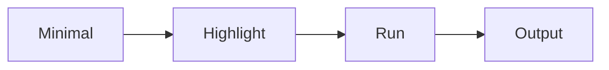

# 예제 코드 설명하기

> 기술 글쓰기 101 시리즈 (5/10)


## 이 글에서 다룰 문제

*예제* 가 *독자* 의 *손* 에 닿아야 *학습* 이 됩니다.

## 개념 한눈에 보기



## Before/After

**Before**: 200줄 코드 덤프.

**After**: 8줄 *MWE* + 2줄 *callout*.

## 실습: 한 예제

### 1단계 — 최소 코드

```python
def add(a, b):
    return a + b
```

### 2단계 — 짚어주기

```python
# 핵심: 두 수를 더해 새 값을 돌려준다
```

### 3단계 — 실행

```bash
python3 -c "from m import add; print(add(2, 3))"
```

### 4단계 — 출력

```text
5
```

### 5단계 — 전체 코드 링크

```python
full_code_url = "https://github.com/example/repo/blob/main/m.py"
```

## 이 코드에서 주목할 점

- *코드* 가 *최소*.
- *주석* 이 *외부* 에 있다.
- *출력* 이 *눈에 보인다*.

## 자주 하는 실수 5가지

1. ***코드* 가 *너무 길다*.**
2. ***주석* 이 *과하다*.**
3. ***출력* 이 *없다*.**
4. ***버전* 명시가 없다.**
5. ***복사* 가 *깨진다*.**

## 실무에서는 이렇게 쓰입니다

오픈소스 README 의 *Quick Start* 는 거의 항상 *MWE + 출력* 패턴입니다.

## 체크리스트

- [ ] *MWE* 10줄 이내.
- [ ] *callout* 1~2줄.
- [ ] *출력* 명시.
- [ ] *버전* 표기.

## 정리 및 다음 단계

다음 글은 *그림과 표 사용하기* 입니다.

<!-- toc:begin -->
- [기술 글쓰기란 무엇인가](./01-what-is-technical-writing.md)
- [독자 정의하기](./02-defining-the-reader.md)
- [제목과 구조 잡기](./03-title-and-structure.md)
- [개념 설명하기](./04-explaining-concepts.md)
- **예제 코드 설명하기 (현재 글)**
- 그림과 표 사용하기 (예정)
- README 작성하기 (예정)
- 튜토리얼 작성하기 (예정)
- 블로그와 문서 차이 (예정)
- 발행 전 체크리스트 (예정)
<!-- toc:end -->

## 참고 자료

- [The Art of Readable Code - Boswell & Foucher](https://www.oreilly.com/library/view/the-art-of/9781449318482/)
- [Stack Overflow MCVE Guide](https://stackoverflow.com/help/minimal-reproducible-example)
- [Python Tutorial Style Guide](https://docs.python.org/3/tutorial/index.html)
- [Diátaxis Framework - Code Examples](https://diataxis.fr/)

Tags: TechnicalWriting, Code, Examples, Walkthrough, Beginner
