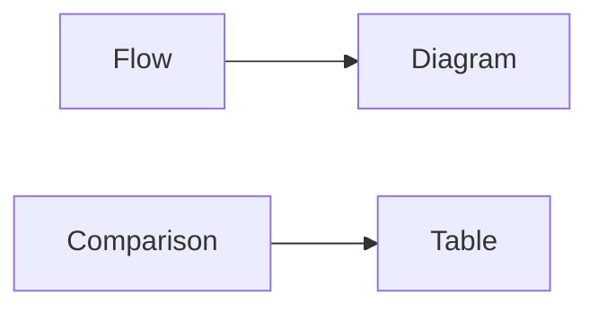
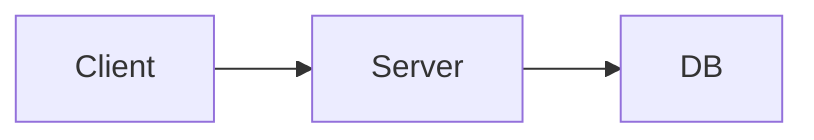
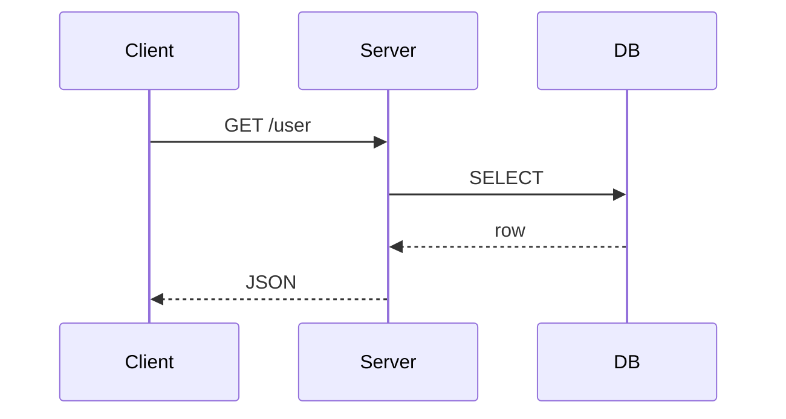

# 그림과 표 사용하기

이 글은 Technical Writing 101 시리즈의 6번째 글입니다.

## 이 글에서 다룰 문제

- 언제 그림이 문단보다 더 나을까요?
- 언제 표가 비교를 더 정확하게 보여 줄까요?
- 캡션과 대체 텍스트는 왜 장식이 아니라 본문 일부일까요?
- 해상도와 접근성은 왜 시각 자료의 기본 조건일까요?

## 이 글에서 배울 것

- 흐름도와 시퀀스 다이어그램
- 비교 표와 결정 표
- 캡션 쓰기
- 대체 텍스트 쓰기
- 해상도와 접근성

## 왜 중요한가

좋은 그림 한 장은 다섯 문단을 대신할 수 있습니다. 좋은 표 하나는 여러 선택지를 한 번에 비교하게 해 줍니다. 시각 자료는 장식이 아니라 탐색 비용을 줄이는 도구입니다.

## 한눈에 보는 멘탈 모델

> 멘탈 모델: 흐름을 보여 주고 싶으면 그림을 고르고, 선택지를 나란히 비교하고 싶으면 표를 고릅니다. 이 구분만 지켜도 많은 시각 자료가 더 정확해집니다.



## 핵심 용어

- **flowchart**: 흐름도입니다.
- **sequence diagram**: 시퀀스 다이어그램입니다.
- **caption**: 캡션입니다.
- **alt text**: 이미지 대체 텍스트입니다.
- **a11y**: 접근성입니다.

## Before / After

**Before**: "The request goes from client to server to DB..." (five lines)

**After**: One flowchart.

## 실습: 그림 하나와 표 하나 만들기

### 1단계 — 흐름도



### 2단계 — 시퀀스



### 3단계 — 비교 표

```markdown
| Option | Speed | Cost |
| --- | --- | --- |
| A | Fast | High |
| B | Medium | Low |
```

### 4단계 — 캡션

```markdown
*Figure 1*. Request flow from client to database.
```

### 5단계 — 대체 텍스트

```markdown

```

## 이 코드에서 먼저 볼 점

- 그림은 흐름을 보여 줍니다.
- 표는 비교를 보여 줍니다.
- 캡션은 완전한 문장입니다.

## 자주 하는 실수 5가지

1. **그림이 전혀 없습니다.**
2. **표가 너무 큽니다.**
3. **캡션이 없습니다.**
4. **대체 텍스트가 없습니다.**
5. **해상도가 낮습니다.**

## 실무에서는 이렇게 드러납니다

스펙 문서, 아키텍처 문서, 장애 회고는 거의 늘 그림과 표를 함께 씁니다. 흐름은 그림으로, 선택지는 표로 나누어야 독자가 훨씬 빨리 읽을 수 있기 때문입니다.

## 시니어 엔지니어는 이렇게 생각합니다

- 흐름에는 그림을 씁니다.
- 비교에는 표를 씁니다.
- 캡션은 완전한 문장입니다.
- 대체 텍스트는 필수입니다.
- 해상도는 표시 크기의 두 배입니다.

## 체크리스트

- [ ] 그림이 하나 이상 있는가
- [ ] 표가 일곱 행 이하인가
- [ ] 모든 그림에 캡션이 있는가
- [ ] 모든 그림에 대체 텍스트가 있는가

## 연습 문제

1. flowchart와 sequence diagram의 차이를 한 줄로 적어 보세요.
2. caption의 뜻을 한 줄로 적어 보세요.
3. alt text의 뜻을 한 줄로 적어 보세요.

## 정리

그림과 표는 글을 꾸미는 요소가 아니라 설명을 압축하는 도구입니다. 흐름은 그림으로, 비교는 표로 나누면 독자는 구조를 훨씬 빨리 파악합니다. 다음 글에서는 처음 방문한 사람이 5분 안에 프로젝트를 실행할 수 있게 만드는 README를 어떻게 써야 하는지 살펴보겠습니다.

<!-- toc:begin -->
- [기술 글쓰기란 무엇인가](./01-what-is-technical-writing.md)
- [독자 정의하기](./02-defining-the-reader.md)
- [제목과 구조 잡기](./03-title-and-structure.md)
- [개념 설명하기](./04-explaining-concepts.md)
- [예제 코드 설명하기](./05-explaining-example-code.md)
- **그림과 표 사용하기 (현재 글)**
- README 작성하기 (예정)
- 튜토리얼 작성하기 (예정)
- 블로그와 문서 차이 (예정)
- 발행 전 체크리스트 (예정)
<!-- toc:end -->

## 참고 자료

- [The Visual Display of Quantitative Information - Tufte](https://www.edwardtufte.com/tufte/books_vdqi)
- [Mermaid Diagram Syntax](https://mermaid.js.org/intro/)
- [Web Content Accessibility Guidelines](https://www.w3.org/WAI/standards-guidelines/wcag/)
- [Storytelling with Data - Knaflic](https://www.storytellingwithdata.com/)

Tags: TechnicalWriting, Diagrams, Tables, Visual, Beginner
