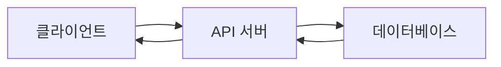
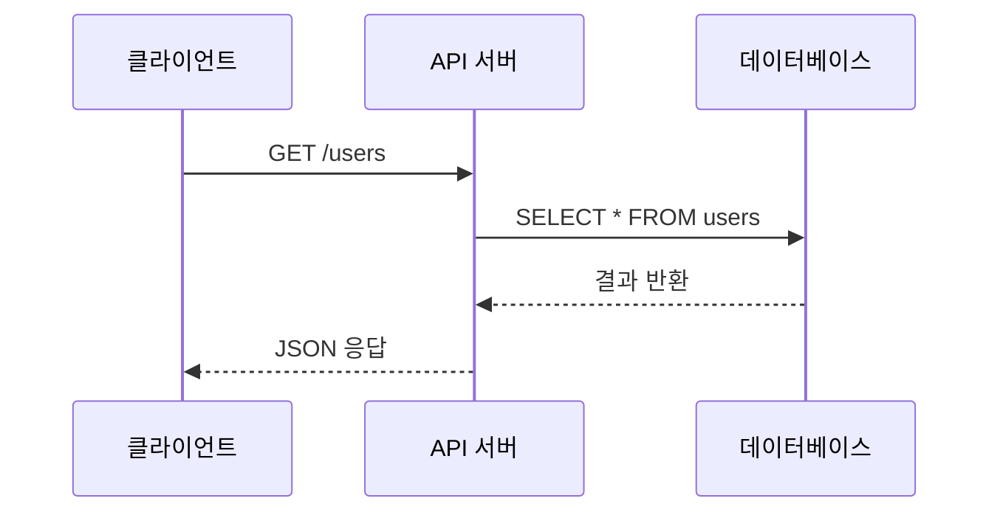

# Technical Writing 101 (6/10): 그림과 표 사용하기

문단으로 충분히 설명할 수 있는 내용을 그림으로 바꾸면 오히려 독자를 헷갈리게 만들 수 있습니다. 반대로 흐름이나 비교를 문단으로만 밀어붙이면 독자는 핵심 구조를 파악하기도 전에 스크롤부터 내리게 됩니다. 중요한 것은 시각 자료의 양이 아니라 질문과 형식의 짝을 맞추는 일입니다.

좋은 그림은 문장을 장식하지 않고 문장을 줄여 줍니다. 좋은 표는 선택지를 예쁘게 나열하는 대신 의사결정 기준을 한눈에 드러냅니다. 그래서 시각 자료는 글의 말미에 덧붙이는 부록이 아니라 본문 설계의 일부로 다루는 편이 낫습니다.

이 글은 기술 글쓰기 101 시리즈의 6번째 글입니다.

여기서는 그림과 표를 언제 고르고, 캡션과 대체 텍스트를 어떻게 써야 하는지 정리합니다.


*Technical Writing 101 6장 흐름 개요*
> 흐름을 보여 줄 때는 그림을, 선택지를 비교할 때는 표를 고르는 기준이 핵심입니다.

## 먼저 던지는 질문

- 언제 그림이 문단보다 더 나을까요?
- 언제 표가 비교를 더 정확하게 보여 줄까요?
- 캡션과 대체 텍스트는 왜 장식이 아니라 본문 일부일까요?

## 이 글에서 배울 것

- 흐름도와 시퀀스 다이어그램
- 비교 표와 결정 표
- 캡션 쓰기
- 대체 텍스트 쓰기
- 해상도와 접근성

## 왜 중요한가

좋은 그림 한 장은 다섯 문단을 대신할 수 있습니다. 좋은 표 하나는 여러 선택지를 한 번에 비교하게 해 줍니다. 시각 자료는 장식이 아니라 탐색 비용을 줄이는 도구입니다.

## 한눈에 보는 멘탈 모델

> 멘탈 모델: 흐름을 보여 주고 싶으면 그림을 고르고, 선택지를 나란히 비교하고 싶으면 표를 고릅니다. 이 구분만 지켜도 많은 시각 자료가 더 정확해집니다.

## 핵심 용어

- **flowchart**: 흐름도입니다.
- **sequence diagram**: 시퀀스 다이어그램입니다.
- **caption**: 캡션입니다.
- **alt text**: 이미지 대체 텍스트입니다.
- **a11y**: 접근성입니다.

## 전후 비교

**Before**: "The request goes from client to server to DB..." (five lines)

**After**: One flowchart.

## 독자의 질문에 따라 시각 자료를 고르는 기준

| 독자의 질문 | 더 잘 맞는 형식 | 이유 |
| --- | --- | --- |
| 요청이 어디로 흐르나요? | 흐름도 | 방향과 순서를 빠르게 보여 줍니다. |
| 어떤 선택지가 더 싼가요? | 비교 표 | 기준을 나란히 맞춰 읽게 합니다. |
| 장애가 어느 단계에서 납니까? | 시퀀스 다이어그램 | 호출 순서와 응답 지점을 드러냅니다. |
| 팀 기준은 무엇이 다른가요? | 결정 표 | 선택 기준을 항목별로 비교합니다. |

## 다이어그램 유형별 사용 가이드

| 다이어그램 유형 | 적합한 상황 | 강점 | 추천 도구 |
| --- | --- | --- | --- |
| Flowchart | 요청 흐름, 결정 분기, 프로세스 단계 | 방향과 조건을 직관적으로 표현 | Mermaid, draw.io |
| Sequence Diagram | 서비스 간 호출 순서, 시간 흐름 | 호출 순서와 응답 관계를 명확히 드러냄 | Mermaid, PlantUML |
| ER Diagram | 데이터베이스 구조, 엔티티 관계 | 테이블 간 관계를 한눈에 파악 | dbdiagram.io, ERDPlus |
| Architecture Diagram | 시스템 구성 요소, 배포 구조 | 전체 시스템 경계와 역할 분리 표현 | draw.io, Lucidchart |
| State Diagram | 상태 전이, 워크플로 단계 | 상태 변화와 조건을 명확히 표현 | Mermaid, PlantUML |

다이어그램은 독자가 글에서 가장 먼저 눈길을 주는 요소입니다. 그래서 도구보다 먼저 어떤 질문에 답하려는지 명확히 해야 합니다. 요청이 어디로 흐르는지 보여 주려면 Flowchart가 강하고, 누가 누구를 언제 호출하는지 보여 주려면 Sequence Diagram이 더 적합합니다.

## 표 설계 원칙

표는 선택지를 나란히 비교할 때 가장 강력한 도구입니다. 하지만 표가 잘못 설계되면 오히려 혼란을 키울 수 있습니다. 다음 원칙을 따르면 독자가 훨씬 빨리 판단할 수 있습니다.

### 1. 비교축을 행에 둡니다

독자는 보통 왼쪽에서 오른쪽으로 읽습니다. 그래서 비교 대상(Option A, Option B)은 행으로, 비교 기준(Speed, Cost, Complexity)은 열로 두는 편이 자연스럽습니다.

### 2. 열 순서는 중요도 순입니다

가장 중요한 기준을 왼쪽에 둡니다. 예를 들어 비용이 가장 중요한 결정 요소라면 Cost 열을 Speed보다 먼저 배치합니다.

### 3. 단위를 헤더에 명시합니다

각 셀마다 `100ms`, `50ms`처럼 단위를 반복하지 말고, 헤더에 `Latency (ms)`처럼 한 번만 적습니다. 표가 훨씬 깔끔해집니다.

### 4. 셀 내용은 짧게 유지합니다

한 셀에 세 줄 이상 들어가면 표보다 본문 설명이 나을 수 있습니다. 표는 비교를 위한 요약 도구이지 전체 설명을 담는 곳이 아닙니다.

## 캡션 작성법

캡션은 그림이 무엇을 보여 주는지 한 문장으로 설명합니다. 좋은 캡션은 그림만 봐도 글의 맥락을 일부 복구할 수 있게 만듭니다.

### 좋은 캡션

```markdown
*클라이언트 요청이 API 서버와 데이터베이스를 거쳐 응답으로 돌아오는 전체 흐름입니다.*
```

이 캡션은 누가(클라이언트), 무엇을(요청), 어디로(API 서버 → 데이터베이스), 어떻게(흐름) 흐르는지 명확히 적었습니다.

### 나쁜 캡션

```markdown
*구조 다이어그램*
```

이 캡션은 그림의 종류만 밝힐 뿐, 무엇을 읽어야 하는지 알려 주지 않습니다. 독자는 그림을 보고 나서야 맥락을 추측해야 합니다.

### 캡션과 대체 텍스트의 차이

- **캡션**: 시각 자료가 무엇을 보여 주는지 설명합니다. 모든 독자가 읽습니다.
- **대체 텍스트(alt text)**: 이미지를 볼 수 없는 환경(스크린 리더, 이미지 로딩 실패)에서 이미지를 대신합니다. 접근성 도구가 읽습니다.

둘 다 필수입니다. 캡션은 본문 흐름의 일부이고, 대체 텍스트는 접근성 요구사항입니다.

## Mermaid 코드 예시

Mermaid는 코드로 다이어그램을 그리는 도구입니다. 버전 관리가 쉽고, 텍스트 기반이라 협업에 강합니다.

### Flowchart 예시



이 코드는 클라이언트에서 API 서버로, 다시 데이터베이스로 이어지는 요청 흐름을 네 단계로 보여 줍니다.

### Sequence Diagram 예시



이 코드는 호출 순서와 응답 방향을 화살표로 명확히 드러냅니다. 실선 화살표는 요청, 점선 화살표는 응답을 나타냅니다.
캡션도 제목처럼 역할이 분명해야 합니다. `구조 다이어그램`처럼 뭉뚱그린 캡션보다 `클라이언트 요청이 API 서버와 데이터베이스를 거치는 순서`처럼 무엇을 읽어야 하는지 알려 주는 문장이 훨씬 강합니다. 좋은 시각 자료는 그림만 봐도 맥락이 조금씩 회복되게 만듭니다.

## 해상도와 접근성 실전 가이드

이미지는 눈에 보이는 크기보다 두 배 해상도로 준비해야 레티나 디스플레이에서도 선명합니다.

### 권장 해상도

| 표시 크기 | 실제 이미지 해상도 | 비율 |
| --- | --- | --- |
| 800×600px | 1600×1200px | 2x |
| 1200×800px | 2400×1600px | 2x |

### 접근성 체크리스트

- [ ] 모든 이미지에 alt 텍스트가 있는가
- [ ] 캡션이 완전한 문장인가
- [ ] 색상만으로 정보를 전달하지 않는가
- [ ] 대비율이 4.5:1 이상인가

## 실무 팁: 다이어그램 도구 선택

| 상황 | 추천 도구 | 이유 |
| --- | --- | --- |
| 버전 관리가 중요 | Mermaid | 코드로 작성, Git 친화적 |
| 복잡한 아키텍처 | draw.io | 무료, 풍부한 아이콘 |
| 협업 중심 | Lucidchart | 실시간 협업, 클라우드 |
| 데이터베이스 설계 | dbdiagram.io | ERD 특화, 빠른 생성 |

## 그림과 표 본문 통합 원칙

그림과 표는 본문의 흐름 안에서 자연스럽게 등장해야 합니다. 독자는 본문을 읽다가 그림이나 표를 만나고, 다시 본문으로 돌아옵니다.

### 1. 그림보다 먼저 맥락을 제공합니다

그림이 나오기 전에 독자가 무엇을 볼지 한 문장으로 예고합니다.

```markdown
다음 그림은 클라이언트 요청이 API 서버와 데이터베이스를 거쳐 응답으로 돌아오는 전체 흐름을 보여 줍니다.


```

### 2. 그림 다음에는 핵심 요약을 둡니다

그림 아래에 2-3문장으로 그림이 보여 주는 핵심을 요약합니다.

```markdown


*클라이언트 요청이 API 서버와 데이터베이스를 거쳐 응답으로 돌아오는 전체 흐름입니다.*

이 흐름에서 API 서버는 요청을 검증하고, 데이터베이스는 실제 데이터를 반환합니다. 응답은 같은 경로로 되돌아갑니다.
```

### 3. 표는 비교 기준을 먼저 밝힙니다

표를 보기 전에 독자가 무엇을 비교할지 명시합니다.

```markdown
다음 표는 세 가지 배포 옵션의 속도, 비용, 복잡도를 비교합니다.

| Option | Speed | Cost | Complexity |
| --- | --- | --- | --- |
| A | Fast | High | Low |
| B | Medium | Medium | Medium |
| C | Slow | Low | High |
```

### 4. 그림 번호는 필요할 때만 씁니다

블로그 글이나 짧은 문서에서는 그림 번호(Figure 1, Figure 2)가 오히려 독자를 혼란스럽게 만들 수 있습니다. 긴 문서나 학술 글에서만 그림 번호를 사용합니다.

**짧은 글**:

```markdown

```

**긴 문서**:

```markdown
*Figure 1. Request flow from client to database.*
```

## 실전 케이스 스터디: 다이어그램 선택

같은 API 서버 설명이라도 독자의 질문에 따라 다이어그램 유형이 달라집니다.

### 케이스 1: "API가 어떻게 구성되어 있나요?"

→ **Architecture Diagram** 사용

시스템 경계, 주요 컴포넌트, 외부 의존성을 박스와 화살표로 표현합니다.

### 케이스 2: "요청이 어떻게 처리되나요?"

→ **Flowchart** 사용

요청 입구부터 응답까지의 단계를 순서대로 보여줍니다. 조건 분기(if/else)도 명확히 표현할 수 있습니다.

### 케이스 3: "서비스 간 호출 순서가 궁금해요"

→ **Sequence Diagram** 사용

시간 흐름에 따라 누가 누구를 언제 호출하는지, 응답은 언제 돌아오는지 보여줍니다.

### 케이스 4: "데이터베이스 테이블은 어떻게 연결되나요?"

→ **ER Diagram** 사용

테이블, 컬럼, 외래 키 관계를 명확히 표현합니다.
## 실습: 그림 하나와 표 하나 만들기

### 1단계 — 흐름도


*클라이언트 요청이 서버와 데이터베이스로 흐르는 기본 경로를 보여 주는 흐름도입니다.*
### 2단계 — 시퀀스


*클라이언트와 서버, 데이터베이스 사이의 호출 순서를 보여 주는 시퀀스 다이어그램입니다.*
### 3단계 — 비교 표

```markdown
| Option | Speed | Cost |
| --- | --- | --- |
| A | Fast | High |
| B | Medium | Low |
```

### 4단계 — 캡션

```markdown
*Figure 1*. Request flow from client to database.
```

### 5단계 — 대체 텍스트

```markdown

```

## 이 코드에서 먼저 볼 점

- 그림은 흐름을 보여 줍니다.
- 표는 비교를 보여 줍니다.
- 캡션은 완전한 문장입니다.

## 자주 하는 실수 5가지

1. **그림이 전혀 없습니다.**
2. **표가 너무 큽니다.**
3. **캡션이 없습니다.**
4. **대체 텍스트가 없습니다.**
5. **해상도가 낮습니다.**

## 실무에서는 이렇게 드러납니다

스펙 문서, 아키텍처 문서, 장애 회고는 거의 늘 그림과 표를 함께 씁니다. 흐름은 그림으로, 선택지는 표로 나누어야 독자가 훨씬 빨리 읽을 수 있기 때문입니다.

## 시니어 엔지니어는 이렇게 생각합니다

- 흐름에는 그림을 씁니다.
- 비교에는 표를 씁니다.
- 캡션은 완전한 문장입니다.
- 대체 텍스트는 필수입니다.
- 해상도는 표시 크기의 두 배입니다.

## 체크리스트

- [ ] 그림이 하나 이상 있는가
- [ ] 표가 일곱 행 이하인가
- [ ] 모든 그림에 캡션이 있는가
- [ ] 모든 그림에 대체 텍스트가 있는가

## 연습 문제

1. flowchart와 sequence diagram의 차이를 한 줄로 적어 보세요.
2. caption의 뜻을 한 줄로 적어 보세요.
3. alt text의 뜻을 한 줄로 적어 보세요.

## 정리

그림과 표는 글을 꾸미는 요소가 아니라 설명을 압축하는 도구입니다. 흐름은 그림으로, 비교는 표로 나누면 독자는 구조를 훨씬 빨리 파악합니다. 다음 글에서는 처음 방문한 사람이 5분 안에 프로젝트를 실행할 수 있게 만드는 README를 어떻게 써야 하는지 살펴보겠습니다.

## 실전 앵커: 그림과 표 품질을 올리는 제작 체크리스트

그림과 표는 본문 이해 속도를 올려야 합니다. 보기 좋은 시각 자료가 아니라, 판단 시간을 줄이는 시각 자료가 목표입니다.

### 그림 제작 전 질문

- 이 그림이 없으면 독자가 어느 문장에서 멈추는가?
- 흐름, 구조, 경계 중 무엇을 보여 주는가?
- 그림 아래 2문장으로 핵심을 설명할 수 있는가?

### 표 제작 전 질문

- 비교 기준이 3-5개로 정리되는가?
- 각 셀이 한 줄로 표현되는가?
- 표를 읽은 뒤 독자가 바로 선택 결정을 내릴 수 있는가?

### 캡션 교정 예시

| 교정 전 | 교정 후 |
| --- | --- |
| 구조 다이어그램 | 클라이언트 요청이 API 게이트웨이, 서비스, 데이터베이스를 거쳐 응답으로 돌아오는 경로 |
| 배포 표 | 세 가지 배포 방식의 초기 비용, 운영 난이도, 장애 대응 속도 비교 |

### 접근성 검사표

| 항목 | 기준 |
| --- | --- |
| alt 텍스트 | 이미지가 없어도 핵심을 이해할 수 있는 문장 |
| 대비 | 텍스트/배경 대비 4.5:1 이상 |
| 해상도 | 표시 크기의 2배 |
| 색상 의존성 | 색상 없이도 정보 구분 가능 |

## 실무용 비교 표 예시

| 선택지 | 초기 구축 시간 | 운영 난이도 | 장애 분석 속도 |
| --- | --- | --- | --- |
| 텍스트만 사용 | 짧음 | 낮음 | 느림 |
| 그림만 사용 | 중간 | 중간 | 중간 |
| 그림+표 병행 | 중간 | 중간 | 빠름 |

그림과 표를 함께 쓰는 패턴이 대부분의 기술 글에서 가장 안정적으로 동작합니다.


### 실전 보강 섹션 1

이 단락은 본문 원칙을 실제 작성 루틴으로 옮기기 위한 보강 섹션입니다. 팀 문서에서 품질 편차가 생기는 이유는 원칙을 모르는 것이 아니라, 원칙을 반복 적용할 고정 루틴이 없기 때문입니다. 그래서 작성자와 리뷰어가 같은 기준을 공유하는 문장, 표, 체크리스트를 함께 두는 편이 좋습니다.

| 점검 항목 | 질문 | 통과 기준 |
| --- | --- | --- |
| 대상 독자 | 이 문단이 누구를 위한 설명인가 | 독자가 한 문장으로 명시됨 |
| 실행 가능성 | 독자가 바로 따라 할 수 있는가 | 명령 또는 절차가 구체적으로 적힘 |
| 검증 가능성 | 성공 여부를 확인할 수 있는가 | 출력, 상태, 체크포인트가 제시됨 |
| 범위 통제 | 다루지 않는 항목이 명시되었는가 | 비목표 또는 한계가 적힘 |

- 작성 팁: 한 섹션 안에 새 개념을 1개만 두면 독자가 중간에 이탈할 확률이 줄어듭니다.
- 리뷰 팁: 문장 정확성보다 먼저 독자의 다음 행동이 보이는지 확인하면 실용성이 올라갑니다.
- 운영 팁: 반복되는 질문은 FAQ나 오류 해결 섹션으로 승격해 검색 비용을 낮춥니다.

다음 예시 문장은 실제로 수정 비용을 줄이는 데 유용합니다. "이 단계가 끝나면 터미널에 특정 메시지가 보입니다."처럼 눈으로 확인 가능한 결과를 붙이면, 독자는 추측 대신 확인으로 진행할 수 있습니다. 또한 "이 글은 여기까지만 다룹니다."라는 범위 문장을 넣으면 글이 과도하게 확장되는 문제를 막을 수 있습니다.


### 실전 보강 섹션 2

이 단락은 본문 원칙을 실제 작성 루틴으로 옮기기 위한 보강 섹션입니다. 팀 문서에서 품질 편차가 생기는 이유는 원칙을 모르는 것이 아니라, 원칙을 반복 적용할 고정 루틴이 없기 때문입니다. 그래서 작성자와 리뷰어가 같은 기준을 공유하는 문장, 표, 체크리스트를 함께 두는 편이 좋습니다.

| 점검 항목 | 질문 | 통과 기준 |
| --- | --- | --- |
| 대상 독자 | 이 문단이 누구를 위한 설명인가 | 독자가 한 문장으로 명시됨 |
| 실행 가능성 | 독자가 바로 따라 할 수 있는가 | 명령 또는 절차가 구체적으로 적힘 |
| 검증 가능성 | 성공 여부를 확인할 수 있는가 | 출력, 상태, 체크포인트가 제시됨 |
| 범위 통제 | 다루지 않는 항목이 명시되었는가 | 비목표 또는 한계가 적힘 |

- 작성 팁: 한 섹션 안에 새 개념을 1개만 두면 독자가 중간에 이탈할 확률이 줄어듭니다.
- 리뷰 팁: 문장 정확성보다 먼저 독자의 다음 행동이 보이는지 확인하면 실용성이 올라갑니다.
- 운영 팁: 반복되는 질문은 FAQ나 오류 해결 섹션으로 승격해 검색 비용을 낮춥니다.

다음 예시 문장은 실제로 수정 비용을 줄이는 데 유용합니다. "이 단계가 끝나면 터미널에 특정 메시지가 보입니다."처럼 눈으로 확인 가능한 결과를 붙이면, 독자는 추측 대신 확인으로 진행할 수 있습니다. 또한 "이 글은 여기까지만 다룹니다."라는 범위 문장을 넣으면 글이 과도하게 확장되는 문제를 막을 수 있습니다.


### 실전 보강 섹션 3

이 단락은 본문 원칙을 실제 작성 루틴으로 옮기기 위한 보강 섹션입니다. 팀 문서에서 품질 편차가 생기는 이유는 원칙을 모르는 것이 아니라, 원칙을 반복 적용할 고정 루틴이 없기 때문입니다. 그래서 작성자와 리뷰어가 같은 기준을 공유하는 문장, 표, 체크리스트를 함께 두는 편이 좋습니다.

| 점검 항목 | 질문 | 통과 기준 |
| --- | --- | --- |
| 대상 독자 | 이 문단이 누구를 위한 설명인가 | 독자가 한 문장으로 명시됨 |
| 실행 가능성 | 독자가 바로 따라 할 수 있는가 | 명령 또는 절차가 구체적으로 적힘 |
| 검증 가능성 | 성공 여부를 확인할 수 있는가 | 출력, 상태, 체크포인트가 제시됨 |
| 범위 통제 | 다루지 않는 항목이 명시되었는가 | 비목표 또는 한계가 적힘 |

- 작성 팁: 한 섹션 안에 새 개념을 1개만 두면 독자가 중간에 이탈할 확률이 줄어듭니다.
- 리뷰 팁: 문장 정확성보다 먼저 독자의 다음 행동이 보이는지 확인하면 실용성이 올라갑니다.
- 운영 팁: 반복되는 질문은 FAQ나 오류 해결 섹션으로 승격해 검색 비용을 낮춥니다.

다음 예시 문장은 실제로 수정 비용을 줄이는 데 유용합니다. "이 단계가 끝나면 터미널에 특정 메시지가 보입니다."처럼 눈으로 확인 가능한 결과를 붙이면, 독자는 추측 대신 확인으로 진행할 수 있습니다. 또한 "이 글은 여기까지만 다룹니다."라는 범위 문장을 넣으면 글이 과도하게 확장되는 문제를 막을 수 있습니다.


### 실전 보강 섹션 4

이 단락은 본문 원칙을 실제 작성 루틴으로 옮기기 위한 보강 섹션입니다. 팀 문서에서 품질 편차가 생기는 이유는 원칙을 모르는 것이 아니라, 원칙을 반복 적용할 고정 루틴이 없기 때문입니다. 그래서 작성자와 리뷰어가 같은 기준을 공유하는 문장, 표, 체크리스트를 함께 두는 편이 좋습니다.

| 점검 항목 | 질문 | 통과 기준 |
| --- | --- | --- |
| 대상 독자 | 이 문단이 누구를 위한 설명인가 | 독자가 한 문장으로 명시됨 |
| 실행 가능성 | 독자가 바로 따라 할 수 있는가 | 명령 또는 절차가 구체적으로 적힘 |
| 검증 가능성 | 성공 여부를 확인할 수 있는가 | 출력, 상태, 체크포인트가 제시됨 |
| 범위 통제 | 다루지 않는 항목이 명시되었는가 | 비목표 또는 한계가 적힘 |

- 작성 팁: 한 섹션 안에 새 개념을 1개만 두면 독자가 중간에 이탈할 확률이 줄어듭니다.
- 리뷰 팁: 문장 정확성보다 먼저 독자의 다음 행동이 보이는지 확인하면 실용성이 올라갑니다.
- 운영 팁: 반복되는 질문은 FAQ나 오류 해결 섹션으로 승격해 검색 비용을 낮춥니다.

다음 예시 문장은 실제로 수정 비용을 줄이는 데 유용합니다. "이 단계가 끝나면 터미널에 특정 메시지가 보입니다."처럼 눈으로 확인 가능한 결과를 붙이면, 독자는 추측 대신 확인으로 진행할 수 있습니다. 또한 "이 글은 여기까지만 다룹니다."라는 범위 문장을 넣으면 글이 과도하게 확장되는 문제를 막을 수 있습니다.


## 처음 질문으로 돌아가기

- **언제 그림이 문단보다 더 나을까요?**
  그림은 순서와 경계가 중요한 설명에서 문단보다 빠르게 구조를 전달합니다.
  요청 흐름, 책임 경계, 분기 조건처럼 방향성이 있는 설명은 그림으로 옮길 때 독자의 이해 속도가 빨라집니다.
- **언제 표가 비교를 더 명확하게 보여 줄까요?**
  표는 같은 기준으로 여러 선택지를 나란히 놓아 의사결정 시간을 줄입니다.
- **캠학션과 대체 텍스트는 왜 장식이 아니라 본문 일부일까요?**
  캡션은 그림의 읽기 포인트를, 대체 텍스트는 접근성 상황에서의 의미 전달을 담당하므로 둘 다 본문 품질의 일부입니다.

<!-- toc:begin -->
## 시리즈 목차

- [Technical Writing 101 (1/10): 기술 글쓰기란 무엇인가](./01-what-is-technical-writing.md)
- [Technical Writing 101 (2/10): 독자 정의하기](./02-defining-the-reader.md)
- [Technical Writing 101 (3/10): 제목과 구조 잡기](./03-title-and-structure.md)
- [Technical Writing 101 (4/10): 개념 설명하기](./04-explaining-concepts.md)
- [Technical Writing 101 (5/10): 예제 코드 설명하기](./05-explaining-example-code.md)
- **그림과 표 사용하기 (현재 글)**
- README 작성하기 (예정)
- 튜토리얼 작성하기 (예정)
- 블로그와 문서 차이 (예정)
- 발행 전 체크리스트 (예정)

<!-- toc:end -->

## 참고 자료

- [The Visual Display of Quantitative Information - Tufte](https://www.edwardtufte.com/tufte/books_vdqi)
- [Mermaid Diagram Syntax](https://mermaid.js.org/intro/)
- [Web Content Accessibility Guidelines](https://www.w3.org/WAI/standards-guidelines/wcag/)
- [Storytelling with Data - Knaflic](https://www.storytellingwithdata.com/)

- [이 글의 예제 코드 (book-examples)](https://github.com/yeongseon-books/book-examples/tree/main/technical-writing-101/ko)

Tags: TechnicalWriting, Diagrams, Tables, Visual, Beginner
