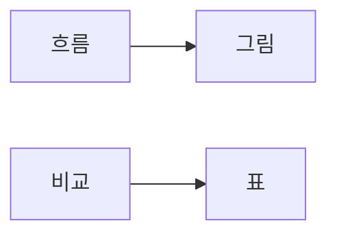
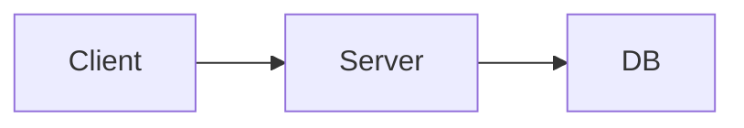
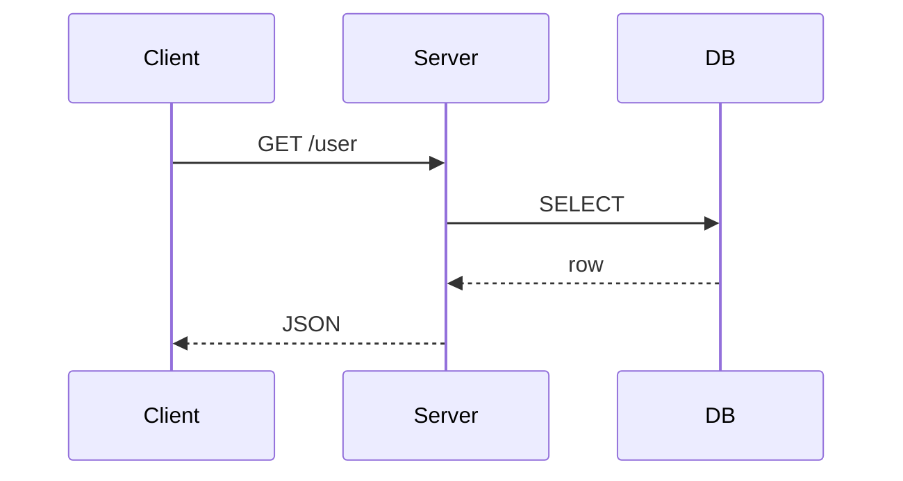

# 그림과 표 사용하기

## 이 글에서 다룰 문제

- 어떤 설명은 왜 문단보다 그림 한 장이 더 빠를까요?
- 흐름을 보여 줄 때와 비교를 보여 줄 때는 왜 같은 시각 요소를 쓰면 안 될까요?
- 캡션과 대체 텍스트는 왜 장식이 아니라 본문 일부일까요?
- 기술 글에서 그림과 표를 넣을 때 어떤 최소 기준을 지켜야 할까요?

> 흐름을 보여 주려면 그림이 유리하고, 선택지를 비교하려면 표가 더 정확합니다.

> 기술 글쓰기 101 시리즈 (6/10)

텍스트만으로도 많은 것을 설명할 수 있지만, 모든 것을 문장으로만 밀어붙일 필요는 없습니다. 요청 흐름, 아키텍처 연결, 단계 관계처럼 움직임이 있는 설명은 그림이 훨씬 빠르고, 옵션 비교나 장단점 정리는 표가 훨씬 명확합니다.

문제는 많은 글이 이 둘을 뒤섞는다는 점입니다. 표로 흐름을 설명하거나, 그림으로 단순 비교를 하려 들면 독자는 오히려 더 천천히 읽게 됩니다. 좋은 시각 자료는 많아서 좋은 것이 아니라, 쓰임이 분명해서 좋습니다.

## 왜 중요한가

적절한 그림 한 장은 여러 문단을 대신할 수 있습니다. 독자는 구조를 한눈에 보고, 이후 본문에서 세부 설명을 읽습니다. 표도 마찬가지입니다. 선택지를 나란히 놓아 보면 무엇이 다른지 즉시 파악할 수 있습니다.

특히 기술 글에서는 스캔 가능성이 중요합니다. 독자는 처음부터 끝까지 정독하기보다, 필요한 정보를 빨리 찾고 싶어 합니다. 그림과 표는 그 탐색 비용을 크게 줄여 줍니다.

## 한눈에 보는 흐름



흐름에는 그림, 비교에는 표라는 기준만 기억해도 많은 실수를 줄일 수 있습니다. 이 기준은 단순하지만 실전에서 매우 잘 맞습니다.

## 핵심 용어

- **흐름도**: 단계와 이동 경로를 보여 주는 그림입니다.
- **시퀀스 다이어그램**: 주체 간 메시지 흐름을 시간 순서대로 보여 주는 그림입니다.
- **캡션**: 그림이나 표가 무엇을 보여 주는지 설명하는 문장입니다.
- **대체 텍스트**: 이미지를 볼 수 없을 때 내용을 대신 전달하는 텍스트입니다.
- **접근성**: 더 많은 사용자가 같은 정보를 읽고 이해할 수 있게 만드는 기준입니다.

기술 글에서는 캡션과 대체 텍스트를 빼먹기 쉽지만, 둘 다 핵심 정보 전달과 직결됩니다. 특히 플랫폼에 따라 이미지가 늦게 뜨거나 깨질 수 있다는 점까지 생각하면 더 그렇습니다.

## Before / After

**Before**: "요청이 클라이언트에서 서버를 거쳐 DB로 간다"라는 설명을 다섯 줄에 걸쳐 적기

**After**: 요청 흐름을 보여 주는 그림 한 장 넣기

문장만으로도 설명은 가능하지만, 흐름을 한 번에 보여 주는 그림이 있으면 독자는 훨씬 빠르게 구조를 파악합니다.

## 실습: 그림 하나와 표 하나 만들기

### 1단계 — 흐름도 그리기



흐름도는 이동 방향이 보일 때 가장 효과적입니다. 요청이 어디서 시작해 어디로 가는지, 어느 단계가 중간에 있는지만 보여 줘도 본문 이해가 훨씬 쉬워집니다.

### 2단계 — 시퀀스 다이어그램 그리기



시퀀스 다이어그램은 순서가 중요할 때 좋습니다. 누가 먼저 호출하고, 응답이 어디로 돌아오는지 보여 주고 싶다면 흐름도보다 더 정확할 수 있습니다.

### 3단계 — 비교 표 만들기

```markdown
| Option | Speed | Cost |
| --- | --- | --- |
| A | Fast | High |
| B | Medium | Low |
```

표는 비교 대상이 분명할 때 힘을 발휘합니다. 속도, 비용, 복잡도처럼 열 기준을 통일해 놓으면 선택지가 바로 보입니다.

### 4단계 — 캡션 쓰기

```markdown
*Figure 1*. Request flow from client to database.
```

캡션은 단순 제목이 아니라, 그림이 전달하는 핵심을 한 문장으로 묶는 역할을 합니다. 독자가 그림만 먼저 보고 지나가더라도 최소한의 정보를 가져갈 수 있게 해 줍니다.

### 5단계 — 대체 텍스트 넣기

```markdown

```

대체 텍스트는 접근성을 위한 기본 장치입니다. 이미지를 볼 수 없는 환경에서도 핵심 정보가 남아야 하기 때문입니다.

## 이 예시에서 봐야 할 점

- 그림은 흐름을 보여 줍니다.
- 표는 비교를 보여 줍니다.
- 캡션은 완전한 문장으로 적습니다.
- 대체 텍스트는 생략하지 않습니다.

이 네 가지를 지키면 시각 자료가 장식이 아니라 설명 도구로 바뀝니다.

## 자주 하는 실수 다섯 가지

1. 그림이 전혀 없어 복잡한 흐름을 문단으로만 설명합니다.
2. 표가 너무 커져 오히려 읽기 어렵습니다.
3. 캡션이 없어 그림의 의도를 독자가 추측해야 합니다.
4. 대체 텍스트가 없어 접근성과 검색성이 떨어집니다.
5. 해상도가 낮아 확대하지 않으면 읽기 어렵습니다.

시각 자료는 넣는 순간 끝나는 것이 아니라, 읽히는지까지 확인해야 비로소 제 역할을 합니다.

## 실무에서는 이렇게 드러납니다

기술 사양 문서, 아키텍처 문서, 장애 회고 문서는 대부분 그림과 표를 함께 씁니다. 요청 흐름은 그림으로, 대응 옵션 비교는 표로, 타임라인은 또 다른 시각 형식으로 풀어냅니다.

좋은 문서는 독자가 “어디를 봐야 하지?”를 고민하지 않게 만듭니다. 그림과 표를 정확한 자리에 배치하는 것이 그 지름길입니다.

## 시니어 엔지니어는 이렇게 생각합니다

- 흐름은 그림으로 풀어냅니다.
- 비교는 표로 정리합니다.
- 캡션은 본문과 같은 무게로 다룹니다.
- 대체 텍스트는 필수라고 봅니다.
- 표시 크기의 두 배 정도 해상도를 기본으로 생각합니다.

시니어가 시각 자료를 아끼는 이유는 예쁘게 보이기 위해서가 아니라, 복잡한 구조를 더 적은 비용으로 전달하기 위해서입니다.

## 체크리스트

- [ ] 최소 한 개의 그림이 있는가
- [ ] 표는 일곱 행 안팎으로 유지되는가
- [ ] 모든 그림에 캡션이 있는가
- [ ] 모든 그림에 대체 텍스트가 있는가
- [ ] 글자와 선이 축소해도 읽히는가

## 연습 문제

1. 흐름도와 시퀀스 다이어그램의 차이를 한 줄로 적어 보세요.
2. 캡션이 맡는 역할을 한 줄로 적어 보세요.
3. 같은 내용을 표로 보여 줄지 그림으로 보여 줄지 판단할 기준을 한 줄로 적어 보세요.

## 정리 및 다음 단계

그림과 표는 글을 꾸미는 요소가 아니라, 설명을 압축하는 도구입니다. 흐름에는 그림이, 비교에는 표가 더 잘 맞습니다. 그리고 캡션과 대체 텍스트까지 포함해야 시각 자료가 완성됩니다.

다음 글에서는 프로젝트의 첫인상을 좌우하는 문서인 README를 어떻게 써야 하는지 살펴보겠습니다. 이번 작업 대상은 아니지만, 시리즈 흐름상 다음 글은 **README 작성하기**입니다.

<!-- toc:begin -->
- [기술 글쓰기란 무엇인가](./01-what-is-technical-writing.md)
- [독자 정의하기](./02-defining-the-reader.md)
- [제목과 구조 잡기](./03-title-and-structure.md)
- [개념 설명하기](./04-explaining-concepts.md)
- [예제 코드 설명하기](./05-explaining-example-code.md)
- **그림과 표 사용하기 (현재 글)**
- README 작성하기 (예정)
- 튜토리얼 작성하기 (예정)
- 블로그와 문서 차이 (예정)
- 발행 전 체크리스트 (예정)
<!-- toc:end -->

## 참고 자료

- [The Visual Display of Quantitative Information - Tufte](https://www.edwardtufte.com/tufte/books_vdqi)
- [Mermaid Diagram Syntax](https://mermaid.js.org/intro/)
- [Web Content Accessibility Guidelines](https://www.w3.org/WAI/standards-guidelines/wcag/)
- [Storytelling with Data - Knaflic](https://www.storytellingwithdata.com/)

Tags: TechnicalWriting, Diagrams, Tables, Visual, Beginner
