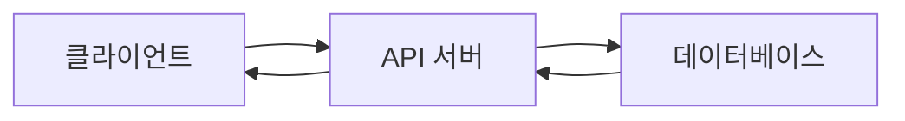
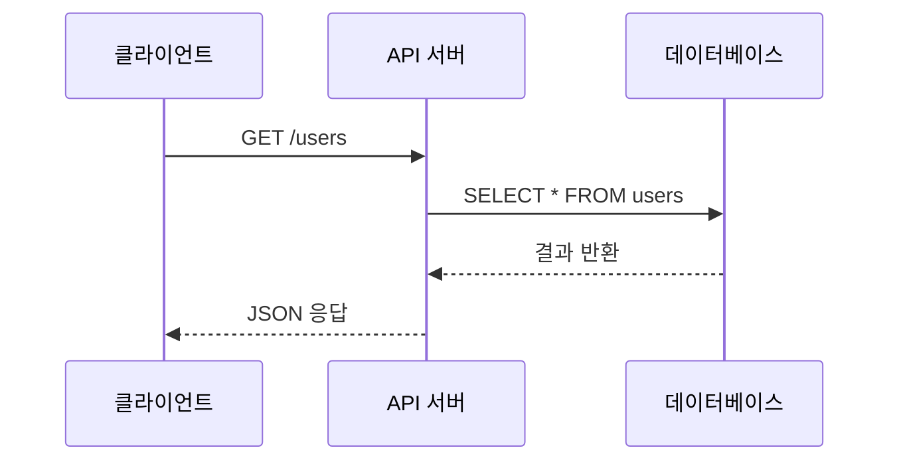

# Technical Writing 101 (6/10): 그림과 표 사용하기

문단으로 충분히 설명할 수 있는 내용을 그림으로 바꾸면 오히려 독자를 헷갈리게 만들 수 있습니다. 반대로 흐름이나 비교를 문단으로만 밀어붙이면 독자는 핵심 구조를 파악하기도 전에 스크롤부터 내리게 됩니다. 중요한 것은 시각 자료의 양이 아니라 질문과 형식의 짝을 맞추는 일입니다.

이 글은 기술 글쓰기 101 시리즈의 6번째 글입니다.

좋은 그림은 문장을 장식하지 않고 문장을 줄여 줍니다. 좋은 표는 선택지를 예쁘게 나열하는 대신 의사결정 기준을 한눈에 드러냅니다. 그래서 시각 자료는 글의 말미에 덧붙이는 부록이 아니라 본문 설계의 일부로 다루는 편이 낫습니다.

여기서는 그림과 표를 언제 고르고, 캡션과 대체 텍스트를 어떻게 써야 하는지 정리합니다.


*Technical Writing 101 6장 흐름 개요*
> 흐름을 보여 줄 때는 그림을, 선택지를 비교할 때는 표를 고르는 기준이 핵심입니다.

## 이 글에서 다룰 문제

- 언제 그림이 문단보다 더 나을까요?
- 언제 표가 비교를 더 정확하게 보여 줄까요?
- 캡션과 대체 텍스트는 왜 장식이 아니라 본문 일부일까요?
- 다이어그램 유형은 어떻게 고르고, 도구는 어떤 것을 써야 할까요?
- 그림을 본문 흐름 안에 어떻게 자연스럽게 통합할 수 있을까요?

## 이 글에서 배울 것

- 독자의 질문에 따른 시각 자료 선택 기준
- 흐름도, 시퀀스 다이어그램 등 유형별 사용 가이드
- 비교 표 설계 원칙
- 캡션과 대체 텍스트 작성법
- 접근성(a11y)과 해상도 기준

좋은 그림 한 장은 다섯 문단을 대신할 수 있습니다. 좋은 표 하나는 여러 선택지를 한 번에 비교하게 해 줍니다. 시각 자료는 장식이 아니라 탐색 비용을 줄이는 도구입니다.

## 한눈에 보는 멘탈 모델

> 멘탈 모델: 흐름을 보여 주고 싶으면 그림을 고르고, 선택지를 나란히 비교하고 싶으면 표를 고릅니다. 이 구분만 지켜도 많은 시각 자료가 더 정확해집니다.

- **flowchart**: 흐름도입니다.
- **sequence diagram**: 시퀀스 다이어그램입니다.
- **caption**: 캡션입니다.
- **alt text**: 이미지 대체 텍스트입니다.
- **a11y**: 접근성입니다.

## 시각 자료 선택 흐름

```
독자의 질문이 있는가?
        │
        ▼
 흐름/순서를 보여 주는가?
        │
   Yes  │  No
   ─────┼──────────────────────────────
   │                                  │
   ▼                                  ▼
그림 (Diagram)                  비교/나열인가?
  │                                   │
  ├─ 방향/단계 → Flowchart        Yes ─┼─ No
  ├─ 호출 순서 → Sequence              │         │
  ├─ 상태 전이 → State Diagram    표 (Table)  문단으로 충분
  └─ DB 구조  → ER Diagram
```

이 흐름도를 따르면 시각 자료 형식을 직관적으로 선택할 수 있습니다.

## Before / After 비교: 시각 자료 활용

### Before / After 예시 1: 텍스트 흐름 설명 vs 흐름도

**Before — 다섯 문장으로 설명한 요청 흐름**

"요청은 먼저 클라이언트에서 시작됩니다. 클라이언트는 API 서버로 요청을 보냅니다. API 서버는 요청을 검증한 다음 데이터베이스에 질의합니다. 데이터베이스는 결과를 API 서버로 반환합니다. API 서버는 클라이언트에 응답을 보냅니다."

독자는 이 다섯 문장을 순서대로 읽어야 구조를 파악합니다. 흐름이 이미 눈에 들어왔어야 할 자리에 문장이 자리를 차지하고 있습니다.

**After — 흐름도 한 장**

```
클라이언트 ──요청──▶ API 서버 ──질의──▶ 데이터베이스
클라이언트 ◀──응답── API 서버 ◀──결과── 데이터베이스
```

흐름도 한 장으로 5문장을 대신합니다. 독자는 1초 안에 구조를 파악합니다.

---

### Before / After 예시 2: 뭉뚱그린 캡션 vs 구체적인 캡션

**Before — 캡션이 너무 추상적**

```markdown

*구조 다이어그램*
```

독자는 그림을 보고 나서야 맥락을 추측해야 합니다.

**After — 내용을 전달하는 캡션**

```markdown

*클라이언트 요청이 API 서버와 데이터베이스를 거쳐 응답으로 돌아오는 전체 흐름입니다.*
```

이 캡션은 그림을 보지 않아도 핵심을 전달합니다.

---

### Before / After 예시 3: 나열형 비교 vs 비교 표

**Before — 문단으로 배포 옵션 비교**

"옵션 A는 빠르지만 비용이 높습니다. 옵션 B는 중간 속도에 중간 비용입니다. 옵션 C는 느리지만 비용이 낮습니다."

**After — 비교 표**

| 옵션 | 속도 | 비용 | 복잡도 |
| --- | --- | --- | --- |
| A | 빠름 | 높음 | 낮음 |
| B | 중간 | 중간 | 중간 |
| C | 느림 | 낮음 | 높음 |

표에서 독자는 열을 기준으로 빠르게 비교하고 선택을 결정할 수 있습니다.

## 문서 템플릿: 시각 자료 통합 블록

```markdown
<!-- 그림 통합 블록 -->

다음 그림은 [이 그림이 무엇을 보여 주는지 한 문장].


*캡션: 그림의 핵심 내용을 완전한 문장으로*

이 그림에서 [가장 중요한 요소]는 [한두 문장 설명].

<!-- 표 통합 블록 -->

다음 표는 [비교 기준 명시].

| [비교 대상] | [기준 1] | [기준 2] | [기준 3] |
| --- | --- | --- | --- |
| 옵션 A | 값 | 값 | 값 |
| 옵션 B | 값 | 값 | 값 |

[표를 읽은 뒤 독자가 내려야 할 결론 또는 선택 기준 한 문장]
```

## 독자의 질문에 따라 시각 자료를 고르는 기준

| 독자의 질문 | 더 잘 맞는 형식 | 이유 |
| --- | --- | --- |
| 요청이 어디로 흐르나요? | 흐름도 | 방향과 순서를 빠르게 보여 줍니다 |
| 어떤 선택지가 더 싼가요? | 비교 표 | 기준을 나란히 맞춰 읽게 합니다 |
| 장애가 어느 단계에서 납니까? | 시퀀스 다이어그램 | 호출 순서와 응답 지점을 드러냅니다 |
| 팀 기준은 무엇이 다른가요? | 결정 표 | 선택 기준을 항목별로 비교합니다 |

## 다이어그램 유형별 사용 가이드

| 다이어그램 유형 | 적합한 상황 | 강점 | 추천 도구 |
| --- | --- | --- | --- |
| Flowchart | 요청 흐름, 결정 분기 | 방향과 조건을 직관적으로 표현 | Mermaid, draw.io |
| Sequence Diagram | 서비스 간 호출 순서 | 호출 순서와 응답 관계를 명확히 드러냄 | Mermaid, PlantUML |
| ER Diagram | 데이터베이스 구조 | 테이블 간 관계를 한눈에 파악 | dbdiagram.io, ERDPlus |
| Architecture Diagram | 시스템 구성 요소 | 전체 시스템 경계와 역할 분리 표현 | draw.io, Lucidchart |
| State Diagram | 상태 전이, 워크플로 | 상태 변화와 조건을 명확히 표현 | Mermaid, PlantUML |

## Mermaid 코드 예시

Mermaid는 코드로 다이어그램을 그리는 도구입니다. 버전 관리가 쉽고 텍스트 기반이라 협업에 강합니다.

**Flowchart:**


```mermaid
flowchart LR
    Client["클라이언트"] --> API["API 서버"]
    API --> DB["데이터베이스"]
    DB --> API
    API --> Client
```

**Sequence Diagram:**


```mermaid
sequenceDiagram
    participant C as 클라이언트
    participant A as API 서버
    participant D as 데이터베이스

    C->>A: GET /users
    A->>D: SELECT * FROM users
    D-->>A: 결과 반환
    A-->>C: JSON 응답
```

## 표 설계 원칙

표는 선택지를 나란히 비교할 때 가장 강력한 도구입니다. 잘못 설계된 표는 오히려 혼란을 키웁니다.

| 원칙 | 설명 | 예시 |
| --- | --- | --- |
| 비교축을 행에 둡니다 | 비교 대상은 행으로, 기준은 열로 배치합니다 | 옵션 A/B/C가 행, Speed/Cost가 열 |
| 열 순서는 중요도 순입니다 | 가장 중요한 기준을 왼쪽에 둡니다 | Cost 열이 Speed보다 앞 |
| 단위를 헤더에 명시합니다 | 셀마다 단위 반복 대신 헤더에 한 번만 씁니다 | `Latency (ms)` |
| 셀 내용은 짧게 유지합니다 | 한 셀에 세 줄 이상이면 본문 설명이 낫습니다 | 단어 또는 짧은 구 |

## 캡션 작성법

캡션은 그림이 무엇을 보여 주는지 한 문장으로 설명합니다. 그림만 봐도 글의 맥락을 일부 복구할 수 있게 만드는 것이 목표입니다.

**좋은 캡션:**
```
클라이언트 요청이 API 서버와 데이터베이스를 거쳐 응답으로 돌아오는 전체 흐름입니다.
```

**나쁜 캡션:**
```
구조 다이어그램
```

캡션과 대체 텍스트의 역할 차이:

- **캡션**: 시각 자료가 무엇을 보여 주는지 설명합니다. 모든 독자가 읽습니다.
- **대체 텍스트(alt text)**: 이미지를 볼 수 없는 환경에서 이미지를 대신합니다. 스크린 리더가 읽습니다.

## 실습: 그림 하나와 표 하나 만들기

### 1단계 — 흐름도


*클라이언트 요청이 서버와 데이터베이스로 흐르는 기본 경로를 보여 주는 흐름도입니다.*

### 2단계 — 시퀀스


*클라이언트와 서버, 데이터베이스 사이의 호출 순서를 보여 주는 시퀀스 다이어그램입니다.*

### 3단계 — 비교 표

```markdown
| Option | Speed | Cost |
| --- | --- | --- |
| A | Fast | High |
| B | Medium | Low |
```

### 4단계 — 캡션

```markdown
*클라이언트 요청이 API 서버와 데이터베이스를 거쳐 응답으로 돌아오는 전체 흐름입니다.*
```

### 5단계 — 대체 텍스트

```markdown

```

## 자주 하는 실수

| 실수 | 왜 문제인가 | 바로 고치는 방법 |
| --- | --- | --- |
| 그림이 전혀 없습니다 | 흐름 설명이 문단에 묻혀 독자가 구조를 파악하기 어렵습니다 | 흐름이나 구조가 있는 곳에 다이어그램 하나를 추가합니다 |
| 캡션이 없습니다 | 그림만 보고 맥락을 알 수 없습니다 | 완전한 문장으로 캡션을 작성합니다 |
| 대체 텍스트가 없습니다 | 스크린 리더 사용자와 이미지 로딩 실패 시 정보 손실이 생깁니다 | alt="" 대신 핵심 내용을 설명하는 문장을 씁니다 |
| 표가 너무 많은 열을 가집니다 | 독자가 한눈에 비교하지 못합니다 | 비교 기준을 3-5개로 좁힙니다 |
| 해상도가 낮습니다 | 레티나 디스플레이에서 흐릿하게 보입니다 | 표시 크기의 2배 해상도로 이미지를 준비합니다 |
| 그림보다 설명이 먼저 없습니다 | 독자가 그림을 보고 무엇을 읽어야 할지 모릅니다 | 그림 앞에 "다음 그림은 ..." 한 문장을 추가합니다 |

## 운영 체크리스트

- [ ] 그림이 하나 이상 있는가
- [ ] 모든 그림에 캡션(완전한 문장)이 있는가
- [ ] 모든 그림에 대체 텍스트가 있는가
- [ ] 표의 열이 5개 이하인가
- [ ] 그림보다 앞에 맥락 한 문장이 있는가
- [ ] 이미지 해상도가 표시 크기의 2배인가

## 연습 문제

1. flowchart와 sequence diagram의 차이를 한 줄로 적어 보세요.
2. 아래 캡션을 개선하세요: "시스템 아키텍처 그림"
3. 다음 세 가지 질문에 어떤 시각 자료가 맞는지 골라 보세요.
   - a. "인증 흐름이 어떻게 되나요?"
   - b. "세 가지 DB 옵션 중 어떤 게 비용이 가장 낮나요?"
   - c. "주문 상태가 어떻게 변하나요?"

## 정리

그림과 표는 글을 꾸미는 요소가 아니라 설명을 압축하는 도구입니다. 흐름은 그림으로, 비교는 표로 나누면 독자는 구조를 훨씬 빨리 파악합니다. 캡션과 대체 텍스트는 장식이 아니라 접근성과 맥락 전달의 핵심입니다. 다음 글에서는 처음 방문한 사람이 5분 안에 프로젝트를 실행할 수 있게 만드는 README를 어떻게 써야 하는지 봅니다.

<!-- toc:begin -->
## 시리즈 목차

- [Technical Writing 101 (1/10): 기술 글쓰기란 무엇인가](./01-what-is-technical-writing.md)
- [Technical Writing 101 (2/10): 독자 정의하기](./02-defining-the-reader.md)
- [Technical Writing 101 (3/10): 제목과 구조 잡기](./03-title-and-structure.md)
- [Technical Writing 101 (4/10): 개념 설명하기](./04-explaining-concepts.md)
- [Technical Writing 101 (5/10): 예제 코드 설명하기](./05-explaining-example-code.md)
- **Technical Writing 101 (6/10): 그림과 표 사용하기 (현재 글)**
- [Technical Writing 101 (7/10): README 작성하기](./07-writing-the-readme.md)
- [Technical Writing 101 (8/10): 튜토리얼 작성하기](./08-writing-tutorials.md)
- [Technical Writing 101 (9/10): 블로그와 문서 차이](./09-blog-vs-docs.md)
- [발행 전 체크리스트](./10-pre-publish-checklist.md)

<!-- toc:end -->

## 참고 자료

- [The Visual Display of Quantitative Information - Tufte](https://www.edwardtufte.com/tufte/books_vdqi)
- [Mermaid Diagram Syntax](https://mermaid.js.org/intro/)
- [Web Content Accessibility Guidelines](https://www.w3.org/WAI/standards-guidelines/wcag/)
- [Storytelling with Data - Knaflic](https://www.storytellingwithdata.com/)

- [이 글의 예제 코드 (book-examples)](https://github.com/yeongseon-books/book-examples/tree/main/technical-writing-101/ko)

Tags: TechnicalWriting, Diagrams, Tables, Visual, Beginner
