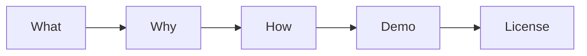

# README 작성하기

이 글은 Technical Writing 101 시리즈의 7번째 글입니다.

## 이 글에서 다룰 문제

- 처음 방문한 사람이 README만 보고 5분 안에 실행할 수 있을까요?
- README의 다섯 부분은 왜 거의 같은 순서로 반복될까요?
- Quick Start는 왜 짧을수록 더 강할까요?
- FAQ, 배지, 라이선스는 언제 문서의 신뢰를 높일까요?

## 이 글에서 배울 것

- 다섯 부분 구조
- Quick Start 쓰기
- 배지 쓰기
- FAQ 추가하기
- 라이선스 적기

## 왜 중요한가

README는 프로젝트의 첫인상입니다. 저장소에 처음 들어온 사람은 코드보다 먼저 README를 읽고, 여기서 계속 볼지 떠날지를 결정합니다.

## 한눈에 보는 멘탈 모델

> 멘탈 모델: 좋은 README는 이 프로젝트가 무엇인지, 왜 만들었는지, 어떻게 써야 하는지, 실제로 돌아가는지, 법적으로 무엇이 허용되는지까지 한 흐름으로 답합니다.



## 핵심 용어

- **What**: 이것이 무엇인지입니다.
- **Why**: 왜 만들었는지입니다.
- **How**: 어떻게 쓰는지입니다.
- **Demo**: 실제로 돌아간다는 증거입니다.
- **License**: 법적 조건입니다.

## Before / After

**Before**: "A Python package called Hello."

**After**: A README with all five parts.

## 실습: README 다섯 부분 만들기

### 1단계 — What

```markdown
# greeter
A small greeting library.
```

### 2단계 — Why

```markdown
## Why
I wanted multilingual greetings in a single line.
```

### 3단계 — How

```bash
pip install greeter
python3 -c "from greeter import hello; print(hello('en'))"
```

### 4단계 — Demo

```text
Hello!
```

### 5단계 — License

```markdown
## License
MIT
```

## 이 코드에서 먼저 볼 점

- 다섯 부분이 모두 있습니다.
- 명령은 복사해 붙여 넣을 수 있습니다.
- 결과가 눈에 보입니다.

## 자주 하는 실수 5가지

1. **Why가 없습니다.**
2. **Quick Start가 깁니다.**
3. **데모 결과가 없습니다.**
4. **라이선스가 없습니다.**
5. **스크린샷이 없습니다.**

## 실무에서는 이렇게 드러납니다

GitHub에서 주목받는 프로젝트 대부분은 거의 같은 다섯 부분 패턴을 따릅니다. 독자가 가장 빨리 프로젝트를 이해하고 실행할 수 있는 구조이기 때문입니다.

## 시니어 엔지니어는 이렇게 생각합니다

- 5분 안에 실행돼야 합니다.
- Why는 한 줄이어야 합니다.
- 명령은 적힌 그대로 돌아가야 합니다.
- 라이선스는 명시해야 합니다.
- 스크린샷은 하나 이상 있어야 합니다.

## 체크리스트

- [ ] 다섯 부분이 모두 있는가
- [ ] Quick Start가 다섯 줄 이하인가
- [ ] 데모 결과를 보여 주는가
- [ ] 라이선스를 적었는가

## 연습 문제

1. What의 뜻을 한 줄로 적어 보세요.
2. Demo의 뜻을 한 줄로 적어 보세요.
3. License의 예시를 한 줄로 적어 보세요.

## 정리

좋은 README는 저장소 소개문이 아니라 친절한 입구입니다. 무엇인지, 왜 만들었는지, 어떻게 쓰는지, 실제로 돌아가는지, 어떤 조건으로 쓸 수 있는지까지 짧고 분명하게 보여 줘야 합니다. 다음 글에서는 독자가 실제로 따라 하며 배울 수 있는 튜토리얼을 어떻게 설계할지 살펴보겠습니다.

<!-- toc:begin -->
- [기술 글쓰기란 무엇인가](./01-what-is-technical-writing.md)
- [독자 정의하기](./02-defining-the-reader.md)
- [제목과 구조 잡기](./03-title-and-structure.md)
- [개념 설명하기](./04-explaining-concepts.md)
- [예제 코드 설명하기](./05-explaining-example-code.md)
- [그림과 표 사용하기](./06-using-figures-and-tables.md)
- **README 작성하기 (현재 글)**
- 튜토리얼 작성하기 (예정)
- 블로그와 문서 차이 (예정)
- 발행 전 체크리스트 (예정)
<!-- toc:end -->

## 참고 자료

- [Make a README - GitHub](https://www.makeareadme.com/)
- [Standard README - RichardLitt](https://github.com/RichardLitt/standard-readme)
- [Awesome README - matiassingers](https://github.com/matiassingers/awesome-readme)
- [Choose a License](https://choosealicense.com/)

Tags: TechnicalWriting, README, OpenSource, Documentation, Beginner
