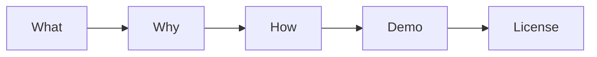

# README 작성하기

> 기술 글쓰기 101 시리즈 (7/10)


## 이 글에서 다룰 문제

README는 프로젝트의 첫인상입니다.

## 전체 흐름


## Before/After

**Before**: "*Hello* 라는 *Python 패키지*."

**After**: *5요소* 가 모두 있는 *README*.

## README 5요소

### 1단계 — What

```markdown
# greeter
간단한 인사말 라이브러리.
```

### 2단계 — Why

```markdown
## Why
다국어 인사말을 한 줄로 만들고 싶어 만들었습니다.
```

### 3단계 — How

```bash
pip install greeter
python3 -c "from greeter import hello; print(hello('ko'))"
```

### 4단계 — Demo

```text
안녕하세요!
```

### 5단계 — License

```markdown
## License
MIT
```

## 이 코드에서 주목할 점

- 다섯 요소가 모두 있습니다.
- 명령을 그대로 복사해 실행할 수 있습니다.
- 결과가 바로 보입니다.

## 자주 하는 실수 5가지

1. **Why 절이 없습니다.**
2. **Quick Start가 깁니다.**
3. **Demo 결과가 없습니다.**
4. **라이선스가 없습니다.**
5. **스크린샷이 없습니다.**

## 실무에서는 이렇게 쓰입니다

깃허브에서 주목받는 프로젝트들도 거의 같은 다섯 요소 패턴을 씁니다.

## 체크리스트

- [ ] 다섯 요소가 모두 들어갔는가
- [ ] Quick Start가 5줄 이하인가
- [ ] 데모 결과를 보여 주는가
- [ ] 라이선스를 명시했는가

## 정리 및 다음 단계

다음 글은 튜토리얼 작성하기입니다.

<!-- toc:begin -->
- [기술 글쓰기란 무엇인가](./01-what-is-technical-writing.md)
- [독자 정의하기](./02-defining-the-reader.md)
- [제목과 구조 잡기](./03-title-and-structure.md)
- [개념 설명하기](./04-explaining-concepts.md)
- [예제 코드 설명하기](./05-explaining-example-code.md)
- [그림과 표 사용하기](./06-using-figures-and-tables.md)
- **README 작성하기 (현재 글)**
- 튜토리얼 작성하기 (예정)
- 블로그와 문서 차이 (예정)
- 발행 전 체크리스트 (예정)
<!-- toc:end -->

## 참고 자료

- [Make a README - GitHub](https://www.makeareadme.com/)
- [Standard README - RichardLitt](https://github.com/RichardLitt/standard-readme)
- [Awesome README - matiassingers](https://github.com/matiassingers/awesome-readme)
- [Choose a License](https://choosealicense.com/)

Tags: TechnicalWriting, README, OpenSource, Documentation, Beginner
