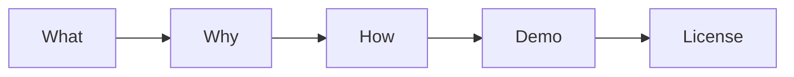

# README 작성하기

> 기술 글쓰기 101 시리즈 (7/10)


## 이 글에서 다룰 문제

*README* 가 *프로젝트* 의 *첫 인상* 입니다.

## 전체 흐름


## Before/After

**Before**: "*Hello* 라는 *Python 패키지*."

**After**: *5요소* 가 모두 있는 *README*.

## README 5요소

### 1단계 — What

```markdown
# greeter
간단한 인사말 라이브러리.
```

### 2단계 — Why

```markdown
## Why
다국어 인사말을 한 줄로 만들고 싶어 만들었습니다.
```

### 3단계 — How

```bash
pip install greeter
python3 -c "from greeter import hello; print(hello('ko'))"
```

### 4단계 — Demo

```text
안녕하세요!
```

### 5단계 — License

```markdown
## License
MIT
```

## 이 코드에서 주목할 점

- *5요소* 가 모두 있다.
- *명령* 이 *복사* 가능.
- *결과* 가 *보인다*.

## 자주 하는 실수 5가지

1. ***Why* 가 *없다*.**
2. ***Quick Start* 가 *길다*.**
3. ***Demo* 결과가 *없다*.**
4. ***라이선스* 가 *없다*.**
5. ***스크린샷* 이 *없다*.**

## 실무에서는 이렇게 쓰입니다

깃허브 추세 1위 프로젝트들도 거의 동일한 *5요소* 패턴을 씁니다.

## 체크리스트

- [ ] *5요소* 모두.
- [ ] *Quick Start* 5줄 이하.
- [ ] *데모 결과* 표시.
- [ ] *라이선스* 명시.

## 정리 및 다음 단계

다음 글은 *튜토리얼 작성하기* 입니다.

<!-- toc:begin -->
- [기술 글쓰기란 무엇인가](./01-what-is-technical-writing.md)
- [독자 정의하기](./02-defining-the-reader.md)
- [제목과 구조 잡기](./03-title-and-structure.md)
- [개념 설명하기](./04-explaining-concepts.md)
- [예제 코드 설명하기](./05-explaining-example-code.md)
- [그림과 표 사용하기](./06-using-figures-and-tables.md)
- **README 작성하기 (현재 글)**
- 튜토리얼 작성하기 (예정)
- 블로그와 문서 차이 (예정)
- 발행 전 체크리스트 (예정)
<!-- toc:end -->

## 참고 자료

- [Make a README - GitHub](https://www.makeareadme.com/)
- [Standard README - RichardLitt](https://github.com/RichardLitt/standard-readme)
- [Awesome README - matiassingers](https://github.com/matiassingers/awesome-readme)
- [Choose a License](https://choosealicense.com/)

Tags: TechnicalWriting, README, OpenSource, Documentation, Beginner
