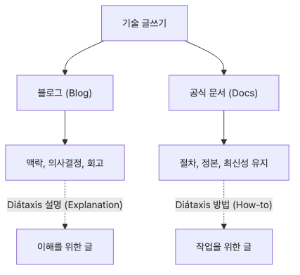

# 블로그와 문서 차이

같은 주제를 다뤘다는 이유로 블로그 글과 공식 문서를 같은 선반에 올려두면 운영이 금방 어긋납니다. 장애 원인을 설명한 회고 글은 훌륭한 맥락 자료가 될 수 있지만, 지금 팀이 따라야 할 절차의 정본이 되기에는 최신성 보장이 약합니다. 반대로 공식 문서는 정본으로서 강하지만, 왜 그런 결정을 했는지까지 늘 충분히 설명하지는 못합니다.

그래서 강한 팀은 블로그와 문서를 경쟁시키지 않고 역할을 나눕니다. 경험과 해석은 블로그에 남기고, 현재의 기준과 절차는 문서에 고정한 뒤 서로를 정확하게 링크합니다.

이 글은 Technical Writing 101 시리즈의 9번째 글입니다. 여기서는 블로그와 문서를 역할, 최신성, 소유권 관점에서 구분하는 기준을 다룹니다.

## 이 글에서 다룰 문제

- 블로그와 공식 문서는 왜 서로 섞이면 안 될까요?
- 둘의 생명주기와 소유권은 무엇이 다를까요?
- Diátaxis의 네 구역은 이 차이를 어떻게 설명해 줄까요?
- 블로그와 문서를 연결하되 책임은 어떻게 나눠야 할까요?

## 이 글에서 배울 것

- Diátaxis의 네 구역
- 블로그와 문서의 생명주기
- 블로그가 잘하는 일
- 문서가 잘하는 일
- 둘을 연결하는 방법

## 왜 중요한가

글의 종류가 섞이면 독자가 길을 잃습니다. 블로그를 공식 문서처럼 인용하거나, 공식 문서를 개인 경험담처럼 쓰는 순간 신뢰의 기준이 흐려집니다.

## 한눈에 보는 멘탈 모델

> 멘탈 모델: 블로그는 경험과 해석을 담고, 문서는 지금 따라야 할 기준을 담습니다. 둘은 연결할 수 있지만 서로를 대신하면 안 됩니다.



*한눈에 보는 멘탈 모델*
## 핵심 용어

- **Diátaxis**: 네 구역 문서 모델입니다.
- **lifecycle**: 생명주기입니다.
- **freshness**: 최신성입니다.
- **canonical**: 정본입니다.
- **archive**: 아카이브입니다.

## Before / After

**Before**: A blog post gets cited as official documentation.

**After**: Blogs hold experience; docs hold truth.

## 채널보다 먼저 소유권과 최신성 규칙을 나눕니다

| 항목 | 블로그 | 문서 |
| --- | --- | --- |
| 주 소유자 | 개인 또는 팀 필자 | 제품/플랫폼 소유 팀 |
| 최신성 기준 | 기록 시점 기준 | 현재 기준 유지 |
| 독자 기대 | 배경, 경험, 해석 | 절차, 규칙, 정본 |
| 업데이트 방식 | 필요 시 개정 | 코드 변경과 함께 갱신 |
| 링크 방향 | 문서 정본을 가리킴 | 관련 배경 글을 보조 링크로 제공 |

이 표가 필요한 이유는 블로그와 문서의 차이가 문체보다 운영 방식에서 더 크게 드러나기 때문입니다. 같은 FastAPI 배포 글이라도, 블로그는 왜 그런 결정을 했는지 회고할 수 있고, 문서는 지금 배포할 때 따라야 할 명령과 제한사항을 최신 상태로 유지해야 합니다.

## 실습: 네 구역에 배치해 보기

### 1단계 — Tutorial

```python
tutorial = "First-time learning"
```

### 2단계 — How-to

```python
how_to = "Solving a specific problem"
```

### 3단계 — Reference

```python
reference = "API specification"
```

### 4단계 — Explanation

```python
explanation = "Why a design was chosen"
```

### 5단계 — 블로그와 문서

```python
blog = "My experience and opinion"
docs = "The team's official truth"
```

## 이 코드에서 먼저 볼 점

- 블로그는 경험을 담습니다.
- 문서는 기준을 담습니다.
- 둘은 네 구역으로 더 잘 나눌 수 있습니다.

## 자주 하는 실수 5가지

1. **블로그를 공식 문서처럼 인용합니다.**
2. **문서를 오래된 채로 둡니다.**
3. **버전을 적지 않습니다.**
4. **아카이브 정책이 없습니다.**
5. **정본 링크가 없습니다.**

## 실무에서는 이렇게 드러납니다

좋은 엔지니어링 팀은 블로그와 문서를 분리해 운영하고, 문서는 코드와 함께 버전 관리합니다. 블로그는 경험과 배경을 남기고, 문서는 팀의 현재 진실을 유지합니다.

## 시니어 엔지니어는 이렇게 생각합니다

- 블로그는 지난 결정과 경험을 담습니다.
- 문서는 살아 있는 진실입니다.
- 오래된 글은 아카이브로 보냅니다.
- 정본은 문서에 둡니다.
- 블로그는 문서를 가리킵니다.

## 체크리스트

- [ ] 네 구역 매핑이 있는가
- [ ] 최신성 기준이 드러나는가
- [ ] 정본 링크가 있는가
- [ ] 아카이브 정책이 있는가

## 연습 문제

1. Diátaxis의 네 구역을 한 줄로 적어 보세요.
2. canonical의 뜻을 한 줄로 적어 보세요.
3. freshness의 뜻을 한 줄로 적어 보세요.

## 정리

블로그와 문서는 같은 기술을 다뤄도 역할이 다릅니다. 블로그는 경험과 배경을 남기고, 문서는 지금 따라야 할 기준을 유지합니다. 둘을 링크로 연결하는 것은 좋지만, 서로를 대신하게 두면 안 됩니다. 다음 글에서는 발행 직전에 무엇을 어떻게 점검해야 하는지 시리즈 마지막 정리로 이어 가겠습니다.

<!-- toc:begin -->
- [기술 글쓰기란 무엇인가](./01-what-is-technical-writing.md)
- [독자 정의하기](./02-defining-the-reader.md)
- [제목과 구조 잡기](./03-title-and-structure.md)
- [개념 설명하기](./04-explaining-concepts.md)
- [예제 코드 설명하기](./05-explaining-example-code.md)
- [그림과 표 사용하기](./06-using-figures-and-tables.md)
- [README 작성하기](./07-writing-the-readme.md)
- [튜토리얼 작성하기](./08-writing-tutorials.md)
- **블로그와 문서 차이 (현재 글)**
- 발행 전 체크리스트 (예정)
<!-- toc:end -->

## 참고 자료

- [Diátaxis - Procida](https://diataxis.fr/)
- [Docs Like Code - Anne Gentle](https://www.docslikecode.com/)
- [Docs as Code - Write the Docs](https://www.writethedocs.org/guide/docs-as-code/)
- [Stripe Engineering Blog](https://stripe.com/blog/engineering)

Tags: TechnicalWriting, Blog, Documentation, Diataxis, Beginner