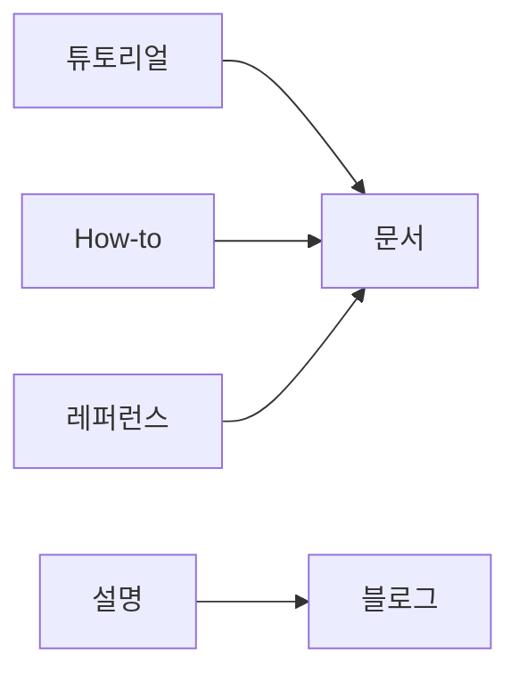

# 블로그와 문서 차이

## 이 글에서 다룰 문제

- 블로그 글과 공식 문서는 왜 같은 기술 내용을 다뤄도 역할이 다를까요?
- 경험을 담는 글과 팀의 공식 진실을 담는 글을 섞으면 어떤 문제가 생길까요?
- Diátaxis의 네 가지 구분은 이 차이를 이해하는 데 어떻게 도움을 줄까요?
- 블로그와 문서를 연결해 두되, 출처와 책임은 어떻게 분리해야 할까요?

> 블로그는 경험을 남기고, 문서는 현재의 기준을 남깁니다.

> 기술 글쓰기 101 시리즈 (9/10)

개인 블로그 글이 팀의 공식 문서처럼 인용되거나, 반대로 공식 문서가 개인 경험담처럼 쓰이는 경우가 있습니다. 둘 다 독자를 헷갈리게 만듭니다. 블로그와 문서는 겉모습이 비슷해 보여도 생명주기와 책임 주체가 다르기 때문입니다.

블로그는 맥락과 경험을 전달하는 데 강합니다. 문서는 현재 기준과 반복 가능한 사실을 유지하는 데 강합니다. 둘을 같은 틀로 다루면 어느 쪽의 장점도 살리지 못합니다.

## 왜 중요한가

글의 종류가 섞이면 독자가 길을 잃습니다. 개인 경험을 공식 규칙으로 오해하거나, 이미 오래된 블로그 글을 최신 가이드로 착각하는 일은 생각보다 자주 일어납니다. 반대로 공식 문서가 너무 설명형으로 흘러가면, 필요한 사실을 빨리 찾기 어려워집니다.

좋은 팀은 블로그와 문서를 분리합니다. 경험과 배경은 블로그에, 현재 진실과 절차는 문서에 둡니다. 그리고 둘을 링크로 연결해 독자가 맥락과 기준을 모두 따라갈 수 있게 만듭니다.

## 한눈에 보는 흐름

Diátaxis 관점에서 보면 기술 글의 역할 구분이 더 쉬워집니다.



튜토리얼, How-to, 레퍼런스는 보통 문서 쪽에 더 가깝고, 설명과 배경 맥락은 블로그 글에서 더 살아나는 경우가 많습니다. 물론 절대적인 구분은 아니지만, 글의 목적을 판단하는 데 좋은 기준이 됩니다.

## 핵심 용어

- **Diátaxis**: 문서를 튜토리얼, How-to, 레퍼런스, 설명으로 나누는 프레임워크입니다.
- **생명주기**: 글이 얼마나 자주 갱신되고 얼마나 오래 유효한지를 뜻합니다.
- **최신성**: 지금 기준으로 이 내용이 여전히 맞는지를 나타냅니다.
- **정본(canonical)**: 공식 기준으로 삼는 원본 문서입니다.
- **아카이브**: 더는 최신 기준은 아니지만 기록 가치가 있어 보관하는 글입니다.

기술 글을 쓰는 사람에게 이 구분이 중요한 이유는, 같은 내용도 어떤 형식에 담느냐에 따라 독자의 기대가 달라지기 때문입니다.

## Before / After

**Before**: 블로그 글이 공식 문서처럼 인용된다.

**After**: 블로그는 경험을 담고, 문서는 공식 기준을 담는다.

앞 상태에서는 책임이 모호합니다. 뒤 상태에서는 독자가 무엇을 믿고 어디를 따라야 하는지 분명합니다.

## 실습: 네 가지 구역에 배치해 보기

### 1단계 — Tutorial

```python
tutorial = "First-time learning"
```

튜토리얼은 처음 배우는 사람을 위한 글입니다. 독자가 따라 하며 작은 성공을 얻는 것이 우선입니다.

### 2단계 — How-to

```python
how_to = "Solving a specific problem"
```

How-to는 이미 어느 정도 아는 독자가 특정 문제를 해결할 때 찾는 글입니다. 운영 이슈 대응이나 설정 방법이 여기에 많이 들어갑니다.

### 3단계 — Reference

```python
reference = "API specification"
```

레퍼런스는 사실을 빠르게 찾는 문서입니다. 매개변수, 반환값, 옵션, 제약처럼 해석보다 정확성이 더 중요합니다.

### 4단계 — Explanation

```python
explanation = "Why a design was chosen"
```

설명 글은 “왜 이렇게 했는가”를 다룹니다. 설계 배경, 선택 이유, 트레이드오프는 블로그나 설명 문서에서 더 자연스럽게 풀립니다.

### 5단계 — 블로그와 문서 나누기

```python
blog = "My experience and opinion"
docs = "The team's official truth"
```

이 한 줄이 핵심입니다. 블로그에는 개인 경험과 해석이 들어갈 수 있습니다. 문서는 팀의 현재 기준과 동기화되어야 합니다. 그래서 소유자와 갱신 방식도 달라야 합니다.

## 이 예시에서 봐야 할 점

- 블로그는 경험과 맥락을 잘 담습니다.
- 문서는 공식 기준과 반복 가능한 사실을 담습니다.
- 글의 목적은 네 가지 구역으로 더 명확히 나눌 수 있습니다.
- 링크로 연결하되 책임의 위치는 분리해야 합니다.

이 구분이 있으면 팀 글쓰기도 한결 쉬워집니다. 어떤 내용을 어디에 둘지 기준이 생기기 때문입니다.

## 자주 하는 실수 다섯 가지

1. 블로그 글을 공식 문서처럼 인용합니다.
2. 문서를 갱신하지 않아 최신성이 깨집니다.
3. 버전 정보를 적지 않아 어느 시점 기준인지 흐립니다.
4. 오래된 글을 보관하는 아카이브 정책이 없습니다.
5. 정본 링크가 없어 독자가 어디를 기준으로 삼아야 할지 모릅니다.

블로그와 문서를 헷갈리면 결국 팀의 지식 체계가 흔들립니다. 기술 글쓰기는 문장력보다 정보의 책임 구조가 더 중요할 때가 많습니다.

## 실무에서는 이렇게 드러납니다

좋은 엔지니어링 팀은 블로그와 문서를 분리해 운영합니다. 문서는 코드와 함께 버전 관리하고, 블로그는 경험과 배경을 담아 외부나 내부에 공유합니다. 그리고 블로그 끝에는 공식 문서 링크를, 문서에는 필요할 경우 더 깊은 배경 글 링크를 둡니다.

이렇게 하면 독자는 맥락과 기준을 모두 얻습니다. 무엇을 지금 따라야 하는지와 왜 그런 선택을 했는지를 동시에 볼 수 있기 때문입니다.

## 시니어 엔지니어는 이렇게 생각합니다

- 블로그는 지난 결정과 경험을 기록합니다.
- 문서는 현재 살아 있는 기준입니다.
- 오래된 글은 아카이브로 분리합니다.
- 정본은 문서 쪽에 둡니다.
- 블로그는 문서를 가리키고, 문서는 필요하면 블로그를 보조 자료로 가리킵니다.

시니어가 이 경계를 엄격하게 보는 이유는, 문서의 신뢰가 깨지면 팀 전체가 같은 문제를 반복해서 겪기 때문입니다.

## 체크리스트

- [ ] 글의 목적이 네 가지 구역 중 어디에 가까운지 보이는가
- [ ] 최신성 기준이나 버전이 드러나는가
- [ ] 정본 링크가 있는가
- [ ] 오래된 글을 처리할 아카이브 정책이 있는가
- [ ] 블로그와 문서의 소유자가 구분되는가

## 연습 문제

1. Diátaxis의 네 구역을 한 줄로 적어 보세요.
2. 정본 문서가 왜 필요한지 한 줄로 적어 보세요.
3. 자신이 최근 읽은 글 하나를 골라 블로그형인지 문서형인지 분류해 보세요.

## 정리 및 다음 단계

블로그와 문서는 비슷해 보여도 목적, 생명주기, 소유자가 다릅니다. 블로그는 경험과 맥락을 전달하고, 문서는 지금 따라야 할 기준을 유지합니다. 둘을 연결하는 것은 좋지만, 서로 대신하게 만들면 안 됩니다.

다음 글에서는 이런 내용을 실제 발행 직전에 어떻게 점검할지 살펴보겠습니다. 시리즈의 마지막 글인 **발행 전 체크리스트**로 이어집니다.

<!-- toc:begin -->
- [기술 글쓰기란 무엇인가](./01-what-is-technical-writing.md)
- [독자 정의하기](./02-defining-the-reader.md)
- [제목과 구조 잡기](./03-title-and-structure.md)
- [개념 설명하기](./04-explaining-concepts.md)
- [예제 코드 설명하기](./05-explaining-example-code.md)
- [그림과 표 사용하기](./06-using-figures-and-tables.md)
- [README 작성하기](./07-writing-the-readme.md)
- [튜토리얼 작성하기](./08-writing-tutorials.md)
- **블로그와 문서 차이 (현재 글)**
- 발행 전 체크리스트 (예정)
<!-- toc:end -->

## 참고 자료

- [Diátaxis - Procida](https://diataxis.fr/)
- [Docs Like Code - Anne Gentle](https://www.docslikecode.com/)
- [Docs as Code - Write the Docs](https://www.writethedocs.org/guide/docs-as-code/)
- [Stripe Engineering Blog](https://stripe.com/blog/engineering)

Tags: TechnicalWriting, Blog, Documentation, Diataxis, Beginner
