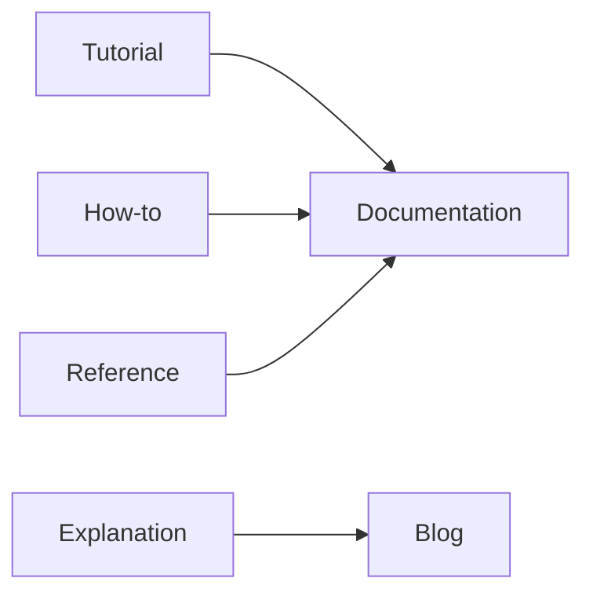

# 블로그와 문서 차이

> 기술 글쓰기 101 시리즈 (9/10)


## 이 글에서 다룰 문제

*글의 종류* 가 *섞이면* *독자* 가 *길* 을 *잃습니다*.

## 전체 흐름


## Before/After

**Before**: *블로그* 글이 *공식 문서* 처럼 인용된다.

**After**: *블로그* 는 *경험*, *문서* 는 *진실* 로 분리된다.

## 4분면 매핑

### 1단계 — Tutorial

```python
tutorial = "처음 학습용"
```

### 2단계 — How-to

```python
how_to = "특정 문제 해결"
```

### 3단계 — Reference

```python
reference = "API 명세"
```

### 4단계 — Explanation

```python
explanation = "왜 이렇게 설계했는가"
```

### 5단계 — 블로그 vs 문서

```python
blog = "내 경험과 의견"
docs = "팀의 공식 진실"
```

## 이 코드에서 주목할 점

- *블로그* 는 *경험*.
- *문서* 는 *진실*.
- *4분면* 으로 나뉜다.

## 자주 하는 실수 5가지

1. ***블로그* 를 *공식 문서* 로 인용.**
2. ***문서* 가 *오래되어* *깨짐*.**
3. ***버전* 을 *명시* 안 한다.**
4. ***archive* 정책이 *없다*.**
5. ***canonical* 링크가 *없다*.**

## 실무에서는 이렇게 쓰입니다

엔지니어링 팀은 *문서* 와 *블로그* 를 *분리* 하고, *문서* 는 *코드* 와 함께 *버전 관리* 합니다.

## 체크리스트

- [ ] *4분면* 분류.
- [ ] *최신성* 표시.
- [ ] *canonical* 링크.
- [ ] *archive* 정책.

## 정리 및 다음 단계

다음 글은 *발행 전 체크리스트* 입니다.

<!-- toc:begin -->
- [기술 글쓰기란 무엇인가](./01-what-is-technical-writing.md)
- [독자 정의하기](./02-defining-the-reader.md)
- [제목과 구조 잡기](./03-title-and-structure.md)
- [개념 설명하기](./04-explaining-concepts.md)
- [예제 코드 설명하기](./05-explaining-example-code.md)
- [그림과 표 사용하기](./06-using-figures-and-tables.md)
- [README 작성하기](./07-writing-the-readme.md)
- [튜토리얼 작성하기](./08-writing-tutorials.md)
- **블로그와 문서 차이 (현재 글)**
- 발행 전 체크리스트 (예정)
<!-- toc:end -->

## 참고 자료

- [Diátaxis - Procida](https://diataxis.fr/)
- [Docs Like Code - Anne Gentle](https://www.docslikecode.com/)
- [Docs as Code - Write the Docs](https://www.writethedocs.org/guide/docs-as-code/)
- [Stripe Engineering Blog](https://stripe.com/blog/engineering)

Tags: TechnicalWriting, Blog, Documentation, Diataxis, Beginner
