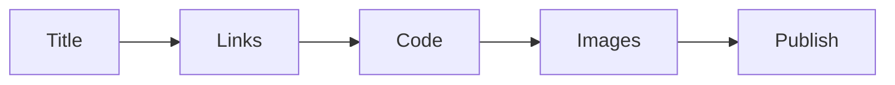

# 발행 전 체크리스트

이 글은 Technical Writing 101 시리즈의 마지막 글입니다.

## 이 글에서 다룰 문제

- 발행 버튼을 누르기 전에 마지막으로 무엇을 봐야 할까요?
- 제목, 링크, 코드, 이미지, 발행 후 대응은 왜 한 루틴으로 봐야 할까요?
- 발행 후 수정 비용은 왜 발행 전 점검 비용보다 훨씬 클까요?
- 자동 검증과 동료 검토는 왜 함께 갈수록 좋을까요?

## 이 글에서 배울 것

- 제목 검토
- 링크 검증
- 코드 실행
- 이미지 점검
- 발행 후 검토

## 왜 중요한가

발행 후 수정은 발행 전 점검보다 훨씬 비쌉니다. 독자는 이미 잘못된 링크를 눌렀을 수 있고, 깨진 명령을 복사했을 수 있고, 첫인상도 이미 남았을 수 있기 때문입니다.

## 한눈에 보는 멘탈 모델

> 멘탈 모델: 발행 전 체크리스트는 완벽주의가 아니라 운영 습관입니다. 제목에서 시작해 링크와 코드와 이미지를 확인하고, 발행 뒤까지 이어지는 작은 루틴이 큰 수정 비용을 막습니다.



## 핵심 용어

- **link rot**: 시간이 지나며 생기는 깨진 링크입니다.
- **smoke test**: 기본 동작 점검입니다.
- **canary read**: 동료의 사전 읽기입니다.
- **post-mortem**: 발행 뒤 회고입니다.
- **errata**: 오탈자 수정 목록입니다.

## Before / After

**Before**: A broken link found right after publish.

**After**: The checklist passes before publish.

## 실습: 다섯 단계로 점검하기

### 1단계 — 제목 다시 보기

```python
title_ok = ["has a verb", "fits 55 chars", "uses reader words"]
```

### 2단계 — 링크 검증

```bash
python3 scripts/check_links.py
```

### 3단계 — 코드 실행

```bash
python3 -c "from m import add; assert add(2,3) == 5"
```

### 4단계 — 이미지 점검

```python
images = {"caption": True, "alt_text": True, "resolution": "2x"}
```

### 5단계 — 발행 후 검토

```python
post = ["fix typos within 24h", "reply to reader comments"]
```

## 이 코드에서 먼저 볼 점

- 제목은 55자 안에 들어갑니다.
- 링크는 자동으로 검증합니다.
- 코드는 실제로 실행합니다.

## 자주 하는 실수 5가지

1. **link rot를 방치합니다.**
2. **코드가 실행되지 않습니다.**
3. **이미지에 대체 텍스트가 없습니다.**
4. **오탈자를 그대로 둡니다.**
5. **post-mortem이 없습니다.**

## 실무에서는 이렇게 드러납니다

엔지니어링 블로그 팀은 동료 검토, 자동 점검, 발행 후 회고를 함께 굴립니다. 이 세 가지가 있어야 한 번의 발행이 다음 글의 품질까지 끌어올립니다.

## 시니어 엔지니어는 이렇게 생각합니다

- 체크리스트는 루틴입니다.
- 링크는 자동으로 검증합니다.
- 코드는 복사해 붙여 넣어도 돌아가야 합니다.
- 오탈자는 24시간 안에 고칩니다.
- 회고는 다음 글의 입력입니다.

## 체크리스트

- [ ] 제목 점검이 끝났는가
- [ ] 링크 검증이 통과하는가
- [ ] 코드 실행이 통과하는가
- [ ] 이미지 점검이 끝났는가

## 연습 문제

1. link rot의 뜻을 한 줄로 적어 보세요.
2. canary read의 뜻을 한 줄로 적어 보세요.
3. errata의 예시를 한 줄로 적어 보세요.

## 정리

발행 전 체크리스트는 글의 마지막 장식이 아니라 품질을 지키는 운영 절차입니다. 제목, 링크, 코드, 이미지, 발행 후 대응까지 한 흐름으로 점검해야 독자 경험이 안정됩니다. 이 글로 Technical Writing 101 시리즈를 마치며, 다음 시리즈에서는 오픈소스 기여로 이어지는 글쓰기와 협업 흐름을 다루게 됩니다.

<!-- toc:begin -->
- [기술 글쓰기란 무엇인가](./01-what-is-technical-writing.md)
- [독자 정의하기](./02-defining-the-reader.md)
- [제목과 구조 잡기](./03-title-and-structure.md)
- [개념 설명하기](./04-explaining-concepts.md)
- [예제 코드 설명하기](./05-explaining-example-code.md)
- [그림과 표 사용하기](./06-using-figures-and-tables.md)
- [README 작성하기](./07-writing-the-readme.md)
- [튜토리얼 작성하기](./08-writing-tutorials.md)
- [블로그와 문서 차이](./09-blog-vs-docs.md)
- **발행 전 체크리스트 (현재 글)**
<!-- toc:end -->

## 참고 자료

- [Editorial Calendars - Trello Guide](https://blog.trello.com/editorial-calendar)
- [Hemingway Editor](https://hemingwayapp.com/)
- [Vale - Prose Linter](https://vale.sh/)
- [Plain Language Guidelines](https://www.plainlanguage.gov/guidelines/)

Tags: TechnicalWriting, Checklist, Publishing, Quality, Beginner
