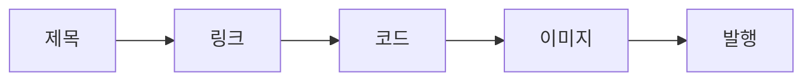

# 발행 전 체크리스트

## 이 글에서 다룰 문제

- 발행 직전에 마지막으로 무엇을 확인해야 할까요?
- 제목, 링크, 코드, 이미지, 사후 점검은 왜 따로 보지 않고 한 흐름으로 봐야 할까요?
- 발행 후 수정 비용이 발행 전 점검 비용보다 왜 훨씬 클까요?
- 혼자 쓰는 글이라도 왜 동료 검토와 자동 검증을 함께 고려해야 할까요?

> 발행 직전에는 글쓴이의 눈이 아니라, 처음 방문한 독자의 눈으로 다시 읽어야 합니다.

> 기술 글쓰기 101 시리즈 (10/10)

글을 다 쓰고 나면 가장 쉽게 놓치는 일이 하나 있습니다. 이미 내용을 다 안다고 생각한 나머지, 독자가 실제로 어떤 경험을 할지를 다시 확인하지 않는 일입니다. 그래서 발행 직후 깨진 링크를 발견하거나, 복사한 명령이 실행되지 않거나, 이미지가 흐리게 보이는 문제가 자주 생깁니다.

좋은 발행 전 점검은 완벽주의가 아닙니다. 아주 큰 비용을 작은 비용으로 바꾸는 습관입니다. 발행 전 10분 점검으로 막을 수 있는 문제를 발행 후에 고치면, 신뢰와 시간을 같이 잃기 쉽습니다.

## 왜 중요한가

발행 후 수정은 발행 전 점검보다 훨씬 비쌉니다. 이미 읽은 독자는 잘못된 정보를 가져갔을 수 있고, 검색 엔진이나 소셜 공유에 남은 첫인상도 바뀌지 않습니다. 특히 코드와 링크 오류는 독자의 신뢰를 빠르게 깎습니다.

반대로 발행 전 체크리스트가 있으면 매번 비슷한 실수를 줄일 수 있습니다. 제목 길이, 링크 상태, 코드 실행, 이미지 상태, 사후 대응 계획을 같은 루틴으로 보면 품질이 훨씬 안정됩니다.

## 한눈에 보는 흐름



이 흐름이 좋은 이유는, 독자가 실제로 겪는 순서와 비슷하기 때문입니다. 제목으로 들어오고, 링크를 따라가고, 코드를 실행하고, 이미지를 보며 이해하고, 마지막에 전체 글을 신뢰하게 됩니다.

## 핵심 용어

- **링크 부패**: 시간이 지나 링크가 깨지거나 더는 맞지 않게 되는 현상입니다.
- **스모크 테스트**: 가장 기본적인 동작만 빠르게 확인하는 점검입니다.
- **사전 시범 읽기**: 동료 한 사람이 발행 전에 먼저 읽어 보는 검토입니다.
- **사후 회고**: 발행 뒤 무엇이 잘됐고 무엇이 아쉬웠는지 돌아보는 정리입니다.
- **정오표**: 오탈자나 잘못된 내용을 수정해 기록하는 목록입니다.

이 용어를 익혀 두면 발행 전후 품질 점검을 감이 아니라 절차로 운영할 수 있습니다.

## Before / After

**Before**: 발행 직후 깨진 링크를 발견한다.

**After**: 발행 전에 체크리스트를 통과한다.

차이는 단순하지만 큽니다. 앞은 독자가 먼저 문제를 발견하고, 뒤는 글쓴이가 먼저 잡습니다. 기술 글에서는 이 차이가 신뢰 차이로 이어집니다.

## 실습: 다섯 단계로 점검하기

### 1단계 — 제목 다시 보기

```python
title_ok = ["has a verb", "fits 55 chars", "uses reader words"]
```

제목은 마지막에 한 번 더 봐야 합니다. 본문을 쓰는 동안 범위가 바뀌었을 수 있기 때문입니다. 제목이 여전히 글의 핵심 결과를 정확히 반영하는지 확인해야 합니다.

### 2단계 — 링크 검증하기

```bash
python3 scripts/check_links.py
```

링크는 자동으로 검증하는 편이 좋습니다. 사람이 눈으로만 보면 상대 경로나 오래된 외부 링크를 놓치기 쉽습니다. 자동 검사는 반복 가능한 품질 습관을 만듭니다.

### 3단계 — 코드 실행하기

```bash
python3 -c "from m import add; assert add(2,3) == 5"
```

코드는 반드시 실제로 돌려 봐야 합니다. 눈으로 읽을 때는 맞아 보여도, 복사해 실행하면 import나 버전 차이로 쉽게 깨집니다. 실행 검증은 기술 글의 신뢰를 지키는 가장 기본적인 단계입니다.

### 4단계 — 이미지 점검하기

```python
images = {"caption": True, "alt_text": True, "resolution": "2x"}
```

이미지는 본문과 따로 노는 요소가 아닙니다. 캡션이 있는지, 대체 텍스트가 있는지, 축소해도 읽히는지 확인해야 합니다. 플랫폼에 따라 렌더링 크기가 달라질 수 있다는 점도 함께 봐야 합니다.

### 5단계 — 발행 후 대응 계획 적기

```python
post = ["fix typos within 24h", "reply to reader comments"]
```

발행은 끝이 아니라 시작입니다. 오탈자를 언제까지 고칠지, 댓글이나 피드백을 어떻게 반영할지 미리 정해 두면 운영이 훨씬 매끄럽습니다.

## 이 예시에서 봐야 할 점

- 제목은 마지막까지 다시 봅니다.
- 링크 검증은 자동화할 수 있습니다.
- 코드는 실제로 실행해야 합니다.
- 이미지는 캡션과 대체 텍스트까지 확인합니다.
- 발행 후 대응도 체크리스트에 포함합니다.

좋은 체크리스트는 해야 할 일을 늘리는 것이 아니라, 같은 실수를 반복하지 않게 만드는 장치입니다.

## 자주 하는 실수 다섯 가지

1. 링크 부패를 방치합니다.
2. 코드가 실행되지 않는데 눈으로만 확인하고 넘어갑니다.
3. 이미지에 대체 텍스트가 없습니다.
4. 오탈자를 알면서도 오래 두어 신뢰를 깎습니다.
5. 발행 후 회고가 없어 같은 문제를 다음 글에서도 반복합니다.

특히 혼자 운영하는 글일수록 체크리스트가 더 중요합니다. 다른 사람이 잡아 줄 마지막 안전망이 없기 때문입니다.

## 실무에서는 이렇게 드러납니다

엔지니어링 블로그 팀은 보통 세 가지를 함께 씁니다. 동료 한 명의 사전 읽기, 자동 검증 스크립트, 발행 후 짧은 회고입니다. 이 세 가지가 합쳐지면 글 품질이 훨씬 안정됩니다.

사내 문서도 마찬가지입니다. 한 번 잘못 적힌 설치 명령이나 운영 절차는 여러 사람이 반복해서 복사하기 때문에, 초기에 잡는 편이 훨씬 싸게 먹힙니다.

## 시니어 엔지니어는 이렇게 생각합니다

- 체크리스트를 감각이 아니라 루틴으로 만듭니다.
- 링크는 자동으로 검증합니다.
- 코드는 복사해 바로 실행해 봅니다.
- 오탈자는 24시간 안에 고칩니다.
- 사후 회고를 다음 글의 입력으로 씁니다.

시니어가 체크리스트를 중시하는 이유는, 좋은 글도 운영하지 않으면 금방 낡는다는 사실을 잘 알기 때문입니다.

## 체크리스트

- [ ] 제목이 글의 결과를 정확히 반영하는가
- [ ] 링크 검증이 통과하는가
- [ ] 코드가 실제로 실행되는가
- [ ] 이미지 캡션과 대체 텍스트가 준비됐는가
- [ ] 발행 후 수정과 피드백 대응 계획이 있는가

## 연습 문제

1. 링크 부패가 무엇인지 한 줄로 적어 보세요.
2. 사전 시범 읽기가 왜 필요한지 한 줄로 적어 보세요.
3. 자신만의 발행 전 체크리스트 항목을 하나 추가해 보세요.

## 정리 및 다음 단계

발행 전 체크리스트는 글의 마지막 장식이 아니라 품질을 지키는 운영 절차입니다. 제목, 링크, 코드, 이미지, 사후 대응까지 한 흐름으로 점검해야 독자 경험이 안정됩니다. 작은 점검 하나가 발행 후 큰 수정을 막아 줍니다.

이 글로 기술 글쓰기 101 시리즈를 마칩니다. 다음 시리즈로 넘어가더라도, 여기서 다룬 독자 관점, 구조, 예제, 시각 자료, 체크리스트는 계속 기본기가 됩니다.

<!-- toc:begin -->
- [기술 글쓰기란 무엇인가](./01-what-is-technical-writing.md)
- [독자 정의하기](./02-defining-the-reader.md)
- [제목과 구조 잡기](./03-title-and-structure.md)
- [개념 설명하기](./04-explaining-concepts.md)
- [예제 코드 설명하기](./05-explaining-example-code.md)
- [그림과 표 사용하기](./06-using-figures-and-tables.md)
- [README 작성하기](./07-writing-the-readme.md)
- [튜토리얼 작성하기](./08-writing-tutorials.md)
- [블로그와 문서 차이](./09-blog-vs-docs.md)
- **발행 전 체크리스트 (현재 글)**
<!-- toc:end -->

## 참고 자료

- [Editorial Calendars - Trello Guide](https://blog.trello.com/editorial-calendar)
- [Hemingway Editor](https://hemingwayapp.com/)
- [Vale - Prose Linter](https://vale.sh/)
- [Plain Language Guidelines](https://www.plainlanguage.gov/guidelines/)

Tags: TechnicalWriting, Checklist, Publishing, Quality, Beginner
