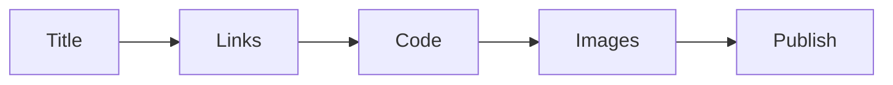

# 발행 전 체크리스트

> 기술 글쓰기 101 시리즈 (10/10)

<!-- a-grade-intro:begin -->

**핵심 질문**: *발행 버튼* 을 *누르기 전* *마지막* 으로 *볼* 것은 *무엇* 인가요?

> *처음 본 사람* 의 *눈* 으로 *다시 읽기* 입니다.

<!-- a-grade-intro:end -->

## 이 글에서 배울 것

- *제목* 검토
- *링크* 검증
- *코드* 실행
- *그림* 점검
- *사후 점검*

## 왜 중요한가

*발행* 후 *수정* 은 *비용* 입니다.

## 개념 한눈에 보기



## 핵심 용어 정리

- **link rot**: *링크 부패*.
- **smoke test**: *기본 동작 확인*.
- **canary read**: *동료 사전 검토*.
- **post-mortem**: *발행 후 회고*.
- **errata**: *오탈자 정정*.

## Before/After

**Before**: 발행 직후 *링크* 가 *깨짐* 발견.

**After**: 발행 전 *체크리스트* 통과.

## 실습: 5단계 점검

### 1단계 — 제목 검토

```python
title_ok = ["동사 포함", "55자 이내", "독자 단어"]
```

### 2단계 — 링크 검증

```bash
python3 scripts/check_links.py
```

### 3단계 — 코드 실행

```bash
python3 -c "from m import add; assert add(2,3) == 5"
```

### 4단계 — 그림 점검

```python
images = {"caption": True, "alt_text": True, "resolution": "2x"}
```

### 5단계 — 사후 점검

```python
post = ["오탈자 24시간 이내 수정", "독자 댓글 응답"]
```

## 이 코드에서 주목할 점

- *제목* 은 *55자 이내*.
- *링크* 는 *자동 검증*.
- *코드* 는 *실제로 실행*.

## 자주 하는 실수 5가지

1. ***링크 부패* 를 *방치*.**
2. ***코드* 가 *실행* 안 됨.**
3. ***그림* 에 *대체 텍스트* 가 *없음*.**
4. ***오탈자* 를 *방치*.**
5. ***회고* 가 *없다*.**

## 실무에서는 이렇게 쓰입니다

엔지니어링 블로그 팀은 *동료 리뷰 + 자동 검증 + 사후 회고* 를 모두 운영합니다.

## 시니어 엔지니어는 이렇게 생각합니다

- *체크리스트* 는 *루틴*.
- *링크* 는 *자동 검증*.
- *코드* 는 *복사하면 동작*.
- *오탈자* 는 *24시간 이내*.
- *회고* 는 *다음 글* 의 *입력*.

## 체크리스트

- [ ] *제목* OK.
- [ ] *링크* 검증 통과.
- [ ] *코드* 실행 통과.
- [ ] *그림* 점검 통과.

## 연습 문제

1. *link rot* 의 의미 한 줄.
2. *canary read* 의 정의 한 줄.
3. *errata* 의 예 한 줄.

## 정리 및 다음 단계

이 글은 *기술 글쓰기 101* 의 *마지막* 글입니다. 다음 시리즈에서는 *오픈소스 기여* 를 다룹니다.

<!-- toc:begin -->
- [기술 글쓰기란 무엇인가](./01-what-is-technical-writing.md)
- [독자 정의하기](./02-defining-the-reader.md)
- [제목과 구조 잡기](./03-title-and-structure.md)
- [개념 설명하기](./04-explaining-concepts.md)
- [예제 코드 설명하기](./05-explaining-example-code.md)
- [그림과 표 사용하기](./06-using-figures-and-tables.md)
- [README 작성하기](./07-writing-the-readme.md)
- [튜토리얼 작성하기](./08-writing-tutorials.md)
- [블로그와 문서 차이](./09-blog-vs-docs.md)
- **발행 전 체크리스트 (현재 글)**
<!-- toc:end -->

## 참고 자료

- [Editorial Calendars - Trello Guide](https://blog.trello.com/editorial-calendar)
- [Hemingway Editor](https://hemingwayapp.com/)
- [Vale - Prose Linter](https://vale.sh/)
- [Plain Language Guidelines](https://www.plainlanguage.gov/guidelines/)

Tags: TechnicalWriting, Checklist, Publishing, Quality, Beginner
