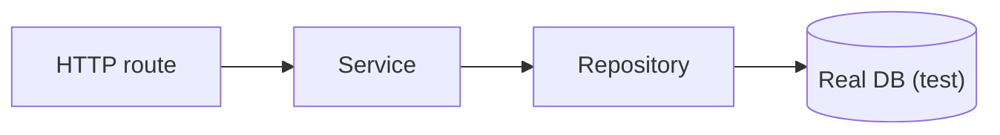

# Integration Test

This is post 3 in the Testing 101 series.

> Testing 101 series (3/10)

<!-- a-grade-intro:begin -->

**Core question**: All your unit tests pass — *why does it still break* in the real environment?

> An integration test verifies *what happens when several parts work together*. Each part may be correct, yet *fitting them together* exposes the real problem.

<!-- a-grade-intro:end -->

## What You Will Learn

- The definition of an *integration test* and how it differs from a unit test
- How to handle *real dependencies* like DB and HTTP
- *Test containers* and fixtures
- Strategies for managing *slow tests*
- Five common pitfalls

## Why It Matters

Most bugs live at *the seams* — DB schema, API contracts, authorization checks — *between modules*, not inside them. Integration tests cover those seams.

> Unit tests look at *parts*; integration tests look at *the assembly*.

## Concept at a Glance



## Key Terms

- **Integration test**: a test that exercises *two or more components* *together*.
- **Test container**: a temporary DB or Redis brought up *via container*.
- **Test database**: a *dedicated DB instance* or *transaction-rollback* pattern.
- **Seed data**: *initial data* the test assumes.
- **Slow test marker**: a tag that lets you *skip slow tests by default*.

## Before/After

**Before (unit only)**

```text
- 100 unit tests pass
- Production deploy returns 500 due to *missing DB column*
```

**After (with integration tests)**

```text
- 100 unit tests
- 5 integration tests for POST /users (real DB)
- The schema gap is *caught in CI* before deploy
```

## Hands-on: FastAPI + SQLite in Five Steps

### Step 1 — Code under test

```python
# src/app.py
from fastapi import FastAPI
from sqlalchemy import create_engine, Column, Integer, String
from sqlalchemy.orm import sessionmaker, declarative_base

Base = declarative_base()
engine = create_engine("sqlite:///./test.db", future=True)
Session = sessionmaker(bind=engine, future=True)

class User(Base):
    __tablename__ = "users"
    id = Column(Integer, primary_key=True)
    email = Column(String, nullable=False, unique=True)

Base.metadata.create_all(engine)
app = FastAPI()

@app.post("/users")
def create_user(email: str):
    with Session() as s:
        u = User(email=email)
        s.add(u); s.commit(); s.refresh(u)
        return {"id": u.id, "email": u.email}
```

### Step 2 — Test client

```python
# tests/test_users_integration.py
from fastapi.testclient import TestClient
from src.app import app, Base, engine

def setup_function():
    Base.metadata.drop_all(engine)
    Base.metadata.create_all(engine)

client = TestClient(app)
```

### Step 3 — Happy path

```python
def test_create_user_returns_201_and_persists():
    res = client.post("/users", params={"email": "a@b.com"})
    assert res.status_code == 200
    body = res.json()
    assert body["email"] == "a@b.com"
```

### Step 4 — Duplicate handling

```python
def test_duplicate_email_fails():
    client.post("/users", params={"email": "a@b.com"})
    res = client.post("/users", params={"email": "a@b.com"})
    assert res.status_code in (400, 409, 500)  # whatever the policy, it must *fail*
```

### Step 5 — Slow test marker

```python
import pytest

@pytest.mark.slow
def test_large_batch_insert():
    for i in range(1000):
        client.post("/users", params={"email": f"u{i}@e.com"})
```

```bash
pytest -m "not slow"   # default
pytest -m slow         # nightly
```

## What to Notice in This Code

- The schema is *recreated before each test* → *state isolation*.
- Real *HTTP calls* are simulated, exercising routing too.
- Slow tests are *isolated by marker*, keeping the *normal cycle fast*.

## Five Common Mistakes

1. **Pointing tests at the *production DB*.** Dangerous — always use *a dedicated DB*.
2. **Sharing *data between tests*.** A reorder *breaks them*.
3. **Running slow tests *every time* until *PR cycle hits 30 minutes*.**
4. **Mocking *down to the DB*.** That is *not an integration test*.
5. **Testing *only happy paths*.** Failure cases prevent more *expensive bugs*.

## How This Shows Up in Production

Most backend teams stand up a *real DB* with combinations like *Postgres + testcontainers*. External APIs are usually replaced by *VCR or mock servers*.

## How a Senior Engineer Thinks

- Believes most bugs come from *seams*.
- Keeps a *ratio* of unit to integration tests (the pyramid).
- Runs *slow tests* *at night*.
- Groups integration tests by *scenario*.
- Treats *state isolation* as the most important property.

## Checklist

- [ ] Integration tests touch a *real DB* or *real HTTP* layer.
- [ ] Each test starts from a *clean state*.
- [ ] Slow tests are *isolated by marker*.
- [ ] At least one failure path is tested.

## Practice Problems

1. Add a `GET /users` route and write *two* integration tests.
2. Verify a *400* response on bad input.
3. Confirm tests pass when *run in different order*.

## Wrap-up and Next Steps

Integration tests show what happens *when parts are connected*. The next post climbs further up to *E2E tests* that include the user-facing screen.

<!-- toc:begin -->
- [What Is Testing?](./01-what-is-testing.md)
- [Unit Test](./02-unit-test.md)
- **Integration Test (current)**
- E2E Test (upcoming)
- Test Double (upcoming)
- Mock and Stub (upcoming)
- Test Coverage (upcoming)
- Regression Test (upcoming)
- Running Tests in CI (upcoming)
- Building a Test Strategy (upcoming)
<!-- toc:end -->

## References

- [FastAPI — TestClient](https://fastapi.tiangolo.com/tutorial/testing/)
- [Testcontainers](https://testcontainers.com/)
- [Martin Fowler — Integration Test](https://martinfowler.com/bliki/IntegrationTest.html)
- [pytest — markers](https://docs.pytest.org/en/stable/example/markers.html)

Tags: Testing, Integration, pytest, Database, HTTP
