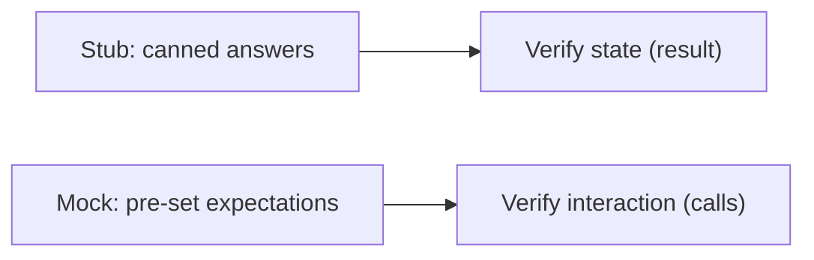

# Mock and Stub

> Testing 101 series (6/10)

<!-- a-grade-intro:begin -->

**Core question**: *Stub* and *Mock* look similar. *What is the actual difference*?

> Same kind of *fake object* — when you verify *the result* it is a Stub; when you verify *the call itself* it is a Mock.

<!-- a-grade-intro:end -->

## What You Will Learn

- The precise definition difference between *Stub and Mock*
- Core APIs of `unittest.mock`
- *State verification* vs *interaction verification*
- Signs that you are *overusing* Mock
- Five practical patterns

## Why It Matters

Confusing Mock and Stub leads to *over-mocking* and *brittle tests*. Knowing the difference lets you put *the right tool* in *the right place*.

> A good test tells you *"what broke"* in *one line*.

## Concept at a Glance



## Key Terms

- **State verification**: verifying the SUT's *final state or return value*.
- **Interaction verification**: verifying *how the SUT called* its dependencies.
- **MagicMock**: a *flexible fake* that accepts any attribute or call.
- **patch**: a decorator/context that *temporarily replaces* an existing object.
- **Side effect**: a configuration that yields *different behavior per call*.

## Before/After

**Before (over-mocking)**

```python
def test_creates_user(repo_mock):
    create_user("a@b.com", repo=repo_mock)
    repo_mock.add.assert_called_once()  # only checks *how* it was called
```

**After (verify by result)**

```python
def test_creates_user_persists():
    repo = InMemoryUserRepo()
    create_user("a@b.com", repo=repo)
    assert repo.find_by_email("a@b.com") is not None
```

## Hands-on: unittest.mock in Five Steps

### Step 1 — Basic Mock

```python
from unittest.mock import MagicMock

def test_basic_mock():
    m = MagicMock()
    m.greet("hi")
    m.greet.assert_called_with("hi")
```

### Step 2 — return_value (Stub style)

```python
def test_return_value():
    m = MagicMock()
    m.fetch.return_value = {"id": 1}
    assert m.fetch()["id"] == 1
```

### Step 3 — side_effect (exceptions/sequences)

```python
def test_side_effect_raises():
    m = MagicMock()
    m.fetch.side_effect = TimeoutError("slow")
    try:
        m.fetch()
    except TimeoutError as e:
        assert str(e) == "slow"
```

### Step 4 — patch to replace external functions

```python
from unittest.mock import patch

def test_patch_function():
    with patch("src.weather.requests.get") as mock_get:
        mock_get.return_value.json.return_value = {"temp": 20}
        from src.weather import current_temp
        assert current_temp() == 20
```

### Step 5 — assert_called_with vs assert_not_called

```python
def test_not_called_when_disabled():
    mailer = MagicMock()
    notify("a@b.com", mailer=mailer, enabled=False)
    mailer.send.assert_not_called()
```

## What to Notice in This Code

- `return_value` plays the *Stub role*; `assert_called_*` plays the *Mock role*.
- `patch` is *a surgical tool* — apply it with the *narrowest scope*.
- `side_effect` lets you cover *error paths* too.

## Five Common Mistakes

1. **Setting *over-detailed expectations* on a Mock.** Refactors become *impossible*.
2. **Applying `patch` *too broadly*.** Other tests get *contaminated*.
3. **Mixing return-value and call verification *into one test*.**
4. **Hitting *real money/email/SMS* instead of mocking.**
5. **Mocking *every line*.** That is *not a test anymore*.

## How This Shows Up in Production

In most new tests, *Stubs/Fakes come first*, and Mocks appear only where *the interaction is the essence* (email/payment/push notifications, where *the side effect itself* is what you verify).

## How a Senior Engineer Thinks

- Verifies *by result whenever possible*.
- *Minimizes expectations* when using Mock.
- Keeps `patch` scope at the *function level*.
- Uses Mock when *the side effect itself* is the system's core.
- Reads "too many mocks" as a *design signal*.

## Checklist

- [ ] You can describe the *purpose difference* between Stub and Mock in one line.
- [ ] You used `return_value`, `side_effect`, and `assert_called_with`.
- [ ] You kept `patch` scope *narrow*.
- [ ] You preferred *result verification*.

## Practice Problems

1. Write a function that calls an external API and test it *both* with a Stub and a Mock.
2. Use `side_effect` to simulate *one failure every three calls*.
3. Test the same scenario with a *Fake* and compare *which is more readable*.

## Wrap-up and Next Steps

Mock and Stub are *tools with different goals*. The next post measures *how much you tested* — *test coverage*.

<!-- toc:begin -->
- [What Is Testing?](./01-what-is-testing.md)
- [Unit Test](./02-unit-test.md)
- [Integration Test](./03-integration-test.md)
- [E2E Test](./04-e2e-test.md)
- [Test Double](./05-test-double.md)
- **Mock and Stub (current)**
- Test Coverage (upcoming)
- Regression Test (upcoming)
- Running Tests in CI (upcoming)
- Building a Test Strategy (upcoming)
<!-- toc:end -->

## References

- [unittest.mock docs](https://docs.python.org/3/library/unittest.mock.html)
- [Martin Fowler — Mocks Aren't Stubs](https://martinfowler.com/articles/mocksArentStubs.html)
- [pytest-mock](https://pytest-mock.readthedocs.io/)
- [Sandi Metz — POODR](https://www.poodr.com/)

Tags: Testing, Mock, Stub, unittest.mock, Python
