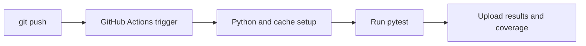

# Running Tests in CI

This is post 9 in the Testing 101 series.

> Testing 101 series (9/10)

<!-- a-grade-intro:begin -->

**Core question**: If your tests pass *only on your laptop*, did they really *pass*?

> CI applies *the same standard to every commit*. It is *the safety net for the whole team*.

<!-- a-grade-intro:end -->

## What You Will Learn

- The definition and purpose of *CI (Continuous Integration)*
- The basic structure of a *GitHub Actions* workflow
- Speeding things up with *matrix* builds and *caching*
- Test *parallelization* and *result artifacts*
- Five common pitfalls

## Why It Matters

Local environments *differ from person to person*. *CI* validates *every PR* in an *identical container*. It is the *last gate* that keeps broken code out of main.

> Tests without CI are tests that *passed by accident*.

## Concept at a Glance



## Key Terms

- **CI**: *Continuous Integration*. *Auto-validate* every commit.
- **Workflow**: A GitHub Actions *YAML definition*.
- **Matrix**: A configuration that runs multiple *Python versions and OSes* *in parallel*.
- **Cache**: *Reusing* dependency installations to gain speed.
- **Artifact**: A *file produced* by a CI run (logs, reports).

## Before/After

**Before (manual testing)**

```text
- Developers run pytest *only on their laptops*
- One forgotten run later, *failures get merged*
```

**After (CI automation)**

```yaml
on: [push, pull_request]
jobs:
  test:
    runs-on: ubuntu-latest
    steps:
      - uses: actions/checkout@v4
      - uses: actions/setup-python@v5
        with: { python-version: '3.12' }
      - run: pip install -r requirements.txt
      - run: pytest -v
```

## Hands-on: Five Steps to Set Up CI

### Step 1 - Create the workflow file

```bash
mkdir -p .github/workflows
touch .github/workflows/test.yml
```

### Step 2 - Test multiple versions with a matrix

```yaml
strategy:
  matrix:
    python-version: ["3.11", "3.12"]
steps:
  - uses: actions/setup-python@v5
    with: { python-version: ${{ matrix.python-version }} }
```

### Step 3 - Cache dependencies

```yaml
- uses: actions/setup-python@v5
  with:
    python-version: ${{ matrix.python-version }}
    cache: 'pip'           # auto-detects requirements.txt
- run: pip install -r requirements.txt
```

### Step 4 - Speed it up with parallel execution

```bash
pip install pytest-xdist
pytest -n auto             # parallel across CPU cores
```

### Step 5 - Upload coverage as an artifact

```yaml
- run: pytest --cov=src --cov-report=html
- uses: actions/upload-artifact@v4
  with:
    name: coverage-html
    path: htmlcov/
```

## What to Notice in This Code

- The *trigger* usually includes *both* `push` and `pull_request`.
- The cache key is *managed by the requirements hash* automatically.
- Be careful with matrix *combinatorial explosion*. *Two or three versions* are usually enough.

## Five Common Mistakes

1. **Tests that are *flaky only on CI*.** Usually an *order dependency* or an *external resource* problem.
2. **Running the *full E2E suite* on every PR.** Split into *unit -> integration -> E2E* tiers.
3. **Cache *without a key* lets *stale dependencies* pass.** Always use a *hash-based key*.
4. **Printing *secrets to the log*.** Never do `echo $SECRET`.
5. **Build time exceeds *10 minutes* and you ignore it.** Aim for *under 5 minutes* with parallelism and caching.

## How This Shows Up in Production

Large teams *split* their suites into a *unit job* (1-2 minutes), an *integration job* (5 minutes), and an *E2E job* (15 minutes, nightly). PRs only require *unit and integration*; *E2E* runs after merge during the night.

## How a Senior Engineer Thinks

- A *red PR getting merged* is a *system failure*.
- CI duration is *developer velocity*. Defend the *5-minute rule*.
- *Flaky tests* are *quarantined immediately* and repaired.
- *Secrets* are *separated per environment*.
- The *badge* is the *first signal in the README*.

## Checklist

- [ ] `.github/workflows/test.yml` *exists*.
- [ ] The *matrix* runs at least *two Python versions*.
- [ ] *Dependency caching* is enabled.
- [ ] *Red PRs* never get merged.

## Practice Problems

1. Add a *test.yml* workflow to your project and produce its first *green build*.
2. Add *Python 3.11 and 3.12* to the matrix.
3. Adopt *pytest-xdist* and *measure and compare* the runtime.

## Wrap-up and Next Steps

CI is *the safety net for the whole team*. In the next post we tie everything together into a *test strategy*.

<!-- toc:begin -->
- [What is testing?](./01-what-is-testing.md)
- [Unit Test](./02-unit-test.md)
- [Integration Test](./03-integration-test.md)
- [E2E Test](./04-e2e-test.md)
- [Test Doubles](./05-test-double.md)
- [Mock and Stub](./06-mock-and-stub.md)
- [Test Coverage](./07-test-coverage.md)
- [Regression Test](./08-regression-test.md)
- **Running Tests in CI (current)**
- Building a Test Strategy (upcoming)
<!-- toc:end -->

## References

- [GitHub Actions docs](https://docs.github.com/en/actions)
- [pytest-xdist](https://pytest-xdist.readthedocs.io/)
- [Martin Fowler — Continuous Integration](https://martinfowler.com/articles/continuousIntegration.html)
- [Google Testing Blog — Flaky Tests](https://testing.googleblog.com/2016/05/flaky-tests-at-google-and-how-we.html)

Tags: Testing, CI, GitHub Actions, Automation, Quality
