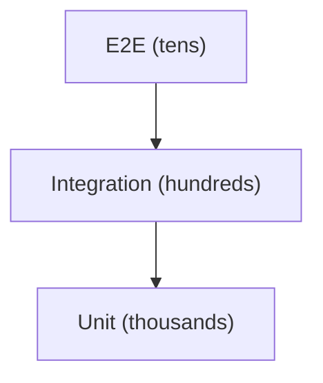

# Building a Test Strategy

This is the final post in the Testing 101 series.

> Testing 101 series (10/10)

<!-- a-grade-intro:begin -->

**Core question**: Is *more tests* always *better*?

> A good strategy is *write less, catch more*. The real question is *where to invest*.

<!-- a-grade-intro:end -->

## What You Will Learn

- The meaning and distribution of the *test pyramid*
- *ROI* per layer and *investment priorities*
- The *team rituals* that keep tests alive
- *Contract tests* at system boundaries
- Five common pitfalls

## Why It Matters

Tests are *not free*. They cost time to write, to run, and to fix. A strategy-less suite becomes a *slow, brittle net*.

> A good strategy *catches bugs while protecting development speed*.

## Concept at a Glance



## Key Terms

- **Test pyramid**: a distribution model with *many unit / fewer integration / even fewer E2E* tests.
- **ROI**: the *cost vs. bugs caught* per test.
- **Critical path**: the *money-flow paths* (payment, login, etc.).
- **Contract test**: validates *input/output shape* at *system boundaries*.
- **Flaky budget**: the *acceptable instability ratio* (e.g., 0.5%).

## Before/After

**Before (no strategy)**

```text
- *Unit tests* on every function
- *E2E tests* on every scenario
- 30-minute CI, team PR velocity stalls
```

**After (strategy applied)**

```text
- *2,000 unit tests* on the core domain
- *200 integration tests* (DB and external APIs)
- *20 E2E tests* on critical paths (payment, login, etc.)
- CI under 5 minutes
```

## Hands-on: Five Steps to a Strategy

### Step 1 - Measure the current distribution

```bash
pytest --collect-only -q | wc -l    # total test count
ls tests/unit | wc -l
ls tests/integration | wc -l
ls tests/e2e | wc -l
```

### Step 2 - Define the critical paths

```text
- Login
- Payment
- Sign-up
- Password reset
```

These flows *must be protected by E2E*.

### Step 3 - Add contract tests at the boundary

```python
# tests/contracts/test_payment_api.py
def test_payment_response_schema():
    res = payment_client.charge(amount=100)
    assert set(res.keys()) >= {"id", "status", "amount"}
```

### Step 4 - Establish team rituals

```text
- PR template: "Did you add a regression test? [ ]"
- Weekly 30 minutes: review *flaky tests*
- Monthly: check coverage *trend* (trend, not absolute)
```

### Step 5 - Quarterly pruning

```bash
# E2E that has not failed for six months is a candidate for review
# Tests that fail repeatedly in the same area are *a refactoring signal*
```

## What to Notice in This Code

- A strategy survives as *rituals*, not as *documents*.
- *Distribution* is unknowable without measurement.
- If *critical paths* are not defined, *everything* becomes critical.

## Five Common Mistakes

1. **The same test intensity *for all code*.** Invest in proportion to *risk*.
2. **Treating E2E as the *primary tier*.** It is slow and brittle and *kills team speed*.
3. **Watching only the *coverage target*.** What you *cover* matters more than the number.
4. **No contract tests.** External API changes get caught *in production*.
5. **Setting the strategy *once and forgetting it*.** Revisit *quarterly*.

## How This Shows Up in Production

Mature teams record their *target distribution* and *flaky budget* in an *Engineering Excellence* document. Every new service follows that baseline, and *quarterly OKRs* include *CI duration* and *flaky ratio*.

## How a Senior Engineer Thinks

- Test on a *risk basis*. Do not distribute evenly.
- *Fast feedback* is the basis of *every decision*.
- *Contract tests* at the boundary reduce *cross-team cost*.
- A *flaky test* is a *broken window*. Fix it immediately.
- A strategy is a *living document*.

## Checklist

- [ ] You know your team's *test distribution*.
- [ ] *Critical paths* are *documented*.
- [ ] The *PR template* includes a regression test item.
- [ ] You *measure* the *flaky ratio*.

## Practice Problems

1. Measure your project's *test distribution* and verify it forms a *pyramid*.
2. Define three *critical paths* and confirm E2E covers them.
3. Propose one *weekly ritual* to introduce to your team.

## Wrap-up and Next Steps

Test strategy is not *technique* but *decision-making*. With this we close out Testing 101 — next, in *DevOps 101* and *Observability 101*, we extend quality work into *post-deployment*.

<!-- toc:begin -->
- [What is testing?](./01-what-is-testing.md)
- [Unit Test](./02-unit-test.md)
- [Integration Test](./03-integration-test.md)
- [E2E Test](./04-e2e-test.md)
- [Test Doubles](./05-test-double.md)
- [Mock and Stub](./06-mock-and-stub.md)
- [Test Coverage](./07-test-coverage.md)
- [Regression Test](./08-regression-test.md)
- [Running Tests in CI](./09-tests-in-ci.md)
- **Building a Test Strategy (current)**
<!-- toc:end -->

## References

- [Martin Fowler — The Practical Test Pyramid](https://martinfowler.com/articles/practical-test-pyramid.html)
- [Google Testing Blog](https://testing.googleblog.com/)
- [Accelerate (Forsgren, Humble, Kim)](https://itrevolution.com/product/accelerate/)
- [ThoughtWorks — Test Strategy](https://www.thoughtworks.com/insights/blog/testing-strategy)

Tags: Testing, Strategy, Quality, Capstone, Engineering
