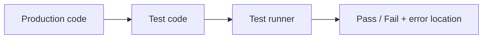

# 테스트란 무엇인가?

처음 테스트를 배울 때는 코드보다 절차부터 떠올리기 쉽습니다. 서버를 띄우고, 브라우저를 열고, 회원가입 버튼을 눌러 보고, 로그인이 되는지 확인하는 식입니다. 이 방식은 처음 한두 번은 통합니다. 그런데 기능이 늘고 사람이 늘면 곧 같은 질문이 따라옵니다. 어제 확인한 기능을 오늘도 다시 손으로 눌러 봐야 할까요?

변경이 잦은 코드베이스에서는 수작업 확인만으로 품질을 지키기 어렵습니다. 확인 범위가 넓어질수록 빠뜨리는 항목이 생기고, 그 공백은 배포 뒤에 사고로 돌아옵니다.

이 글은 Testing 101 시리즈의 첫 번째 글입니다. 여기서는 테스트가 무엇인지, 자동 테스트가 왜 필요한지, 그리고 뒤이어 나올 단위 테스트·통합 테스트·E2E 테스트가 어떤 자리에 놓이는지부터 정리하겠습니다.

---

## 이 글에서 다룰 문제

- 테스트는 정확히 무엇을 검증하는 코드일까요?
- 수동 확인과 자동 테스트는 무엇이 다를까요?
- 단위 테스트, 통합 테스트, E2E 테스트는 어떻게 구분할까요?
- 테스트가 없으면 변경 작업은 왜 불안정해질까요?
- 다음 글에서 다룰 단위 테스트는 전체 그림에서 어느 위치일까요?

> 테스트는 코드가 의도대로 동작하는지 자동으로 확인하는 또 다른 코드입니다. 사람의 기억 대신 실행 가능한 확인 절차를 남기는 장치라고 보면 됩니다.

## 왜 중요한가

테스트가 없으면 모든 수정이 추측에 가까워집니다. 회원가입을 고쳤는데 결제가 깨지고, 결제를 고쳤는데 로그인이 깨지는 일이 반복됩니다. 문제는 버그가 생긴다는 사실만이 아닙니다. 팀이 변경을 두려워하게 된다는 점이 더 큽니다.

자동 테스트는 변경을 멈추지 않으면서 위험을 줄이는 장치입니다. 코드를 고친 뒤 바로 다시 돌려 볼 수 있고, 다른 사람이 만든 변경까지 같은 기준으로 확인할 수 있습니다. 그래서 테스트는 기능 개발의 반대편에 있는 부담이 아니라, 계속 바꿀 수 있게 해 주는 안전장치에 가깝습니다.

## 한눈에 보는 구조



가장 단순한 흐름은 이렇습니다. 프로덕션 코드가 있고, 그 코드를 검증하는 테스트 코드가 있습니다. 테스트 러너는 테스트를 모아서 실행하고, 통과 여부와 실패 위치를 알려 줍니다. 중요한 점은 테스트도 코드라는 사실입니다. 즉, 기대하는 동작을 사람이 말로 설명하는 대신 실행 가능한 형태로 남겨 둔 것입니다.

## 핵심 용어

- 테스트: 기대하는 동작을 코드로 표현한 검증 절차입니다.
- **단언문(assertion)**: 실제 값이 기대와 맞는지 확인하는 표현입니다.
- **테스트 러너**: 테스트를 수집하고 실행하는 도구입니다.
- **픽스처(fixture)**: 테스트에서 재사용할 데이터나 상태입니다.
- **커버리지(coverage)**: 테스트가 프로덕션 코드의 어느 범위까지 실행했는지 보여 주는 지표입니다.

## 바꾸기 전과 후

**바꾸기 전 — 수동 확인 중심**

```text
1. 로컬에서 서버를 띄운다
2. 브라우저에서 회원가입 → 로그인 → 결제를 눌러 본다
3. "잘 되네"라고 판단하고 PR을 머지한다
4. 사흘 뒤 다른 변경 때문에 같은 흐름이 다시 깨진다
```

**바꾼 뒤 — 자동 테스트 중심**

```bash
$ pytest
collected 142 items
.................................... 142 passed in 3.4s
```

차이는 단순합니다. 수동 확인은 그 순간에만 유효합니다. 자동 테스트는 다음 주에도, 반년 뒤에도, 다른 사람이 같은 코드를 건드렸을 때도 다시 실행됩니다. 팀 단위로 작업할수록 이 차이가 크게 벌어집니다.

## 다섯 단계로 첫 자동 테스트 만들기

### 1단계 — 검증할 함수 준비

```python
# src/calc.py
def add(a: int, b: int) -> int:
    return a + b
```

### 2단계 — 테스트 파일 작성

```python
# tests/test_calc.py
from src.calc import add

def test_add_positive_numbers():
    assert add(2, 3) == 5

def test_add_with_zero():
    assert add(0, 7) == 7
```

### 3단계 — 실행

```bash
pip install pytest
pytest -v
```

### 4단계 — 일부러 깨뜨려 보기

```python
def add(a: int, b: int) -> int:
    return a - b   # 버그
```

```bash
pytest -v
# FAILED tests/test_calc.py::test_add_positive_numbers - assert -1 == 5
```

### 5단계 — 다시 고치고 신뢰 확인

`add` 함수를 원래대로 되돌린 뒤 `pytest`를 다시 실행합니다. 모든 테스트가 초록색으로 돌아오면, 테스트가 실제로 버그를 잡아냈다는 경험을 한 번 얻게 됩니다.

## 이 코드에서 먼저 볼 점

- 테스트는 생각보다 작습니다. 거대한 프레임워크를 먼저 배울 필요가 없습니다.
- 코드를 일부러 깨뜨렸다가 다시 초록색으로 만드는 과정이 테스트의 가치를 가장 빨리 보여 줍니다.
- 테스트는 문서 역할도 합니다. 함수가 어떻게 쓰이는지 예제로 남기기 때문입니다.

테스트 입문에서 중요한 감각은 복잡한 예제를 만드는 일이 아닙니다. 실패를 읽고, 원인을 고치고, 다시 통과시키는 반복이 어떻게 신뢰를 쌓는지 몸으로 익히는 일입니다.

## 어디서 자주 헷갈릴까요?

첫 번째 오해는 브라우저에서 한 번 눌러 봤다면 테스트를 한 것이라고 생각하는 경우입니다. 확인 자체는 맞지만, 그 확인을 반복 가능하게 남기지 못하면 팀의 자산이 되지 않습니다.

두 번째 오해는 테스트가 많으면 자동으로 안전하다고 믿는 경우입니다. 테스트는 작성한 시나리오만 검증합니다. 빠진 경로가 있다면 초록색 결과가 떠도 그 경로는 여전히 비어 있습니다.

세 번째 오해는 테스트를 나중에 몰아서 써도 된다고 생각하는 경우입니다. 실제로는 기능을 구현한 맥락이 머릿속에 남아 있을 때 같이 적는 편이 훨씬 저렴합니다. 미루면 테스트는 자주 빠지고, 빠진 테스트는 다시 채워지지 않는 경우가 많습니다.

## 실무에서는 이렇게 생각합니다

현업에서는 테스트를 단순한 검사 도구보다 변경 비용을 낮추는 장치로 봅니다. 팀이 코드를 자주 배포하려면, 사람의 기억과 수동 체크리스트 대신 자동 검증이 먼저 갖춰져야 합니다.

그래서 강한 팀일수록 PR에서 먼저 묻는 질문이 있습니다. 무엇을 바꿨는가보다 무엇을 검증했는가입니다. 테스트가 없으면 리뷰어는 구현 의도와 실패 조건을 파악하기 어려워지고, 머지 뒤의 위험도 크게 올라갑니다.

## 체크리스트

- [ ] `pytest`를 한 번 설치하고 실행해 봤습니다.
- [ ] 코드를 일부러 깨뜨린 뒤 실패 메시지를 읽어 봤습니다.
- [ ] 테스트 하나가 한 가지 동작만 확인하도록 작성했습니다.
- [ ] 테스트 실행 시간이 몇 초 안에 끝나는지 확인했습니다.

## 연습 문제

1. `subtract(a, b)` 함수를 만들고 테스트 세 개를 작성해 보세요.
2. 일부러 버그를 넣고 어떤 실패 메시지가 나오는지 확인해 보세요.
3. 동료에게 테스트가 왜 필요한지 한 문단으로 설명해 보세요.

## 정리

테스트는 코드를 믿게 만드는 장치가 아니라, 변경을 겁내지 않게 만드는 장치입니다. 수동 확인을 자동 검증으로 바꾸는 순간부터 팀은 같은 기능을 더 자주, 더 안전하게 고칠 수 있습니다. 다음 글에서는 이 전체 그림에서 가장 작은 단위인 단위 테스트를 자세히 보겠습니다.

<!-- toc:begin -->
- **테스트란 무엇인가? (현재 글)**
- 단위 테스트 (예정)
- 통합 테스트 (예정)
- E2E 테스트 (예정)
- 테스트 더블 (예정)
- Mock과 Stub (예정)
- 테스트 커버리지 (예정)
- 회귀 테스트 (예정)
- CI에서 테스트 실행하기 (예정)
- 테스트 전략 세우기 (예정)
<!-- toc:end -->

## 참고 자료

- [pytest docs](https://docs.pytest.org/)
- [Martin Fowler — Testing Strategies](https://martinfowler.com/articles/practical-test-pyramid.html)
- [Google Testing Blog](https://testing.googleblog.com/)
- [The Practical Test Pyramid (article)](https://martinfowler.com/articles/practical-test-pyramid.html)

Tags: Testing, Quality, Software, Basics, Engineering
