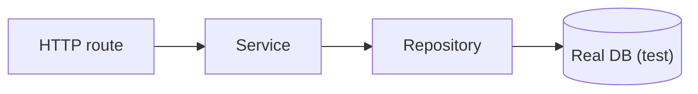

# 통합 테스트

> Testing 101 시리즈 (3/10)


## 이 글에서 다룰 문제

대부분의 버그는 경계에서 발생합니다. 모듈 안쪽보다 DB 스키마, API 계약, 권한 검사처럼 모듈 사이에서 더 자주 터집니다. 통합 테스트는 바로 그 경계를 검증합니다.

> 단위 테스트가 부품을 본다면, 통합 테스트는 조립된 상태를 봅니다.

## 전체 흐름


## Before/After

**Before (단위만 있음)**

```text
- 함수 단위 테스트 100개 통과
- 실제 배포 후 DB 컬럼 누락으로 500 에러
```

**After (통합 테스트 추가)**

```text
- 단위 테스트 100개
- /users POST 통합 테스트 5개 (실 DB)
- 배포 전에 스키마 누락이 CI에서 잡힘
```

## FastAPI + SQLite 5단계

### 1단계 — 대상 코드

```python
# src/app.py 파일
from fastapi import FastAPI
from sqlalchemy import create_engine, Column, Integer, String
from sqlalchemy.orm import sessionmaker, declarative_base

Base = declarative_base()
engine = create_engine("sqlite:///./test.db", future=True)
Session = sessionmaker(bind=engine, future=True)

class User(Base):
    __tablename__ = "users"
    id = Column(Integer, primary_key=True)
    email = Column(String, nullable=False, unique=True)

Base.metadata.create_all(engine)
app = FastAPI()

@app.post("/users")
def create_user(email: str):
    with Session() as s:
        u = User(email=email)
        s.add(u); s.commit(); s.refresh(u)
        return {"id": u.id, "email": u.email}
```

### 2단계 — 테스트 클라이언트

```python
# tests/test_users_integration.py 파일
from fastapi.testclient import TestClient
from src.app import app, Base, engine

def setup_function():
    Base.metadata.drop_all(engine)
    Base.metadata.create_all(engine)

client = TestClient(app)
```

### 3단계 — 정상 흐름

```python
def test_create_user_returns_201_and_persists():
    res = client.post("/users", params={"email": "a@b.com"})
    assert res.status_code == 200
    body = res.json()
    assert body["email"] == "a@b.com"
```

### 4단계 — 중복 처리

```python
def test_duplicate_email_fails():
    client.post("/users", params={"email": "a@b.com"})
    res = client.post("/users", params={"email": "a@b.com"})
    assert res.status_code in (400, 409, 500)  # 어떤 정책이든 *실패해야* 한다
```

### 5단계 — 느린 테스트 표식

```python
import pytest

@pytest.mark.slow
def test_large_batch_insert():
    for i in range(1000):
        client.post("/users", params={"email": f"u{i}@e.com"})
```

```bash
pytest -m "not slow"   # 평소
pytest -m slow         # nightly
```

## 이 코드에서 주목할 점

- 매 테스트 전에 스키마를 새로 만듭니다. 그래서 상태가 격리됩니다.
- 진짜 HTTP 호출을 시뮬레이션해 라우팅까지 검증합니다.
- 느린 테스트는 마커로 분리해 평소 빠른 사이클을 유지합니다.

## 자주 하는 실수 5가지

1. **운영 DB에 직접 붙는다.** 위험합니다. 항상 전용 DB를 써야 합니다.
2. **테스트 사이에 데이터를 공유한다.** 순서가 바뀌면 깨집니다.
3. **느린 테스트를 항상 돌려 PR 사이클이 30분이 된다.**
4. **mock으로 DB까지 가짜로 만든다.** 그건 통합 테스트가 아닙니다.
5. **행복 경로만 테스트한다.** 실패 케이스가 더 비싼 버그를 막습니다.

## 실무에서는 이렇게 쓰입니다

대부분의 백엔드 팀은 Postgres와 testcontainers 조합으로 진짜 DB를 띄워 테스트합니다. 외부 API는 VCR이나 mock 서버로 대체하는 것이 일반적입니다.

## 체크리스트

- [ ] 통합 테스트가 진짜 DB 또는 진짜 HTTP를 거친다.
- [ ] 매 테스트가 깨끗한 상태에서 시작한다.
- [ ] 느린 테스트는 마커로 분리되어 있다.
- [ ] 실패 경로도 한 개 이상 테스트한다.

## 정리 및 다음 단계

통합 테스트는 부품을 끼웠을 때의 동작을 봅니다. 다음 글에서는 사용자가 보는 화면까지 확인하는 E2E 테스트로 한 단계 더 갑니다.

<!-- toc:begin -->
- [테스트란 무엇인가?](./01-what-is-testing.md)
- [단위 테스트](./02-unit-test.md)
- **통합 테스트 (현재 글)**
- E2E 테스트 (예정)
- 테스트 더블 (예정)
- Mock과 Stub (예정)
- 테스트 커버리지 (예정)
- 회귀 테스트 (예정)
- CI에서 테스트 실행하기 (예정)
- 테스트 전략 세우기 (예정)
<!-- toc:end -->

## 참고 자료

- [FastAPI — TestClient](https://fastapi.tiangolo.com/tutorial/testing/)
- [Testcontainers](https://testcontainers.com/)
- [Martin Fowler — Integration Test](https://martinfowler.com/bliki/IntegrationTest.html)
- [pytest — markers](https://docs.pytest.org/en/stable/example/markers.html)

Tags: Testing, Integration, pytest, Database, HTTP
