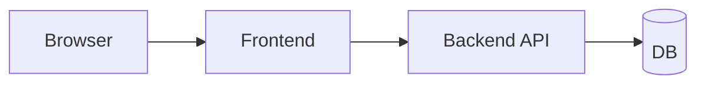

# E2E 테스트

로그인 화면이 잘 보이고, 버튼도 눌리고, API도 정상이라고 각자 확인했는데 실제 사용자는 로그인조차 못 하는 상황이 생길 수 있습니다. 화면과 백엔드, 데이터베이스가 각각 정상이어도 끝에서 끝까지 이어지는 사용자 흐름은 다른 문제를 드러내기 때문입니다.

E2E 테스트는 그 흐름을 사용자의 시선에서 다시 확인합니다. 비용이 가장 큰 대신, 실제 사고와 가장 가까운 신호를 줍니다.

이 글은 Testing 101 시리즈의 네 번째 글입니다. 여기서는 E2E 테스트의 역할, Playwright로 첫 시나리오를 만드는 방법, 그리고 플래키(flaky)한 테스트를 줄이는 운영 원칙을 정리하겠습니다.

---

## 이 글에서 다룰 문제

- E2E 테스트는 다른 테스트 계층과 어떻게 다를까요?
- 브라우저를 직접 띄우는 테스트는 무엇을 검증할까요?
- Playwright로 첫 시나리오를 어떻게 작성할까요?
- 플래키 테스트는 왜 생기고 어떻게 줄일 수 있을까요?
- E2E 테스트는 얼마나 두는 편이 적절할까요?

> E2E 테스트는 브라우저를 띄워 사용자가 클릭하고 입력하는 흐름을 그대로 재현하는 검증입니다. 가장 비싸지만 현실과 가장 가깝습니다.

## 왜 중요한가

E2E 테스트가 통과했다는 말은 프론트엔드, 백엔드, 데이터베이스가 함께 동작했다는 뜻입니다. 그래서 팀은 E2E 결과를 강한 신호로 받아들입니다. 다만 강한 신호인 만큼 값도 비쌉니다. 실행 시간이 길고, 환경 영향을 받기 쉬우며, 잘못 설계하면 금방 불안정해집니다.

그래서 E2E 테스트는 많을수록 좋은 계층이 아닙니다. 핵심 시나리오를 적게 두고 안정적으로 운영하는 편이 낫습니다. 로그인, 회원가입, 결제 같은 치명적인 경로를 보호하는 데 집중해야 합니다.

## 한눈에 보는 구조



브라우저에서 시작한 동작이 화면, API, 저장소까지 이어지는 전체 흐름을 검증합니다. 이 때문에 E2E 테스트는 개별 함수의 옳고 그름보다 사용자 시나리오의 성공 여부를 봅니다. 화면에서 실제로 쓸 수 있는지 확인하는 마지막 검증에 가깝습니다.

## 핵심 용어

- **E2E(end-to-end)**: 사용자의 시작 행동부터 최종 결과까지 이어지는 흐름입니다.
- **헤드리스 브라우저**: 화면을 띄우지 않고 실행되는 브라우저입니다. CI에서 자주 씁니다.
- **셀렉터(selector)**: 화면 요소를 찾는 표현입니다.
- **플래키 테스트**: 같은 코드인데도 어떤 날은 통과하고 어떤 날은 실패하는 불안정한 테스트입니다.
- **페이지 객체(page object)**: 화면별 동작을 객체로 감싼 재사용 패턴입니다.

## 바꾸기 전과 후

**바꾸기 전 — 수동 회귀 확인**

```text
- 배포 전마다 여러 사람이 한 시간씩 직접 클릭한다
- 그래도 결제 화면 버그가 운영에서 처음 드러난다
```

**바꾼 뒤 — 핵심 시나리오 자동화**

```text
- 회원가입, 로그인, 결제, 검색, 로그아웃 시나리오를 자동화한다
- CI에서 5분 안에 결과를 확인한다
```

사람이 반복해서 눌러 보는 작업은 결국 지칩니다. E2E 테스트는 이 반복을 코드로 바꿔 놓습니다. 다만 모든 화면을 다 올리려 하지 말고, 사용자 피해가 큰 흐름부터 고르는 편이 좋습니다.

## 다섯 단계로 Playwright 시작하기

### 1단계 — 설치

```bash
pip install pytest-playwright
playwright install
```

### 2단계 — 첫 시나리오 작성

```python
# tests/e2e/test_login.py
def test_login_flow(page):
    page.goto("https://example.com/login")
    page.get_by_label("Email").fill("a@b.com")
    page.get_by_label("Password").fill("secret")
    page.get_by_role("button", name="Sign in").click()
    page.wait_for_url("**/dashboard")
    assert page.get_by_text("Welcome").is_visible()
```

### 3단계 — 안정적인 셀렉터 선택

```python
# 권장: role + name
page.get_by_role("button", name="Sign in")
# 또는 data-testid
page.get_by_test_id("submit-login")
# 비권장: 자주 바뀌는 CSS 클래스
page.locator(".btn-primary-3xl")
```

### 4단계 — 기다림은 조건으로 처리

```python
# 나쁨
import time; time.sleep(3)
# 좋음
page.wait_for_url("**/dashboard")
page.wait_for_selector("text=Welcome")
```

### 5단계 — 페이지 객체로 재사용성 높이기

```python
class LoginPage:
    def __init__(self, page):
        self.page = page
    def open(self):
        self.page.goto("https://example.com/login")
    def login(self, email, pw):
        self.page.get_by_label("Email").fill(email)
        self.page.get_by_label("Password").fill(pw)
        self.page.get_by_role("button", name="Sign in").click()

def test_login_with_page_object(page):
    LoginPage(page).open(); LoginPage(page).login("a@b.com", "secret")
    assert page.get_by_text("Welcome").is_visible()
```

## 이 코드에서 먼저 볼 점

- 역할 기반 셀렉터와 텍스트 기반 셀렉터는 UI 디자인이 바뀌어도 비교적 오래 버팁니다.
- `sleep` 대신 조건부 대기를 써야 플래키함을 줄일 수 있습니다.
- 페이지 객체를 쓰면 같은 화면 동작을 여러 시나리오에서 재사용하기 쉽습니다.

E2E 테스트는 작성보다 유지가 더 어렵습니다. 그래서 처음부터 안정적인 셀렉터와 조건부 대기를 고르는 습관이 중요합니다. 작은 선택이 나중의 유지비를 크게 바꿉니다.

## 어디서 자주 헷갈릴까요?

가장 흔한 실수는 모든 화면을 E2E로 덮으려는 시도입니다. 시간이 지나면 5분짜리 테스트 묶음이 한 시간짜리 묶음으로 커지고, 누구도 자주 돌리지 않게 됩니다.

또 하나는 `time.sleep`으로 문제를 덮는 방식입니다. 잠깐은 통과할 수 있어도, 네트워크 상태나 렌더링 타이밍이 흔들리면 금방 다시 깨집니다. 기다림은 시간으로 처리하는 것이 아니라 조건으로 처리해야 합니다.

실제 결제나 실제 운영 계정을 E2E에서 호출하는 문제도 자주 생깁니다. 비용과 위험이 너무 큽니다. E2E는 스테이징이나 샌드박스 환경에서 돌리는 것이 기본입니다.

## 실무에서는 이렇게 생각합니다

대부분의 팀은 E2E 테스트를 5개에서 20개 사이의 핵심 시나리오로 제한합니다. 로그인, 회원가입, 결제, 검색처럼 서비스 가치가 직접 걸린 경로만 남기고 나머지는 단위 테스트나 통합 테스트로 내려 보냅니다.

경험 많은 엔지니어는 E2E의 역할을 분명히 압니다. E2E는 모든 것을 설명하는 계층이 아니라, 사용자가 실제로 못 쓰게 되는 사고를 막는 마지막 신호입니다. 그래서 비싸고 드문 계층이어야 합니다.

## 체크리스트

- [ ] Playwright로 시나리오 하나를 작성했습니다.
- [ ] role, text, test-id 기반 셀렉터를 사용했습니다.
- [ ] `sleep` 대신 조건부 대기를 썼습니다.
- [ ] 각 시나리오가 서로 독립적으로 실행됩니다.

## 연습 문제

1. 로그인 실패 시나리오를 하나 추가해 보세요.
2. 셀렉터 세 종류를 비교하고 무엇이 가장 안정적인지 기록해 보세요.
3. `sleep`을 일부러 넣고 왜 불안정해지는지 관찰해 보세요.

## 정리

E2E 테스트는 가장 현실에 가까운 품질 신호입니다. 다만 현실에 가까운 만큼 유지비도 큽니다. 적게 두고, 핵심 경로에 집중하고, 안정적으로 운영하는 것이 좋습니다. 다음 글에서는 외부 의존을 다룰 때 자주 쓰는 테스트 더블을 살펴보겠습니다.

<!-- toc:begin -->
- [테스트란 무엇인가?](./01-what-is-testing.md)
- [단위 테스트](./02-unit-test.md)
- [통합 테스트](./03-integration-test.md)
- **E2E 테스트 (현재 글)**
- 테스트 더블 (예정)
- Mock과 Stub (예정)
- 테스트 커버리지 (예정)
- 회귀 테스트 (예정)
- CI에서 테스트 실행하기 (예정)
- 테스트 전략 세우기 (예정)
<!-- toc:end -->

## 참고 자료

- [Playwright docs](https://playwright.dev/python/)
- [Cypress docs](https://docs.cypress.io/)
- [Martin Fowler — Test Pyramid](https://martinfowler.com/bliki/TestPyramid.html)
- [Google Testing Blog — Flaky Tests](https://testing.googleblog.com/2016/05/flaky-tests-at-google-and-how-we.html)

Tags: Testing, E2E, Playwright, Browser, Automation
