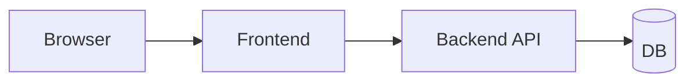

# E2E 테스트

> Testing 101 시리즈 (4/10)


## 이 글에서 다룰 문제

E2E 테스트가 통과한다는 것은 프론트엔드, 백엔드, DB가 함께 동작한다는 뜻입니다. 가장 현실에 가까운 신호이지만 비용도 가장 큽니다. 그래서 적게 두되 핵심 시나리오에만 집중합니다.

> E2E는 사용자의 시선에서 보는 테스트입니다.

## 전체 흐름


## Before/After

**Before (수동 회귀 테스트)**

```text
- 매 배포 전 5명이 1시간씩 클릭
- 그래도 결제 화면 버그가 운영에서 처음 발견
```

**After (E2E 5개)**

```text
- 회원가입, 로그인, 결제, 검색, 로그아웃 시나리오 자동화
- CI에서 5분 안에 결과
```

## Playwright 5단계

### 1단계 — 설치

```bash
pip install pytest-playwright
playwright install
```

### 2단계 — 첫 시나리오

```python
# tests/e2e/test_login.py 파일
def test_login_flow(page):
    page.goto("https://example.com/login")
    page.get_by_label("Email").fill("a@b.com")
    page.get_by_label("Password").fill("secret")
    page.get_by_role("button", name="Sign in").click()
    page.wait_for_url("**/dashboard")
    assert page.get_by_text("Welcome").is_visible()
```

### 3단계 — 안정적인 selector

```python
# 권장: role + name
page.get_by_role("button", name="Sign in")
# 또는 data-testid
page.get_by_test_id("submit-login")
# 비권장: 자주 바뀌는 CSS 클래스
page.locator(".btn-primary-3xl")
```

### 4단계 — 대기 (sleep 금지)

```python
# 나쁜 예
import time; time.sleep(3)
# 좋은 예
page.wait_for_url("**/dashboard")
page.wait_for_selector("text=Welcome")
```

### 5단계 — Page object

```python
class LoginPage:
    def __init__(self, page):
        self.page = page
    def open(self):
        self.page.goto("https://example.com/login")
    def login(self, email, pw):
        self.page.get_by_label("Email").fill(email)
        self.page.get_by_label("Password").fill(pw)
        self.page.get_by_role("button", name="Sign in").click()

def test_login_with_page_object(page):
    LoginPage(page).open(); LoginPage(page).login("a@b.com", "secret")
    assert page.get_by_text("Welcome").is_visible()
```

## 이 코드에서 주목할 점

- `role`/text 기반 selector는 디자인 변경에 강합니다.
- `wait_for_url` 같은 조건 대기가 `sleep` 을 대체합니다.
- Page object로 시나리오를 재사용합니다.

## 자주 하는 실수 5가지

1. **모든 화면을 E2E로 덮으려 한다.** 5분짜리 테스트가 1시간이 됩니다.
2. **`time.sleep` 으로 대기한다.** 플레이키의 가장 흔한 원인입니다.
3. **운영 환경에서 진짜 결제를 호출한다.** 반드시 스테이징이나 샌드박스를 써야 합니다.
4. **selector가 CSS 클래스다.** UI 변경에 항상 깨집니다.
5. **시나리오가 서로 의존한다.** 격리되어야 재실행이 가능합니다.

## 실무에서는 이렇게 쓰입니다

대부분의 팀은 5\~20개의 핵심 시나리오만 E2E로 둡니다. Playwright나 Cypress가 표준이고, 시각 회귀(visual regression) 테스트를 추가하기도 합니다.

## 체크리스트

- [ ] Playwright로 한 시나리오를 작성했다.
- [ ] selector는 role/text/test-id를 썼다.
- [ ] `sleep` 대신 조건 대기를 사용했다.
- [ ] 시나리오가 독립적으로 돈다.

## 정리 및 다음 단계

E2E는 현실에 가장 가까운 신호입니다. 다음 글부터는 외부 의존을 다루는 테스트 더블을 배웁니다.

<!-- toc:begin -->
- [테스트란 무엇인가?](./01-what-is-testing.md)
- [단위 테스트](./02-unit-test.md)
- [통합 테스트](./03-integration-test.md)
- **E2E 테스트 (현재 글)**
- 테스트 더블 (예정)
- Mock과 Stub (예정)
- 테스트 커버리지 (예정)
- 회귀 테스트 (예정)
- CI에서 테스트 실행하기 (예정)
- 테스트 전략 세우기 (예정)
<!-- toc:end -->

## 참고 자료

- [Playwright docs](https://playwright.dev/python/)
- [Cypress docs](https://docs.cypress.io/)
- [Martin Fowler — End to End Tests](https://martinfowler.com/bliki/TestPyramid.html)
- [Google Testing Blog — Flaky Tests](https://testing.googleblog.com/2016/05/flaky-tests-at-google-and-how-we.html)

Tags: Testing, E2E, Playwright, Browser, Automation
