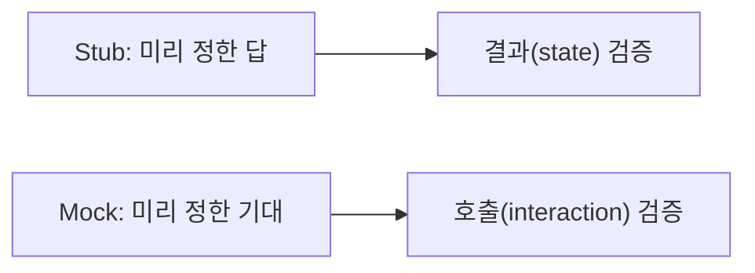

# Mock과 Stub

> Testing 101 시리즈 (6/10)


## 이 글에서 다룰 문제

Mock과 Stub을 혼동하면 *과한 Mock* 으로 *깨지기 쉬운 테스트* 를 만들게 됩니다. 차이를 알면 *올바른 도구* 를 *올바른 자리* 에 둘 수 있습니다.

> 좋은 테스트는 *"무엇이 깨졌는가"* 를 *한 줄* 로 말해 줍니다.

## 전체 흐름


## Before/After

**Before (Mock 남용)**

```python
def test_creates_user(repo_mock):
    create_user("a@b.com", repo=repo_mock)
    repo_mock.add.assert_called_once()  # *어떻게* 호출했는지만 검증
```

**After (결과로 검증)**

```python
def test_creates_user_persists():
    repo = InMemoryUserRepo()
    create_user("a@b.com", repo=repo)
    assert repo.find_by_email("a@b.com") is not None
```

## unittest.mock 5단계

### 1단계 — 기본 Mock

```python
from unittest.mock import MagicMock

def test_basic_mock():
    m = MagicMock()
    m.greet("hi")
    m.greet.assert_called_with("hi")
```

### 2단계 — return_value (Stub처럼)

```python
def test_return_value():
    m = MagicMock()
    m.fetch.return_value = {"id": 1}
    assert m.fetch()["id"] == 1
```

### 3단계 — side_effect (예외/시퀀스)

```python
def test_side_effect_raises():
    m = MagicMock()
    m.fetch.side_effect = TimeoutError("slow")
    try:
        m.fetch()
    except TimeoutError as e:
        assert str(e) == "slow"
```

### 4단계 — patch로 외부 함수 대체

```python
from unittest.mock import patch

def test_patch_function():
    with patch("src.weather.requests.get") as mock_get:
        mock_get.return_value.json.return_value = {"temp": 20}
        from src.weather import current_temp
        assert current_temp() == 20
```

### 5단계 — assert_called_with vs not_called

```python
def test_not_called_when_disabled():
    mailer = MagicMock()
    notify("a@b.com", mailer=mailer, enabled=False)
    mailer.send.assert_not_called()
```

## 이 코드에서 주목할 점

- `return_value` 는 *Stub 역할*, `assert_called_*` 는 *Mock 역할* 입니다.
- `patch` 는 *수술 같은 도구* 입니다 — *최소 범위* 로 사용.
- `side_effect` 로 *오류 경로* 도 검증할 수 있습니다.

## 자주 하는 실수 5가지

1. **Mock에 *너무 자세한 기대* 를 건다.** 리팩터링이 *불가능해집니다*.
2. **`patch` 를 *너무 넓게* 건다.** 다른 테스트가 *오염됩니다*.
3. **반환값과 호출 검증을 *동시에* 한 테스트에 다 넣는다.**
4. **Mock으로 *돈/이메일/SMS* 를 검증하지 않고 *진짜 호출* 한다.**
5. **테스트가 *모든 라인* 을 다 mock 한다.** 그건 *테스트가 아닙니다*.

## 실무에서는 이렇게 쓰입니다

대부분의 새 테스트는 *Stub/Fake가 우선* 이고, *상호작용이 본질* 인 곳에만 Mock을 씁니다 (이메일/결제/푸시 알림 같이 *부수효과 자체* 가 검증 대상).

## 체크리스트

- [ ] Stub과 Mock의 *목적 차이* 를 한 줄로 설명할 수 있다.
- [ ] `return_value`, `side_effect`, `assert_called_with` 를 모두 써 봤다.
- [ ] `patch` 의 *범위* 를 좁게 유지했다.
- [ ] *결과 검증* 을 우선했다.

## 정리 및 다음 단계

Mock과 Stub은 *목적이 다른 도구* 입니다. 다음 글에서는 *얼마나 테스트했는가* 를 측정하는 *커버리지* 를 다룹니다.

<!-- toc:begin -->
- [테스트란 무엇인가?](./01-what-is-testing.md)
- [단위 테스트](./02-unit-test.md)
- [통합 테스트](./03-integration-test.md)
- [E2E 테스트](./04-e2e-test.md)
- [테스트 더블](./05-test-double.md)
- **Mock과 Stub (현재 글)**
- 테스트 커버리지 (예정)
- 회귀 테스트 (예정)
- CI에서 테스트 실행하기 (예정)
- 테스트 전략 세우기 (예정)
<!-- toc:end -->

## 참고 자료

- [unittest.mock docs](https://docs.python.org/3/library/unittest.mock.html)
- [Martin Fowler — Mocks Aren't Stubs](https://martinfowler.com/articles/mocksArentStubs.html)
- [pytest-mock](https://pytest-mock.readthedocs.io/)
- [Sandi Metz — POODR (mocking discussion)](https://www.poodr.com/)

Tags: Testing, Mock, Stub, unittest.mock, Python
