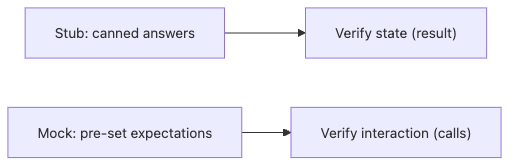

# Mock과 Stub

테스트 더블을 배운 뒤에도 Mock과 Stub은 자주 뒤섞입니다. 둘 다 가짜 객체처럼 보이기 때문입니다. 그런데 목적은 꽤 다릅니다. 이 차이를 놓치면 결과를 검증해야 할 테스트를 호출 검증으로 가득 채우거나, 반대로 상호작용이 핵심인 테스트를 너무 느슨하게 만들게 됩니다.

좋은 테스트는 실패했을 때 무엇이 깨졌는지 한 줄로 말해 줍니다. Mock과 Stub을 구분하는 일은 그 한 줄을 선명하게 만드는 작업입니다.

이 글은 Testing 101 시리즈의 여섯 번째 글입니다. 여기서는 `unittest.mock` 예제를 바탕으로 Mock과 Stub의 목적 차이, 상태 검증과 상호작용 검증의 차이, 그리고 과한 Mock 사용이 보내는 설계 신호를 정리하겠습니다.

---

## 이 글에서 다룰 문제

- Stub과 Mock은 정확히 무엇이 다를까요?
- 상태 검증과 상호작용 검증은 어떻게 구분할까요?
- `MagicMock`, `patch`, `side_effect`는 언제 쓰일까요?
- Mock을 많이 쓸수록 테스트가 왜 깨지기 쉬워질까요?
- 어떤 경우에 결과 검증을 우선하는 편이 좋을까요?

> 같은 가짜 객체라도 결과를 확인하는 쪽이면 Stub에 가깝고, 호출 자체를 검증하는 쪽이면 Mock에 가깝습니다. 무엇을 확인하려는지가 이름을 가릅니다.

## 왜 중요한가

Stub과 Mock을 섞어 쓰면 테스트가 구현 세부사항에 과하게 묶입니다. 예를 들어 실제로 확인하고 싶은 것은 사용자 생성 결과인데, 저장소 메서드가 몇 번 호출됐는지만 검사하면 리팩터링 때 테스트가 먼저 부서집니다.

반대로 상호작용 자체가 핵심인 경우도 있습니다. 메일 발송, 결제 호출, 알림 전송처럼 부작용이 의미의 중심인 기능은 호출 여부와 인자가 중요합니다. 그래서 도구를 구분해야 테스트 의도가 선명해집니다.

## 한눈에 보는 구조



*한눈에 보는 구조*
Stub은 미리 정한 값을 돌려줘서 결과 검증을 돕습니다. Mock은 기대한 호출이 있었는지 확인해서 상호작용 검증을 돕습니다. 같은 `MagicMock` 객체로도 두 역할을 모두 흉내 낼 수 있지만, 테스트 목적은 분리해서 생각해야 합니다.

## 핵심 용어

- **상태 검증**: 최종 반환값이나 상태 변화가 기대와 맞는지 확인하는 방식입니다.
- **상호작용 검증**: 의존을 어떤 방식으로 호출했는지 확인하는 방식입니다.
- **MagicMock**: 속성과 메서드를 유연하게 흉내 낼 수 있는 객체입니다.
- **patch**: 기존 객체를 잠시 다른 객체로 바꿔 끼우는 도구입니다.
- **side_effect**: 호출마다 다른 값이나 예외를 일으키도록 설정하는 기능입니다.

## 바꾸기 전과 후

**바꾸기 전 — Mock에만 기대는 테스트**

```python
def test_creates_user(repo_mock):
    create_user("a@b.com", repo=repo_mock)
    repo_mock.add.assert_called_once()  # 호출 방식만 검증
```

**바꾼 뒤 — 결과를 확인하는 테스트**

```python
def test_creates_user_persists():
    repo = InMemoryUserRepo()
    create_user("a@b.com", repo=repo)
    assert repo.find_by_email("a@b.com") is not None
```

두 테스트 모두 의미가 있을 수 있지만, 질문이 다릅니다. 첫 번째는 호출이 일어났는지, 두 번째는 실제로 저장 결과가 남았는지를 묻습니다. 어떤 질문이 더 본질적인지 먼저 정해야 합니다.

## 다섯 단계로 `unittest.mock` 익히기

### 1단계 — 기본 Mock

```python
from unittest.mock import MagicMock

def test_basic_mock():
    m = MagicMock()
    m.greet("hi")
    m.greet.assert_called_with("hi")
```

### 2단계 — `return_value`로 Stub처럼 쓰기

```python
def test_return_value():
    m = MagicMock()
    m.fetch.return_value = {"id": 1}
    assert m.fetch()["id"] == 1
```

### 3단계 — `side_effect`로 예외와 순서 다루기

```python
def test_side_effect_raises():
    m = MagicMock()
    m.fetch.side_effect = TimeoutError("slow")
    try:
        m.fetch()
    except TimeoutError as e:
        assert str(e) == "slow"
```

### 4단계 — 외부 함수를 `patch`로 교체하기

```python
from unittest.mock import patch

def test_patch_function():
    with patch("src.weather.requests.get") as mock_get:
        mock_get.return_value.json.return_value = {"temp": 20}
        from src.weather import current_temp
        assert current_temp() == 20
```

### 5단계 — 호출 여부 확인하기

```python
def test_not_called_when_disabled():
    mailer = MagicMock()
    notify("a@b.com", mailer=mailer, enabled=False)
    mailer.send.assert_not_called()
```

## 이 코드에서 먼저 볼 점

- `return_value`는 Stub 역할에 가깝고, `assert_called_*`는 Mock 역할에 가깝습니다.
- `patch`는 좁은 범위에서만 써야 다른 테스트에 영향을 남기지 않습니다.
- `side_effect`를 쓰면 정상 경로뿐 아니라 오류 경로도 쉽게 검증할 수 있습니다.

같은 도구를 써도 무엇을 검증하는지에 따라 테스트 성격이 달라집니다. 그래서 Mock 라이브러리를 잘 쓰는 것보다, 결과를 볼지 상호작용을 볼지 먼저 결정하는 감각이 더 중요합니다.

## 어디서 자주 헷갈릴까요?

첫 번째 실수는 한 테스트 안에 결과 검증과 호출 검증을 과하게 섞는 일입니다. 의도가 두 개가 되면 실패 이유도 흐려집니다.

두 번째 실수는 `patch` 범위를 너무 넓게 잡는 일입니다. 함수 하나만 바꾸면 되는 상황에서 모듈 전체를 오래 바꾸면 다른 테스트까지 오염될 수 있습니다.

세 번째 실수는 모든 줄을 Mock으로 감싸 버리는 일입니다. 테스트 대상 코드보다 Mock 설정이 더 길어지는 순간, 테스트는 설계 검증보다 구현 복제에 가까워집니다.

## 직접 검증해 볼 것

1. 같은 시나리오를 `return_value` 기반 결과 검증과 `assert_called_with` 기반 상호작용 검증으로 각각 작성해 봅니다. 어떤 질문을 던지는 테스트인지 차이가 분명하게 보여야 합니다.
2. `patch` 범위를 함수 하나로 좁혔을 때와 모듈 전체로 넓혔을 때 다른 테스트에 미치는 영향을 비교합니다.
3. `side_effect`로 예외를 일으킨 뒤, 실패 메시지가 외부 의존 장애를 충분히 설명하는지 확인합니다.

**예상 결과:** 결과를 검증할 때는 Fake/Stub 버전이 더 읽기 쉽고, 호출 자체가 요구사항일 때만 Mock 검증이 핵심으로 남아야 합니다.

## 실패 신호와 첫 점검

- 하나의 테스트가 결과 검증과 호출 검증을 모두 과하게 담으면 실패 이유가 흐려집니다.
- `patch`가 함수 밖까지 오래 살아 있으면 다른 테스트 오염으로 이어질 수 있습니다.
- Mock 설정이 테스트 대상 코드보다 길어지면 설계나 테스트 계층 선택을 다시 봐야 합니다.

## 실무에서는 이렇게 생각합니다

대부분의 새 테스트는 Stub이나 Fake에서 출발합니다. 실제 결과를 확인할 수 있으면 그 편이 읽기 쉽고 리팩터링에도 강합니다. Mock은 상호작용 그 자체가 요구사항일 때만 꺼내는 편이 좋습니다.

경험 많은 엔지니어는 Mock 수가 많아지는 상황을 설계 신호로 봅니다. 지나친 Mock은 보통 의존이 세분되지 않았거나 함수 책임이 과한 경우가 많습니다. 테스트가 불편하다면 테스트 코드를 고치기 전에 설계를 먼저 살펴보는 편이 낫습니다.

## 체크리스트

- [ ] Stub과 Mock의 차이를 한 문장으로 설명할 수 있습니다.
- [ ] `return_value`, `side_effect`, `assert_called_with`를 직접 사용했습니다.
- [ ] `patch` 범위를 함수 수준으로 좁게 유지했습니다.
- [ ] 가능하면 결과 검증을 먼저 선택했습니다.

## 연습 문제

1. 외부 API를 호출하는 함수를 만들고 Stub 방식과 Mock 방식으로 모두 테스트해 보세요.
2. 세 번에 한 번 실패하는 호출을 `side_effect`로 흉내 내 보세요.
3. 같은 시나리오를 Fake로도 테스트하고 무엇이 더 읽기 쉬운지 비교해 보세요.

## 정리

Mock과 Stub은 비슷해 보이지만 목표가 다릅니다. 결과를 확인할지, 호출을 확인할지 먼저 정하면 어떤 도구를 써야 하는지도 분명해집니다. 다음 글에서는 테스트가 코드의 어느 범위까지 닿았는지 보여 주는 테스트 커버리지를 다루겠습니다.

<!-- toc:begin -->
- [테스트란 무엇인가?](./01-what-is-testing.md)
- [단위 테스트](./02-unit-test.md)
- [통합 테스트](./03-integration-test.md)
- [E2E 테스트](./04-e2e-test.md)
- [테스트 더블](./05-test-double.md)
- **Mock과 Stub (현재 글)**
- 테스트 커버리지 (예정)
- 회귀 테스트 (예정)
- CI에서 테스트 실행하기 (예정)
- 테스트 전략 세우기 (예정)
<!-- toc:end -->

## 참고 자료

- [unittest.mock docs](https://docs.python.org/3/library/unittest.mock.html)
- [Martin Fowler — Mocks Aren't Stubs](https://martinfowler.com/articles/mocksArentStubs.html)
- [pytest-mock](https://pytest-mock.readthedocs.io/)
- [Sandi Metz — POODR](https://www.poodr.com/)

Tags: Testing, Mock, Stub, unittest.mock, Python
