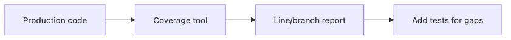

# 테스트 커버리지

테스트를 어느 정도 썼는지 물으면 많은 팀이 숫자부터 말합니다. 80퍼센트인지, 90퍼센트인지, 아니면 100퍼센트를 목표로 하는지 같은 이야기입니다. 그런데 숫자만 보면 금방 착시가 생깁니다. 코드가 실행되었다는 사실과, 올바르게 검증되었다는 사실은 다르기 때문입니다.

커버리지는 유용합니다. 다만 목표가 아니라 진단 도구로 다룰 때만 유용합니다. 숫자를 올리기 위해 의미 없는 테스트를 추가하는 순간 지표는 남고 신뢰는 빠집니다.

이 글은 Testing 101 시리즈의 일곱 번째 글입니다. 여기서는 라인, 브랜치, 함수 커버리지의 차이, `pytest-cov`로 측정하는 기본 흐름, 그리고 100퍼센트 숫자에 집착할 때 생기는 문제를 정리하겠습니다.

---

## 이 글에서 다룰 문제

- 라인, 브랜치, 함수 커버리지는 무엇이 다를까요?
- `pytest-cov`로 커버리지를 어떻게 측정할까요?
- 테스트가 닿지 않은 코드는 어떻게 찾을까요?
- 왜 100퍼센트 커버리지가 위험할 수 있을까요?
- 현실적인 최소 기준은 어떻게 정할까요?

> 커버리지는 어디가 비어 있는지 알려 주는 계기판입니다. 숫자 자체가 품질을 증명하지는 않습니다.

## 왜 중요한가

테스트가 어디까지 닿았는지 모르면 공백 구간에서 사고가 납니다. 어떤 파일이 한 번도 실행되지 않았는지, 어떤 분기가 한쪽만 검증됐는지 모르는 상태에서는 팀이 눈가림으로 안전하다고 느끼기 쉽습니다.

반대로 숫자만 올리려는 테스트도 문제입니다. 코드가 실행됐다는 이유만으로 안전하다고 판단하면, 단언문이 빈약한 테스트가 대량으로 쌓입니다. 그래서 커버리지는 방향을 잡는 도구로만 써야 합니다.

## 한눈에 보는 구조



*한눈에 보는 구조*
프로덕션 코드를 실행하면 커버리지 도구가 어떤 줄과 분기가 실행됐는지 기록합니다. 보고서를 읽고 비어 있는 지점을 확인한 뒤, 필요한 테스트를 보강하는 흐름입니다. 그래서 커버리지는 테스트 작성의 출발점이 아니라 점검 단계에 가깝습니다.

## 핵심 용어

- **라인 커버리지**: 전체 줄 가운데 실제로 실행된 줄의 비율입니다.
- **브랜치 커버리지**: `if/else`처럼 갈라지는 분기의 양쪽이 모두 실행됐는지 보는 지표입니다.
- **함수 커버리지**: 함수가 한 번이라도 호출됐는지 보는 지표입니다.
- **미검증 코드(uncovered code)**: 테스트 실행 중 한 번도 지나가지 않은 코드입니다.
- **커버리지 게이트**: 최소 기준 아래로 떨어지면 CI를 실패시키는 설정입니다.

## 바꾸기 전과 후

**바꾸기 전 — 숫자 없이 감으로 판단**

```text
- "테스트가 많다"는 말만 있다
- 어떤 줄이 한 번도 실행되지 않았는지 알 수 없다
```

**바꾼 뒤 — 보고서로 공백 파악**

```text
src/payment.py: 78% (line 42, 57 uncovered)
src/auth.py: 92% (line 11 uncovered)
TOTAL: 84%
```

보고서가 있으면 적어도 어디가 비었는지는 알 수 있습니다. 그 다음 질문은 숫자가 낮은 이유가 무엇인지, 위험한 코드인지, 우선 보강할 가치가 있는지입니다.

## 다섯 단계로 `pytest-cov` 사용하기

### 1단계 — 설치

```bash
pip install pytest-cov
```

### 2단계 — 기본 보고서 보기

```bash
pytest --cov=src --cov-report=term-missing
```

```text
src/calc.py    24    2    92%   18-19
src/auth.py    50   10    80%   34, 41-49
TOTAL         200   18    91%
```

### 3단계 — HTML 보고서 열기

```bash
pytest --cov=src --cov-report=html
open htmlcov/index.html
```

빨간 줄이 테스트가 닿지 않은 부분입니다.

### 4단계 — 브랜치 커버리지까지 보기

```bash
pytest --cov=src --cov-branch --cov-report=term-missing
```

이 설정을 켜면 `if x > 0:`의 참 경로와 거짓 경로를 모두 지났는지도 확인할 수 있습니다.

### 5단계 — CI 기준선 만들기

```toml
# pyproject.toml
[tool.coverage.report]
fail_under = 80
```

```bash
pytest --cov=src
# Coverage failure: total of 78 is less than fail_under=80
```

## 이 코드에서 먼저 볼 점

- 라인 커버리지는 실행 여부만 보여 줍니다. 값이 맞는지는 단언문이 따로 보장해야 합니다.
- 브랜치 커버리지는 분기 누락을 더 정직하게 드러냅니다.
- HTML 보고서는 비어 있는 줄을 빠르게 찾는 데 유용합니다.

그래서 숫자 하나보다 보고서의 빈칸이 더 중요합니다. 어떤 분기가 빠졌는지, 예외 경로가 비어 있는지, 핵심 도메인 코드가 낮은지부터 봐야 합니다.

## 어디서 자주 헷갈릴까요?

가장 흔한 실수는 100퍼센트를 KPI처럼 다루는 일입니다. 그러면 의미 없는 호출 테스트나 단언문 없는 테스트가 늘어납니다.

둘째, 라인 커버리지만 보고 안심하는 경우입니다. `if/else`에서 한쪽만 지나가도 라인 수치가 높게 나올 수 있으므로 브랜치 커버리지를 함께 봐야 합니다.

셋째, 새 코드와 레거시 코드를 같은 기준으로 묶는 경우입니다. 오래된 코드베이스에서는 전체 평균보다 변경 라인 기준이나 신규 코드 기준을 따로 두는 편이 현실적일 때가 많습니다.

## 직접 검증해 볼 것

1. `pytest --cov=src --cov-report=term-missing` 결과에서 빠진 줄 두세 개를 실제 코드와 함께 읽어 봅니다. 숫자보다 빈칸 위치가 더 중요한지 금방 감이 옵니다.
2. 같은 테스트 묶음에 `--cov-branch`를 추가해 라인 수치와 브랜치 수치가 얼마나 달라지는지 비교합니다.
3. 새로 추가한 예외 처리 한 줄이 커버리지 보고서에 바로 반영되는지 확인해, CI 게이트가 실제 변경을 감시하는지 검증합니다.

**예상 결과:** 단순 총합 퍼센트보다 어떤 분기와 예외 경로가 비었는지가 더 선명하게 드러나야 합니다.

## 실패 신호와 첫 점검

- 높은 라인 커버리지인데도 장애가 반복되면 단언문이 약하거나 브랜치 검증이 빠졌을 가능성이 큽니다.
- 생성 코드나 마이그레이션 파일까지 한데 묶어 측정하면 숫자는 올라가도 의사결정 품질은 떨어집니다.
- 신규 코드와 레거시 코드를 같은 기준으로 강제하다가 팀이 아예 게이트를 우회하기 시작하면 전략을 다시 잡아야 합니다.

## 실무에서는 이렇게 생각합니다

많은 팀이 프로덕션 코드 기준 70퍼센트에서 85퍼센트 사이를 현실적인 범위로 잡습니다. 핵심 도메인 로직은 더 높게 유지하고, 어댑터나 화면 계층은 상대적으로 낮게 두기도 합니다.

경험 많은 엔지니어는 커버리지를 성과 지표보다 진단 지표로 씁니다. 숫자가 낮은 파일을 보면 먼저 왜 낮은지, 테스트가 어려운 구조인지, 위험한 경로가 빠졌는지 묻습니다. 숫자는 질문을 시작하게 만드는 재료이지, 질문을 끝내는 답이 아닙니다.

## 체크리스트

- [ ] `pytest --cov` 보고서를 한 번 이상 읽었습니다.
- [ ] HTML 보고서의 빨간 줄을 확인했습니다.
- [ ] 브랜치 커버리지를 켜 보았습니다.
- [ ] CI에 최소 커버리지 기준을 설정했습니다.

## 연습 문제

1. 프로젝트에서 커버리지가 가장 낮은 파일 하나를 찾아보세요.
2. 왜 낮은지 한 줄로 적고 추가할 테스트 세 개를 제안해 보세요.
3. 라인 커버리지와 브랜치 커버리지의 수치 차이를 비교해 보세요.

## 정리

커버리지는 건강 자체가 아니라 건강 신호입니다. 보고서를 읽으면 어디가 비었는지 알 수 있고, 그 공백을 메우는 우선순위를 정할 수 있습니다. 다음 글에서는 한 번 고친 버그가 다시 돌아오지 않게 만드는 회귀 테스트를 보겠습니다.

<!-- toc:begin -->
- [테스트란 무엇인가?](./01-what-is-testing.md)
- [단위 테스트](./02-unit-test.md)
- [통합 테스트](./03-integration-test.md)
- [E2E 테스트](./04-e2e-test.md)
- [테스트 더블](./05-test-double.md)
- [Mock과 Stub](./06-mock-and-stub.md)
- **테스트 커버리지 (현재 글)**
- 회귀 테스트 (예정)
- CI에서 테스트 실행하기 (예정)
- 테스트 전략 세우기 (예정)
<!-- toc:end -->

## 참고 자료

- [pytest-cov docs](https://pytest-cov.readthedocs.io/)
- [coverage.py docs](https://coverage.readthedocs.io/)
- [Martin Fowler — Test Coverage](https://martinfowler.com/bliki/TestCoverage.html)
- [Google Testing Blog — Code Coverage Best Practices](https://testing.googleblog.com/2020/08/code-coverage-best-practices.html)

Tags: Testing, Coverage, pytest-cov, Quality, Metrics
