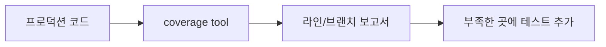

# 테스트 커버리지

> Testing 101 시리즈 (7/10)


## 이 글에서 다룰 문제

테스트가 *어디까지* 닿았는지 모르면 *공백 영역* 에서 사고가 납니다. 동시에 *숫자만 올리려는* 테스트는 *가짜 안전감* 을 줍니다.

> 커버리지는 *나침반* 이지 *지도* 가 아닙니다.

## 개념 한눈에 보기



## Before/After

**Before (커버리지 없음)**

```text
- "테스트가 많다" 라고만 안다
- 어떤 라인이 *한 번도 실행 안 됐는지* 모른다
```

**After (커버리지 보고서)**

```text
src/payment.py: 78% (line 42, 57 uncovered)
src/auth.py: 92% (line 11 uncovered)
TOTAL: 84%
```

## 실습: pytest-cov 5단계

### 1단계 — 설치

```bash
pip install pytest-cov
```

### 2단계 — 측정

```bash
pytest --cov=src --cov-report=term-missing
```

```text
src/calc.py    24    2    92%   18-19
src/auth.py    50   10    80%   34, 41-49
TOTAL         200   18    91%
```

### 3단계 — HTML 보고서

```bash
pytest --cov=src --cov-report=html
open htmlcov/index.html
```

빨간 줄이 *테스트되지 않은 라인* 입니다.

### 4단계 — 브랜치 커버리지

```bash
pytest --cov=src --cov-branch --cov-report=term-missing
```

`if x > 0:` 의 *True와 False 모두* 검증되었는지를 봅니다.

### 5단계 — 게이트 (CI 강제)

```toml
# pyproject.toml
[tool.coverage.report]
fail_under = 80
```

```bash
pytest --cov=src
# Coverage failure: total of 78 is less than fail_under=80
```

## 이 코드에서 주목할 점

- 라인 커버리지는 *"실행" 만* 봅니다 (값 검증은 별개).
- *브랜치 커버리지* 가 더 정직한 신호입니다.
- HTML 보고서로 *어디가 비었는지* 한눈에 봅니다.

## 자주 하는 실수 5가지

1. ***100%* 를 KPI로 둔다.** 의미 없는 테스트가 *양산* 됩니다.
2. **커버리지만 *높이고* 단언이 없다.** *실행만* 했지 *검증은 안* 했습니다.
3. ***생성된 코드/마이그레이션/실험 코드* 를 측정에 포함한다.** 노이즈입니다.
4. **브랜치 커버리지를 *무시* 한다.** if-else의 한쪽만 테스트되어도 *100% 라인* 이 나옵니다.
5. **새 코드와 *레거시 코드* 를 *같은 게이트* 로 본다.** 점진적 향상이 어렵습니다.

## 실무에서는 이렇게 쓰입니다

대부분의 팀은 *프로덕션 코드 70\~85%* 를 목표로 둡니다. 핵심 도메인은 *높게*, 어댑터/UI는 *낮게* 가져갑니다. *변경된 라인 커버리지* (patch coverage)를 별도 게이트로 두기도 합니다.

## 체크리스트

- [ ] `pytest --cov` 보고서를 한 번 봤다.
- [ ] HTML 보고서에서 *빨간 라인* 을 확인했다.
- [ ] 브랜치 커버리지를 *켜* 봤다.
- [ ] CI에 *최소 커버리지* 게이트가 있다.

## 정리 및 다음 단계

커버리지는 *건강 신호* 일 뿐 *건강 그 자체* 는 아닙니다. 다음 글에서는 같은 버그가 *다시 돌아오지 않게* 하는 *회귀 테스트* 를 다룹니다.

<!-- toc:begin -->
- [테스트란 무엇인가?](./01-what-is-testing.md)
- [단위 테스트](./02-unit-test.md)
- [통합 테스트](./03-integration-test.md)
- [E2E 테스트](./04-e2e-test.md)
- [테스트 더블](./05-test-double.md)
- [Mock과 Stub](./06-mock-and-stub.md)
- **테스트 커버리지 (현재 글)**
- 회귀 테스트 (예정)
- CI에서 테스트 실행하기 (예정)
- 테스트 전략 세우기 (예정)
<!-- toc:end -->

## 참고 자료

- [pytest-cov docs](https://pytest-cov.readthedocs.io/)
- [coverage.py docs](https://coverage.readthedocs.io/)
- [Martin Fowler — Test Coverage](https://martinfowler.com/bliki/TestCoverage.html)
- [Google Testing Blog — Code Coverage Best Practices](https://testing.googleblog.com/2020/08/code-coverage-best-practices.html)

Tags: Testing, Coverage, pytest-cov, Quality, Metrics
