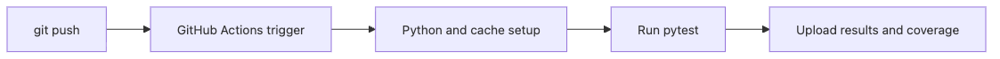

# CI에서 테스트 실행하기

노트북에서는 통과했는데 동료 환경이나 머지 뒤 파이프라인에서는 깨지는 일은 흔합니다. 파이썬 버전이 다르거나, 의존 패키지 캐시 상태가 다르거나, 로컬에만 있는 파일 하나가 원인일 수도 있습니다. 로컬 통과만으로는 팀 전체 기준을 만들기 어렵습니다.

그래서 테스트는 개인 습관에만 맡기지 않고 공통 환경에서 자동으로 돌려야 합니다. 그 역할을 맡는 것이 CI입니다.

이 글은 Testing 101 시리즈의 아홉 번째 글입니다. 여기서는 CI의 목적, GitHub Actions 워크플로의 기본 구조, 매트릭스와 캐시로 속도를 줄이는 방법, 그리고 테스트 결과를 팀 공통 신호로 운영하는 감각을 정리하겠습니다.

---

## 이 글에서 다룰 문제

- CI는 왜 필요한 공통 검증 장치일까요?
- GitHub Actions 워크플로는 어떤 구조로 작성할까요?
- 파이썬 버전 매트릭스와 캐시는 언제 도움이 될까요?
- 병렬 실행과 결과 아티팩트는 어떻게 활용할까요?
- CI에서 자주 생기는 함정은 무엇일까요?

> CI는 모든 커밋에 같은 기준을 적용하는 자동 검증 장치입니다. 개인 환경의 우연한 통과를 팀 기준의 통과로 바꾸는 역할을 합니다.

## 왜 중요한가

로컬 환경은 사람마다 다릅니다. 어떤 사람은 파이썬 3.11을 쓰고, 어떤 사람은 3.12를 쓰며, 어떤 사람은 캐시 덕분에 우연히 통과할 수도 있습니다. CI는 같은 컨테이너 또는 같은 런너 환경에서 모든 PR을 검증해 이런 편차를 줄입니다.

또한 CI는 팀 규율을 강제합니다. 테스트가 실패하면 머지를 막고, 그 압력 덕분에 팀은 작은 PR과 빠른 피드백을 선호하게 됩니다. 테스트 문화는 도구 없이 잘 유지되지 않습니다.

## 한눈에 보는 구조



*한눈에 보는 구조*
커밋이나 PR이 올라오면 워크플로가 실행되고, 파이썬과 의존을 준비한 뒤, 테스트를 돌리고, 결과나 커버리지 보고서를 남깁니다. 흐름은 단순하지만 팀 전체 품질 게이트 역할을 합니다.

## 핵심 용어

- **CI**: Continuous Integration의 약자로, 커밋마다 자동 검증을 수행하는 흐름입니다.
- **워크플로(workflow)**: GitHub Actions에서 실행 규칙을 정의한 YAML 파일입니다.
- **매트릭스(matrix)**: 여러 파이썬 버전이나 운영체제 조합을 병렬 실행하는 설정입니다.
- **캐시(cache)**: 의존 설치 결과를 재사용해 시간을 줄이는 방식입니다.
- **아티팩트(artifact)**: 커버리지 보고서나 로그처럼 CI가 남기는 파일입니다.

## 바꾸기 전과 후

**바꾸기 전 — 수동 실행 중심**

```text
- 개발자가 자기 노트북에서만 pytest를 돌린다
- 한 번 빼먹으면 실패한 코드가 그대로 머지된다
```

**바꾼 뒤 — CI 자동화 적용**

```yaml
on: [push, pull_request]
jobs:
  test:
    runs-on: ubuntu-latest
    steps:
      - uses: actions/checkout@v4
      - uses: actions/setup-python@v5
        with: { python-version: '3.12' }
      - run: pip install -r requirements.txt
      - run: pytest -v
```

이 차이는 습관이 아니라 시스템 차이입니다. CI가 붙는 순간 테스트 실행이 선택이 아니라 기본 경로가 됩니다.

## 다섯 단계로 CI 구성하기

### 1단계 — 워크플로 파일 만들기

```bash
mkdir -p .github/workflows
touch .github/workflows/test.yml
```

### 2단계 — 매트릭스로 여러 버전 확인하기

```yaml
strategy:
  matrix:
    python-version: ["3.11", "3.12"]
steps:
  - uses: actions/setup-python@v5
    with: { python-version: ${{ matrix.python-version }} }
```

### 3단계 — 의존 캐시 켜기

```yaml
- uses: actions/setup-python@v5
  with:
    python-version: ${{ matrix.python-version }}
    cache: 'pip'           # requirements.txt를 자동 감지
- run: pip install -r requirements.txt
```

### 4단계 — 병렬 실행으로 시간 줄이기

```bash
pip install pytest-xdist
pytest -n auto             # CPU 코어 기준 병렬 실행
```

### 5단계 — 커버리지 결과 업로드하기

```yaml
- run: pytest --cov=src --cov-report=html
- uses: actions/upload-artifact@v4
  with:
    name: coverage-html
    path: htmlcov/
```

## 이 코드에서 먼저 볼 점

- 트리거는 보통 `push`와 `pull_request`를 함께 포함합니다.
- `setup-python`의 캐시는 요구사항 파일 해시를 기준으로 관리됩니다.
- 매트릭스는 유용하지만 조합이 많아지면 시간이 급격히 늘 수 있습니다.

CI 설정에서 가장 중요한 숫자 중 하나는 총 실행 시간입니다. 테스트가 아무리 좋아도 PR 하나 확인하는 데 20분이 걸리면 팀은 우회로를 찾기 시작합니다. 속도는 품질과 별개가 아니라 품질을 지속시키는 조건입니다.

## 어디서 자주 헷갈릴까요?

첫 번째 문제는 CI에서만 플래키하게 깨지는 테스트입니다. 대개 실행 순서 의존, 외부 자원 의존, 고정되지 않은 시간 대기 같은 문제가 원인입니다.

둘째, 모든 E2E 테스트를 모든 PR마다 돌리는 구성입니다. 계층을 나누지 않으면 피드백 시간이 너무 길어집니다. 단위 테스트와 통합 테스트는 PR에서, 더 무거운 E2E는 야간이나 머지 뒤에 돌리는 구성이 현실적일 때가 많습니다.

셋째, 로그에 비밀 값을 찍는 실수입니다. 테스트 자동화가 늘어날수록 비밀 관리도 더 엄격해야 합니다.

## 직접 검증해 볼 것

1. 로컬에서 쓰는 명령과 CI 워크플로의 명령이 같은지 나란히 비교합니다. 둘이 다르면 초록색 빌드의 의미가 약해집니다.
2. 캐시를 끈 상태와 켠 상태의 실행 시간을 비교해 실제로 얼마나 줄었는지 기록합니다. 숫자를 모르면 캐시 전략이 비용 대비 가치가 있는지 판단하기 어렵습니다.
3. 단위 테스트와 통합 테스트, E2E 테스트를 한 잡에 몰아넣었을 때와 분리했을 때 피드백 시간을 비교합니다.

**예상 결과:** 기본 PR 검증 경로는 몇 분 안에 끝나고, 실패 시에는 어떤 단계에서 멈췄는지 로그만으로 바로 찾을 수 있어야 합니다.

## 실패 신호와 첫 점검

- CI에서만 간헐적으로 깨지면 순서 의존, 시간 대기, 외부 자원 의존부터 먼저 봅니다.
- 캐시가 오래된 의존을 계속 살려 두면 로컬과 CI 결과가 엇갈릴 수 있습니다.
- 로그에 비밀 값이 찍히면 테스트 안정성보다 먼저 보안 사고로 이어질 수 있습니다.

## 실무에서는 이렇게 생각합니다

큰 팀일수록 테스트 계층을 잡 단위로 나눕니다. 예를 들어 단위 테스트는 1~2분, 통합 테스트는 5분 안팎, E2E는 15분 정도로 별도 운영하는 식입니다. PR에는 빠른 계층만 필수로 걸고, 무거운 계층은 야간이나 머지 뒤 검증으로 옮깁니다.

경험 많은 엔지니어는 빨간 PR이 머지되는 일을 시스템 실패로 봅니다. 개인 실수로 넘기지 않습니다. 머지 규칙, 브랜치 보호, 캐시 전략, 플래키 테스트 격리까지 모두 운영 설계의 일부로 다룹니다.

## 체크리스트

- [ ] `.github/workflows/test.yml`이 존재합니다.
- [ ] 최소 두 개 파이썬 버전을 매트릭스로 확인합니다.
- [ ] 의존 캐시를 켰습니다.
- [ ] 실패한 PR은 머지되지 않도록 운영합니다.

## 연습 문제

1. 프로젝트에 `test.yml` 워크플로를 추가하고 첫 초록색 빌드를 만들어 보세요.
2. Python 3.11과 3.12를 매트릭스에 추가해 보세요.
3. `pytest-xdist`를 도입하고 실행 시간을 비교해 보세요.

## 정리

CI는 테스트를 팀 공통 기준으로 바꾸는 장치입니다. 노트북에서 우연히 통과한 결과를, 누구에게나 같은 방식으로 검증된 결과로 바꿔 줍니다. 다음 글에서는 지금까지 본 모든 계층을 묶어 팀에 맞는 테스트 전략을 세우는 방법을 정리하겠습니다.

<!-- toc:begin -->
- [테스트란 무엇인가?](./01-what-is-testing.md)
- [단위 테스트](./02-unit-test.md)
- [통합 테스트](./03-integration-test.md)
- [E2E 테스트](./04-e2e-test.md)
- [테스트 더블](./05-test-double.md)
- [Mock과 Stub](./06-mock-and-stub.md)
- [테스트 커버리지](./07-test-coverage.md)
- [회귀 테스트](./08-regression-test.md)
- **CI에서 테스트 실행하기 (현재 글)**
- 테스트 전략 세우기 (예정)
<!-- toc:end -->

## 참고 자료

### 공식 문서
- [GitHub Actions documentation](https://docs.github.com/en/actions)
- [actions/setup-python](https://github.com/actions/setup-python)
- [Caching dependencies to speed up workflows](https://docs.github.com/en/actions/using-workflows/caching-dependencies-to-speed-up-workflows)

### 실무 참고
- [pytest-xdist](https://pytest-xdist.readthedocs.io/)
- [Martin Fowler — Continuous Integration](https://martinfowler.com/articles/continuousIntegration.html)

Tags: Testing, CI, GitHub Actions, Automation, Quality
